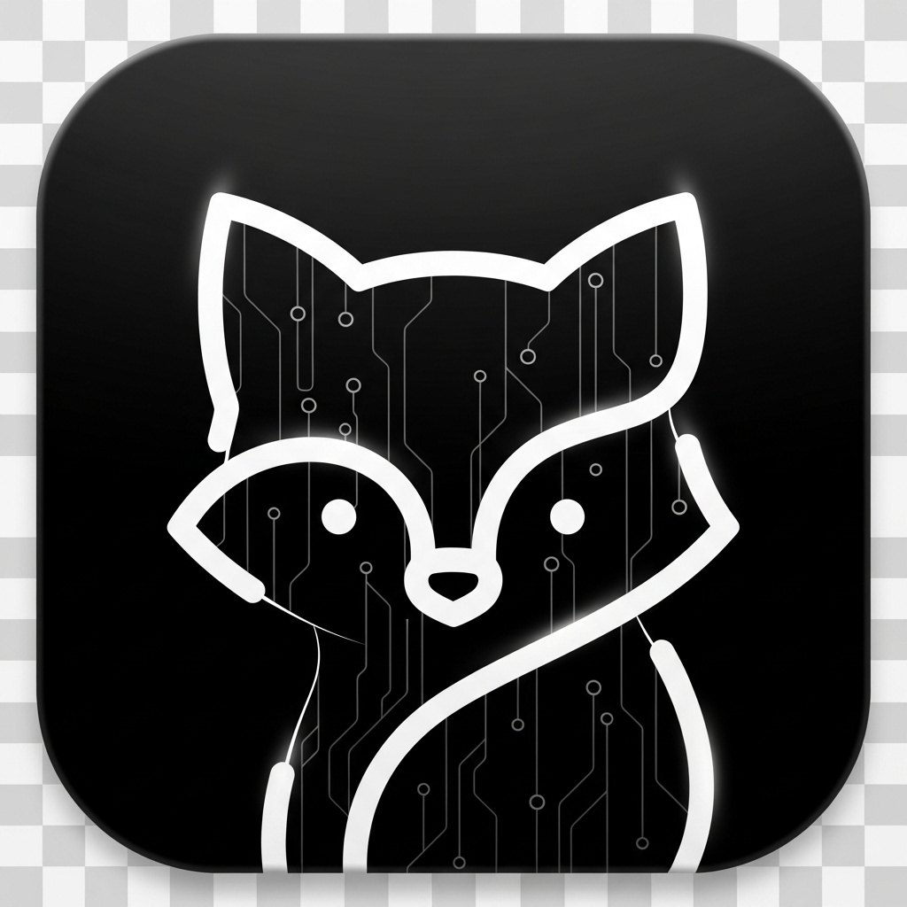
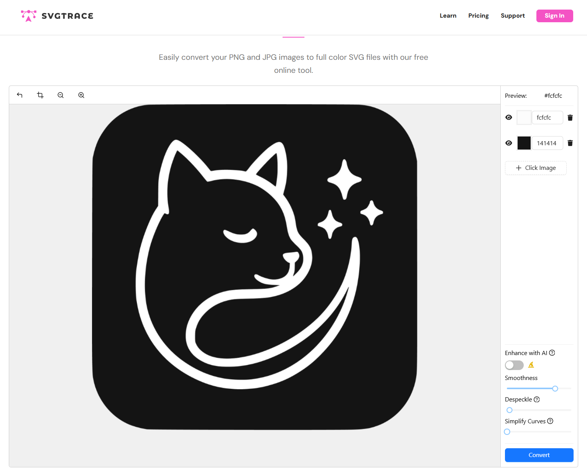
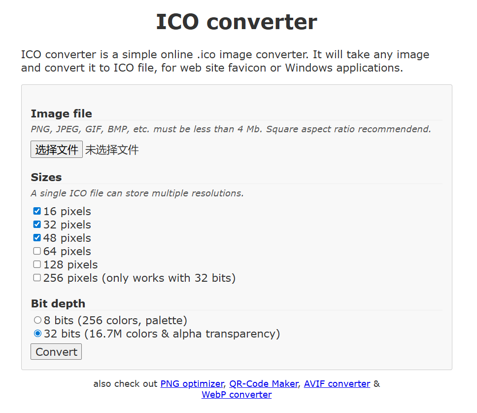

# 独立开发者的 Logo 制作记录

最近做了个一站式 AI 生图工具`Typix`，需要设计一个 Logo，作为一个完全没有设计基础的程序员，我摸索出了一套简单实用的方法，记录下来分享给同样需要的朋友。

这个方法主要用到了 AI 生成 + 网页工具处理。

<!-- more -->

## 步骤一：用 AI 生成基础图案

既然是做文本生成图像的工具，我希望 Logo 能体现这个概念，同时要简洁现代。于是写了这样一个提示词：

> 以 Type To Pixel 输入文本生成图像为主题，设计一个带有 AI 元素、有质感、现代化、科技感、极简风格的 APP logo。黑色背景打底，主体用白色呈现，形状为带圆角的方形。不要出现文字，主体是一只可爱小动物的极简轮廓，最终是透明背景。

我用的是 GPT-4o 的图像生成功能，生成了几张图：

这张还不错，简洁清晰。

我也试了下 Google 的 Imagen 4，同样的提示词得到了这个结果：

两个都挺好的，最后选了第一个。

**小贴士**：多抽卡几次总能找到满意的，提示词也可以根据自己需求进行微调。

## 步骤二：转成矢量格式

AI 生成的是 PNG 位图，放大会糊。Logo 需要在不同尺寸下都清晰，所以要转成矢量格式。

我用的工具：[https://svgtrace.com/png-to-svg](https://svgtrace.com/png-to-svg)

不用登录，免费转换，直接把 PNG 拖上去就能转成 SVG，效果还不错。这样 Logo 就能任意缩放而不失真了。

## 步骤三：生成 ICO 文件

网站和应用通常需要 ICO 格式的图标，我用了这个工具：[https://www.icoconverter.com](https://www.icoconverter.com)

把 SVG 上传，选择需要的尺寸，就能生成包含多种分辨率的 ICO 文件。

## 总结

整个流程就这三步：

1. AI 生成图案（GPT-4o 或 Google Imagen 4）
2. 转成矢量格式（svgtrace.com）
3. 生成多格式文件（icoconverter.com）

成本基本为零，效果对独立开发者来说完全够用了。虽然比不上专业设计师的作品，但至少看起来不会太业余。

---

_如果你也在做独立开发项目，欢迎交流经验。这些小工具小技巧积累起来还是挺有用的。_
