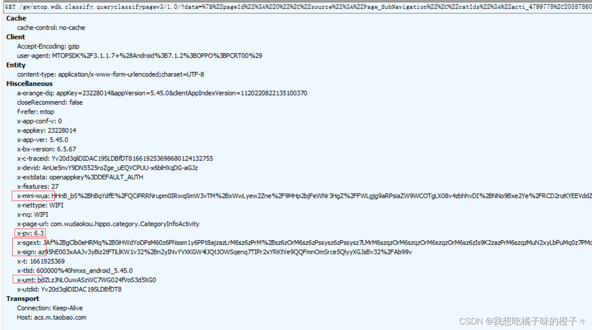
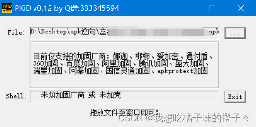
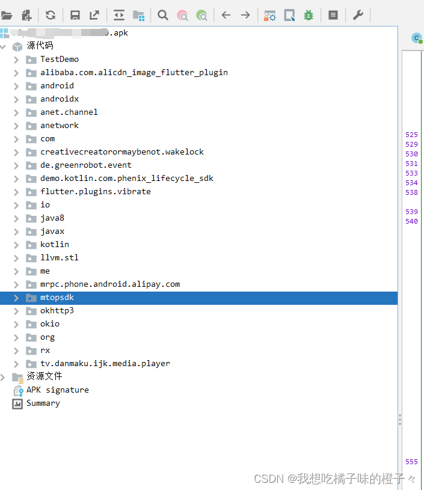
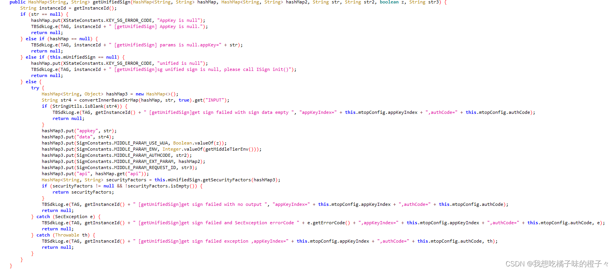
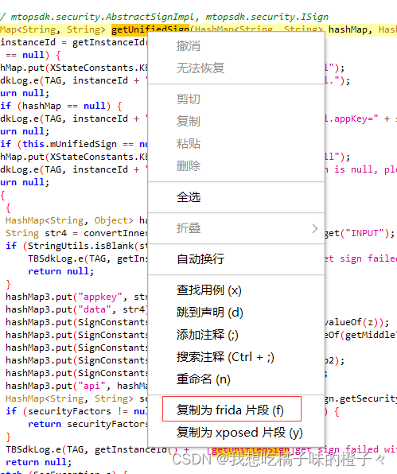
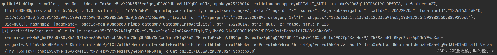
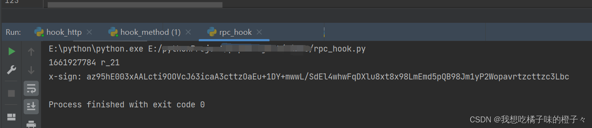
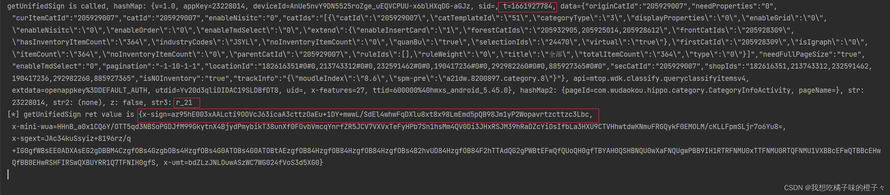
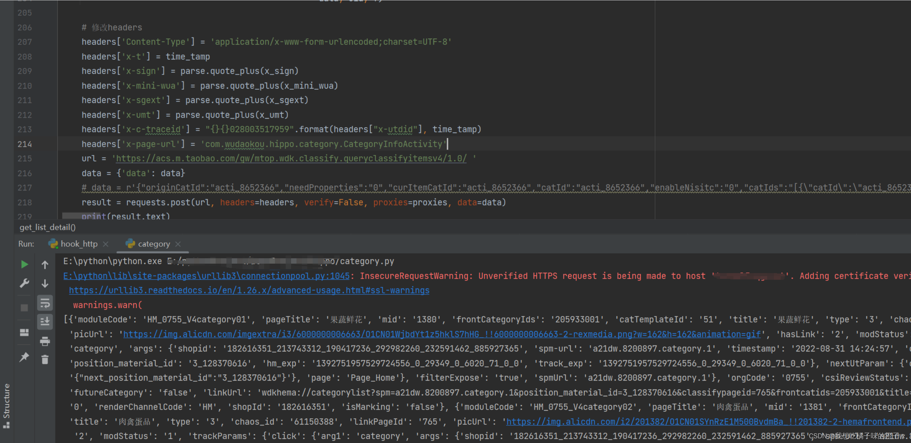
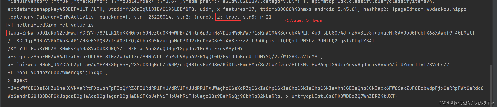

>__转载申明__
>
>文章转载自互联网，如有侵权，请联系删除
>本文仅作为学习交流，禁止用于非法用途

## 1. 背景

阿里系当前采用的加密版本是 6.3，6.2 版本的大家几乎都解决了，6.3 的网上资料很少，这里讲讲 6.3 的解密过程

1. 阿里系通用这一套加密算法，主要是 x-sign，x-sgext，x_mini_wua，x_umt 这四个加密参数，解决了其中一个 app，其他的比如淘 X，咸 X 等 app 都相差不大了，改改参数，或者替换不同的方法名称就行；
2. 使用的是 frida-rpc 主动调用的方法（对加密算法解密的话，难度很高，我没做出来）；
3. 本次做的是阿里系的某生鲜平台 app， __仅作为学习交流，禁止用于商业使用__

<!-- more -->

首先我们抓个包先，可以看到，加密版本是 6.3，加密参数还是我们常见的这四大参数
这里请求头具体分析就不说了，直接去逆向



## 2.逆向

1.查壳
第一步不用多说，不管什么 app，先查壳，查壳工具 PKID，基本上满足需求，我们运气好，HM 没做什么加壳措施，所以我们直接略过这个步骤；



如果有遇到加壳的，可以用一下几种办法

__Frida-Unpack__
firda-unpack 原理是利用 frida hook libart.so 中的 OpenMemory 方法，拿到内存中 dex 的地址，计算出 dex 文件的大小，从内存中将 dex 导出，我们可以查看项目中的 OpenMemory.js 文件中的代码更清晰直观地了解。

```
GitHub地址：https://github.com/GuoQiang1993/Frida-Apk-Unpack
```

__FRIDA-DEXDump__
葫芦娃所写，脱壳后的 dex 文件保存在 PC 端 main.py 同一目录下，以包名为文件名

```
GitHub地址：https://github.com/hluwa/FRIDA-DEXDump
```

__frida_dump__
会搜索 dex 文件并 dump 下来，保存在 data/data/packageName/files 目录下

```
GitHub地址：https://github.com/lasting-yang/frida_dump
```

__Frida_Fart[推荐]__
寒冰写的， Frida 版的 Fart, 目前只能在 andorid8 上使用该 frida 版 fart 是使用 hook 的方式实现的函数粒度的脱壳，仅仅是对类中的所有函数进行了加载，但依然可以解决绝大多数的抽取保护

```
GitHub地址：https://github.com/hanbinglengyue/FART
```

__2.反编译__
既然 app 没有做加壳措施，那我们直接上手 `jadx`。



这里反编译工具推荐使用 Android Killer，jadx，JEB，当你反编译失败的时候，去尝试另外的工具，会发现结果不同哦。__千万别仅使用一个工具；__

## 3.查找加密方法

1.在 jadx 里面直接全局搜索 x-sign 吧



我们很容易就找到这个 getUnifiedSign 函数，仔细分析函数发现是一个接口，那这个函数所在的类 mtopsdk.security.InnerSignImpl 就是我们要找的实现类。

这里教你们一个小方法，在 jadx 里面对这个 getUnifiedSign 函数直接右击，复制 frida 代码，我们函数找的对不对，直接 hook 一下就知道了



写一段调用 js 的 python 程序

```python
import frida, sys


def on_message(message, data):
    if message['type'] == 'send':

        print("[*] {0}".format(message['payload']))

    else:

        print(message)


jscode = '''
Java.perform(function(){

/**  把该部分替换为刚刚复制的内容即可**、

}
)
    '''


process = frida.get_remote_device().attach('app的包名')

script = process.create_script(jscode)

script.on('message', on_message)

script.load()
sys.stdin.read()
```

运行程序我们查看一下结果



非常 nice，我们 hook 之后查看输出，这个方法传入了哪些参数，又输出了哪些值，一目了然，x-sign 等加密值都在里面，说明我们方法找对了

## 4.调用方法

这里我们就直接用 rpc 主动调用的方法获取加密值
方法我们找到了，传入的参数我们也找到了，那用 rpc 调用也不在话下了
直接上代码

```python
import frida


def on_message(message, data):
    if message['type'] == 'send':

        print("[*] {0}".format(message['payload']))

    else:

        print(message)
def start_hook():
	jscode = '''
	    rpc.exports = {
	        para: function(a,b,c,d,e,f) {
	            var ret = {};
	            Java.perform(function() {
	                Java.choose("mtopsdk.security.InnerSignImpl",{
	                onMatch: function(instance){
	                var a= "";
	                var b= "";
	                var c = ;
	                var d = ;
	                var e = ;
	                var f = ;
	                //这些都是传入的参数，具体传参内容根据实际修改
	                var res = instance.getUnifiedSign(a, b, c, d, e, f).toString();
	                
	                //console.log('getUnifiedSign ret value is ' + res);
	                ret["result"] = res;
	                                        },
	                onComplete: function(){
	                    //console.log('******js load over*****')
	                                        }
	                                        
	                                                                 })
	                                    })
	                                    return ret;
	                                                                            }
	            };
	        '''
	process = frida.get_remote_device().attach('')

    script = process.create_script(jscode)

    script.on('message', on_message)

    script.load()
    return script


result_hook = start_hook().exports.para() # 可传参进去

```

我们现在验证一下 rpc 调用是否可行

1.首先执行 rpc 调用的代码，打印出其中的部分参数比如时间戳，以及解密后的 x-sign


2.于此同时我们查看一下前面部分我们提到的 hook 这个 getUnifiedSign 函数，去查看一下结果


我们对比一下，时间戳，x-sign 的值都是一样的，说明传入的参数正常，并能够输出加密参数

## 5.请求数据

上一步实现 frida-rpc 的调用，接下来就可去写请求数据的代码了
这个就没有什么好说的，请求头 headers 放进去，rpc 调用一下，替换加密参数，然后直接 request 请求即可。

## 6.结果


让我们看一下请求后的结果吧!
app 里面的数据可以正常的拿到了，这个 app 的逆向我们就大功告成了，有什么问题可以联系我。

## 九月四号更新 wua 加密算法

很多人问我 wua 怎么获取，还是用咱们这一套 rpc 主动调用，在传入的参数中，**有个 z 参数，需要参入 boolen 值，当传入 false 时，不返回 wua 加密参数** 如图



**当传入 true 时，返回 wua 加密参数**

有新的问题可以继续找我，谢谢！

————————————————
版权声明：本文为 CSDN 博主「我想吃橘子味的橙子々」的原创文章，遵循 CC 4.0 BY-SA 版权协议，转载请附上原文出处链接及本声明。
原文链接：https://blog.csdn.net/qq_44130722/article/details/126621134
