## 前言
最近花了几天时间把自己的博客搭出来了，觉得效果非常不错，在这里记录下搭建博客的步骤和遇到的问题以及解决方案，希望可以帮助看到这篇文章的读者少走弯路。

## 安装node.js
因为hexo是需要node环境的，所以先到[node官网](https://nodejs.org/en/)下载，我安装的版本是`v8.8.1`，安装完成后用命令行验证下。
```
node -v
npm -v
```
两个命令都正常输出版本号的话就没问题了。

## 安装hexo
1. 执行命令安装hexo命令行工具
  ```
  npm instal hexo
  ```
2. 创建一个目录blog，然后在这个目录下运行命令
  ```
  hexo init
  ```
3. 安装完毕，可以在本地开启服务看看效果，运行命令
  ```
  hexo s
  ```
  然后可以在浏览器访问[http://localhost:4000/](http://localhost:4000/)就可以看到效果了。
  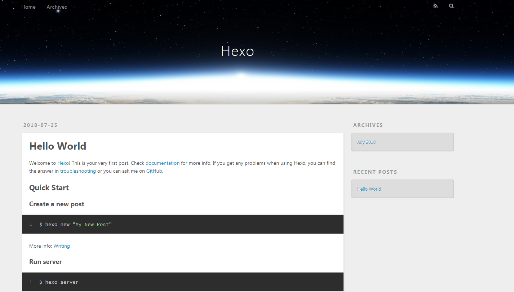

## 更换next主题
hexo是支持更换页面主题的，这里推荐使用next主题，原因是界面简洁，美观，是hexo里使用的最多的主题。我搭建博客的时候发现next的github地址已经替换到[https://github.com/theme-next/hexo-theme-next](https://github.com/theme-next/hexo-theme-next)上了，那就用最新的github地址来安装吧。
1. 在上一步创建的blog目录中执行以下命令。
  ```
  git clone https://github.com/theme-next/hexo-theme-next themes/next
  ```
2. 修改`blog/_config.yml`文件，找到`theme`，然后把值修改为`next`(**注意冒号后面要有个空格**)。
  ```
  theme: next
  ```
3. 重新部署查看效果
  ```
  #清理->构造->启动
  hexo clean && hexo g && hexo s
  ```
  然后浏览器刷新下页面可以看到页面已经变了。
  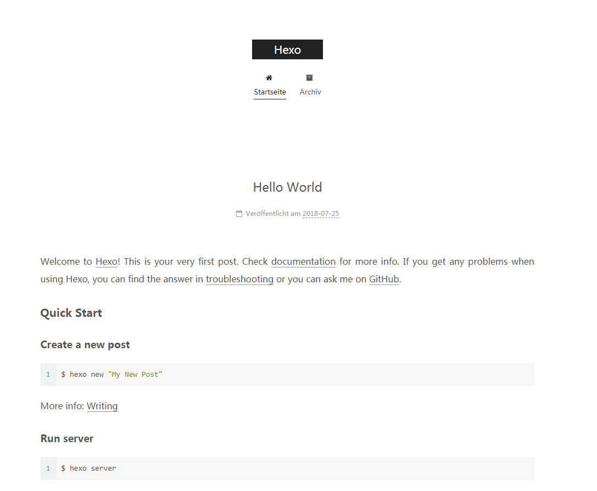

## 博客配置
1. 修改博客基础信息
  修改`blog/_config.yml`文件，找到下面这段配置并修改。
  ```
  title: 
  subtitle: 
  description: 
  keywords: 
  author: 
  language: 
  timezone:
  ```
  根据自己的情况来填写就好了，`language`可以修改为`zh-CN`表示使用中文。
2. 添加文章的字数统计和预计阅读时长
  安装统计插件，在`blog`目录执行以下命令
  ```
  npm install hexo-symbols-count-time --save
  ```
  修改`blog/_config.yml`，在最底下添加：
  ```
  symbols_count_time:
    symbols: true
    time: true
  ```
  修改`blog/themes/next/_config.yml`，找到`symbols_count_time`选项并修改：
  ```
  symbols_count_time:
    separated_meta: true
    item_text_post: true
    item_text_total: false
    awl: 2
    wpm: 300
  ```
  效果图如下
  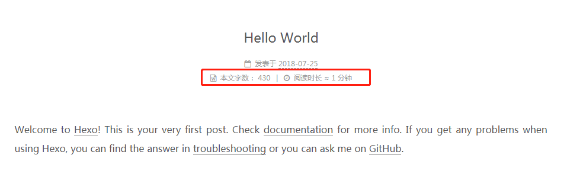
3. 添加阅读次数
  这个需要使用第三方服务，我用的是leancloud而且next本身就支持leancloud的服务。首先在[https://leancloud.cn/](https://leancloud.cn/)上注册一个账号，注册成功后登录，点击右上角的`访问控制台`。
  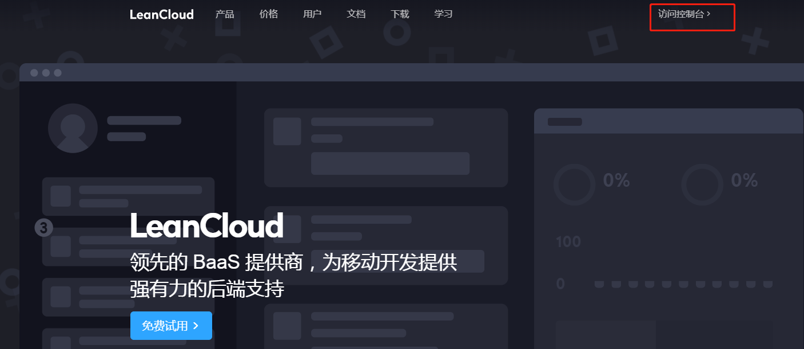
  进入控制台点击创建应用，然后选择开发版，因为开发版免费，缺点就是请求数量有限制，不过应该够用了。
  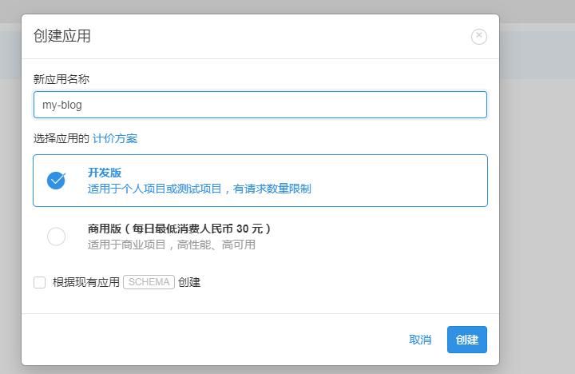
  创建完后在应用的右上角点击设置图标，在左边菜单栏应用key里找到相关的key。
  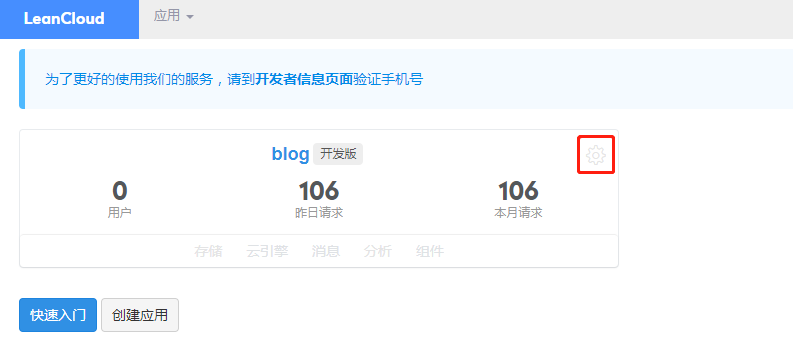
  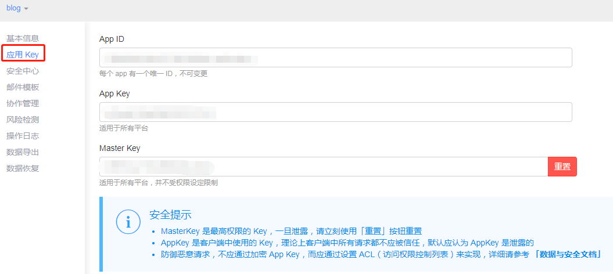
  接着把`App ID`和`App Key`填到`blog/themes/next/_config.yml`的`leancloud_visitors`选项中，配置如下：
  ```
  leancloud_visitors:
    enable: true
    app_id: 填申请的App Id
    app_key: 填申请的App Key
    # Dependencies: https://github.com/theme-next/hexo-leancloud-counter-security
    # If you don't care about security in lc counter and just want to use it directly
    # (without hexo-leancloud-counter-security plugin), set the `security` to `false`.
    security: false
    betterPerformance: false
  ```
  然后需要在应用里创建一个`class`,名称为`Counter`。
  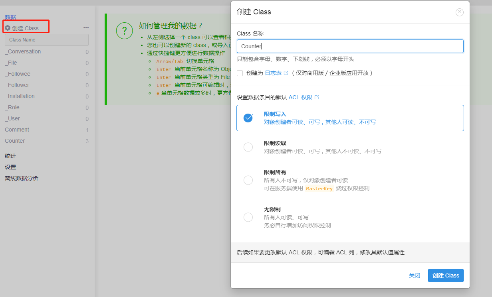
4. 添加评论系统
  有很多第三方评论系统，可以根据自己的需求来选择，这里我是用的`valine`，主要是看在`valine`可以匿名评论而且搭建起来也简单。
  `valine`是基于`leancloud`的评论系统，所以之前创建了`leancloud`的账号和应用就可以不用创建了，没创建的可以参考上一步。接着修改`blog/themes/next/_config.yml`的`valine`选项：
  ```
  valine:
    enable: true # When enable is set to be true, leancloud_visitors is recommended to be closed for the re-initialization problem within different leancloud adk version.
    appid: 填申请的App Id
    appkey: 填申请的App Key
    notify: false # mail notifier , https://github.com/xCss/Valine/wiki
    verify: false # Verification code
    placeholder: 请输入评论 # comment box placeholder
    avatar: mm # gravatar style
    guest_info: nick,mail,link # custom comment header
    pageSize: 10 # pagination size
    visitor: true # leancloud-counter-security is not supported for now. When visitor is set to be true, appid and appkey are recommended to be the same as leancloud_visitors' for counter compatibility. Article reading statistic https://valine.js.org/visitor.html
  ```
  *注1：`valine`里的appid和appkey中间没有下划线*
  *注2：如果同时开启了`leancloud_visitors`和`valine`，会在加载的时候出现冲突，因为都会初始化`leancloud`的脚本对象，如果要同时使用的话需要把`leancloud_visitors`选项里的`enable`设置为`false`，只需要把`valine`选项里的`visitor`设置成`true`就可以同时使用了。*  
  然后需要在应用里创建一个`class`,名称为`Comment`。
  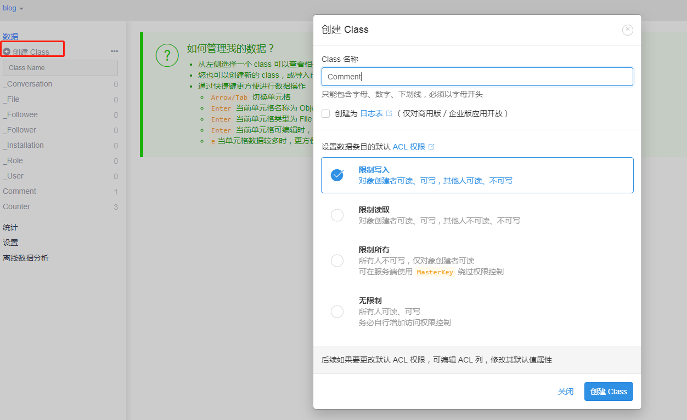
  重启并刷新浏览器查看效果：
  ```
  hexo clean && hexo g && hexo s
  ```
  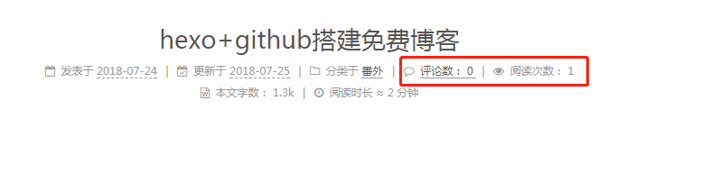
  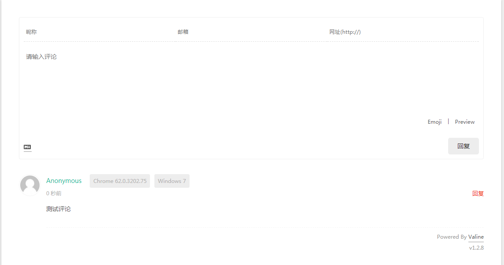

## 编写博客
  