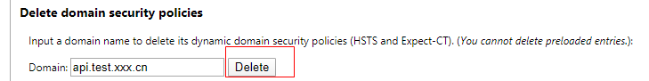

## HSTS 简介

HSTS(HTTP Strict Transport Security)是一套由互联网工程任务组发布的互联网安全策略机制。网站可以选择使用 HSTS 策略，来让浏览器强制使用 HTTPS 与网站进行通信，以减少会话劫持风险。

## 背景

有时候由于某些开发的需要，想访问 http 协议的接口，但是由于 HSTS 的机制，浏览器一直会强制跳转到 https，没办法调试，所以得把 HSTS 记录清除掉。

## 清除步骤

1. 浏览器访问`chrome://net-internals/#hsts`
2. 找到`Delete domain security policies`选项，输入对应的域名点击删除即可
