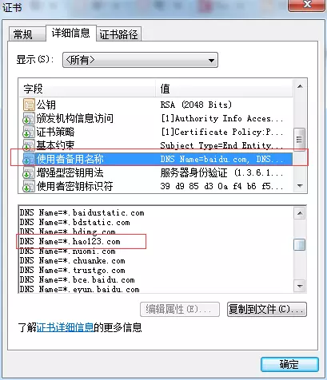
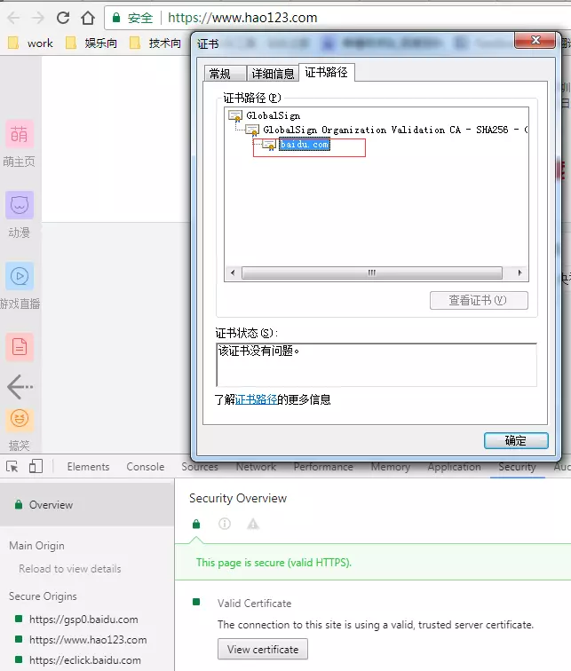
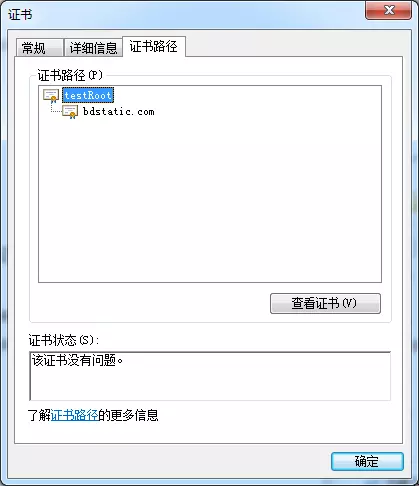
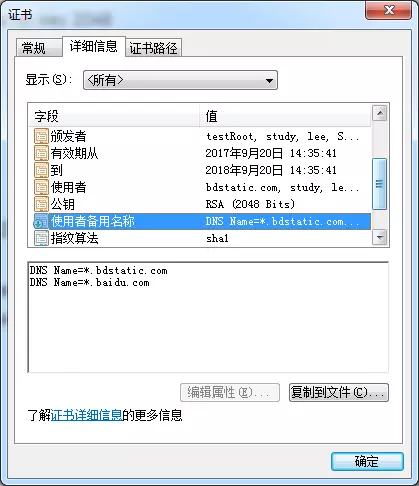
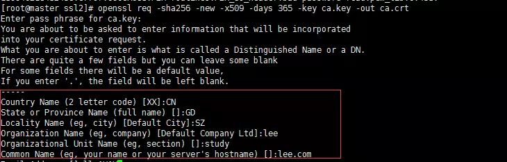
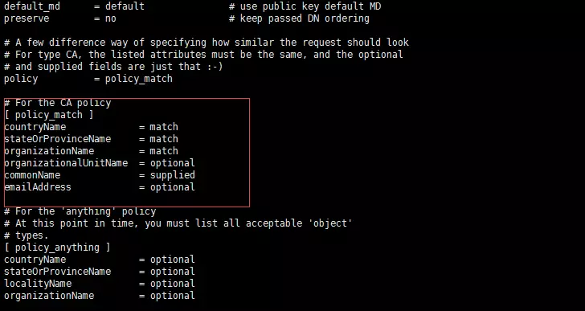

## 什么是 SAN[](http://liaoph.com/openssl-san/#什么是-san)

SAN(Subject Alternative Name) 是 SSL 标准 x509 中定义的一个扩展。使用了 SAN 字段的 SSL 证书，可以扩展此证书支持的域名，使得一个证书可以支持多个不同域名的解析。

<!--more-->

来看看百度的证书，百度证书的扩展域名有这么多，其中还有了\*.hao123.com，那我们再看看 www.hao123.com 的证书

发现的确是用的前面的百度证书


所以 SAN 带来的好处就可以看出来了，一个证书可以用在各种不同的域名下，不需要一个域名买一个证书了。

## 利用 OpenSSL 创建证书

因为是本地环境，直接用 OpenSSL 给自己颁发一个 CA 根证书用于后面给服务器做 CA 签署。

1. 生成 CA 密钥

```
openssl genrsa -des3 -out ca.key 2048
```

2. 生成 CA 根证书

```
openssl req -sha256 -new -x509 -days 365 -key ca.key -out ca.crt \
    -subj "/C=CN/ST=GD/L=SZ/O=lee/OU=study/CN=testRoot"
```

3. 生成服务器密钥

```
openssl genrsa -des3 -out server.key 2048
```

4. 生成服务器证书请求文件

```
openssl req -new \
    -sha256 \
    -key server.key \
    -subj "/C=CN/ST=GD/L=SZ/O=lee/OU=study/CN=bdstatic.com" \
    -reqexts SAN \
    -config <(cat /etc/pki/tls/openssl.cnf \
        <(printf "[SAN]\nsubjectAltName=DNS:*.bdstatic.com,DNS:*.baidu.com")) \
    -out server.csr
```

5. CA 签署服务器证书

```
openssl ca -in server.csr \
        -md sha256 \
        -keyfile ca.key \
	-cert ca.crt \
	-extensions SAN \
	-config <(cat /etc/pki/tls/openssl.cnf \
        <(printf "[SAN]\nsubjectAltName=DNS:*.bdstatic.com,DNS:*.baidu.com")) \
	-out server.crt
```

之后把生成好的服务器证书和服务器密钥在服务器(ngnix,tomcat)里配置好，并且把 ca.crt 证书导入到浏览器的受信任的根证书颁发机构里，在浏览器访问就不会有红叉叉了。





## 注意事项

1. -subj "/C=CN/ST=GD/L=SZ/O=lee/OU=study/CN=testRoot"这行可以不要，会有命令交互填写相关信息。
   

2. 哈希算法不要使用 sha1,因为 Chrome 浏览器下会提示不安全，上面都是用的 sha256。
3. /etc/pki/tls/openssl.cnf 文件是缺省的 OpenSSL 配置文件，可能环境不同路径也不同。
4. 服务器证书请求文件的国家，省，市要和 CA 证书一致,这个在 openssl.cnf 默认配置中指定了，可以修改。
   

5. 关于私钥的加密格式，因为笔者是在 netty 里使用的 ssl 协议，而 netty 仅支持 PKCS8 格式的私钥(见http://netty.io/wiki/sslcontextbuilder-and-private-key.html)，需要对密钥格式进行转换

```
openssl pkcs8 -topk8 -nocrypt -in server.key -out server.pem
```

代码如下

```
SslContext serverSslCtx = SslContextBuilder.forServer(new File("E:/server.crt"),new File("E:/server.pem")).build();
```

## 常见错误

1. 遇到`unable to open '/etc/pki/CA/index.txt'`解决办法：

   ```shell
   touch /etc/pki/CA/index.txt
   ```

2. 遇到`error while loading serial number`解决办法：

   ```shell
   touch /etc/pki/CA/serial
   echo 00 > /etc/pki/CA/serial
   ```

## 参考

[OpenSSL SAN 证书](http://liaoph.com/openssl-san/)
[使用 OpenSSL 生成多域名自签名证书进行 HTTPS 开发调试](https://zhuanlan.zhihu.com/p/26646377)
