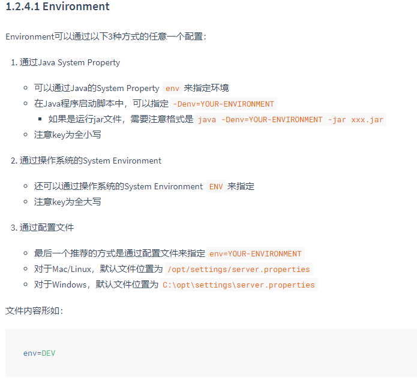
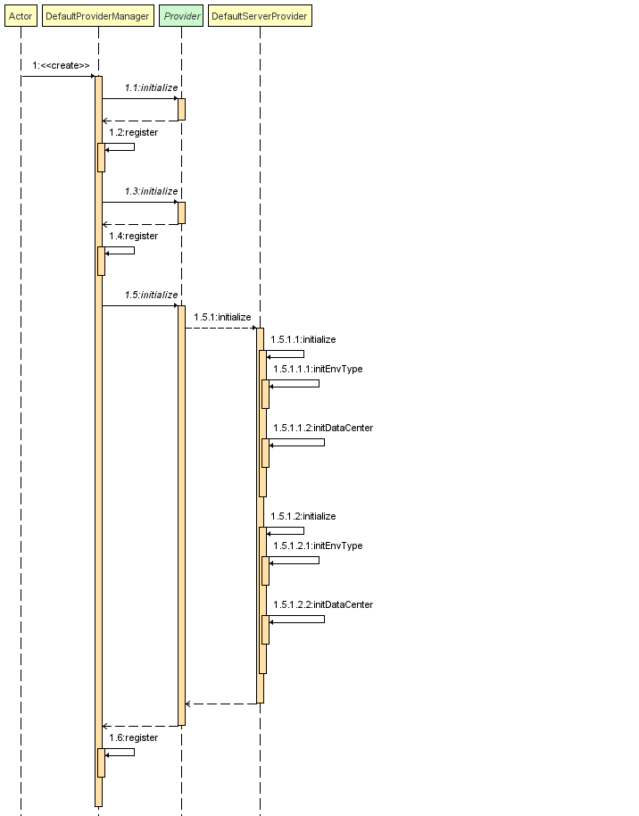
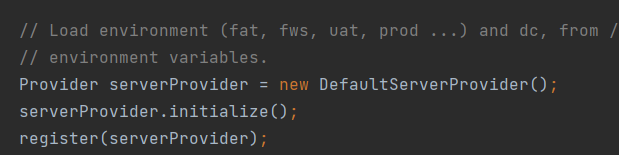
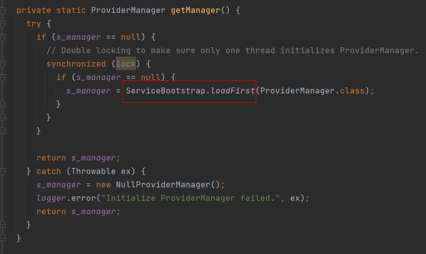

## 前言

最近公司项目要接入配置中心，后来调研下来决定使用`apollo`，但是在使用的时候发现有
个小细节特别难受，`apollo`不支持通过项目代码配置默认的`environment`：

<!--more-->



这样会导致代码拉下来不能直接启动服务，还需要通过上面的三种方式之一来指定`environment`，非常的麻烦。

## 进行魔改

我想着是能不能项目代码的配置文件里配置一个默认的`environment`，这样在没有外部指定`environment`的情况下就默认使用配置文件里的。

通过跟踪[源码](https://github.com/ctripcorp/apollo/blob/891010618214b8e826b3c124f5572988135ade58/apollo-core/src/main/java/com/ctrip/framework/foundation/internals/provider/DefaultServerProvider.java#L149-L177)可以看到加载`environment`是通过`DefaultServerProvider类的initialize方法`进行加载的，然后通过`DefaultProviderManager类中的register方法`进行注册，时序图：



本来理论上来说魔改`DefaultServerProvider`这个类就可以实现目的了，然而这源码里没有为接口`ServerProvider`实现`SPI机制`，是直接`new`出来的：



那么只能从`DefaultProviderManager`类进行入手了，这个接口是通过`SPI机制`去加载的实现类：



现在唯一的入口点就是`register`方法了，通过这个方法可以把注册的`DefaultServerProvider`魔改掉，这个时候设计模式就派上用场了，我直接进行一个`装饰器模式`的秀：

```java
public class HookServerProviderManager extends DefaultProviderManager {

    @Override
    public synchronized void register(Provider provider) {
        // 如果是注册DefaultServerProvider的时候替换成装饰之后的类
        if (provider instanceof DefaultServerProvider) {
            super.register(new DefaultServerProviderWrapper((DefaultServerProvider) provider));
        } else {
            super.register(provider);
        }
    }
}
```

```java
public class DefaultServerProviderWrapper implements ServerProvider {

    private DefaultServerProvider serverProvider;

    private String defaultEnv;

    public DefaultServerProviderWrapper(DefaultServerProvider serverProvider) {
        this.serverProvider = serverProvider;

        // 如果没有读取到环境变量，则加载META-INF/app.properties文件中的default.env变量
        if (serverProvider.getEnvType() == null) {
            Properties prop = new Properties();
            try (InputStream inputStream = Thread.currentThread().getContextClassLoader()
                    .getResourceAsStream(DefaultApplicationProvider.APP_PROPERTIES_CLASSPATH.substring(1))) {
                prop.load(inputStream);
                this.defaultEnv = prop.getProperty("default.env");
            } catch (Exception e) {
                log.warn("load app.properties fail", e);
            }
        }
    }

    @Override
    public String getEnvType() {
        String originEnv = serverProvider.getEnvType();
        return originEnv != null ? originEnv : defaultEnv;
    }

    @Override
    public boolean isEnvTypeSet() {
        return getEnvType() != null;
    }

    @Override
    public String getDataCenter() {
        return serverProvider.getDataCenter();
    }

    @Override
    public boolean isDataCenterSet() {
        return serverProvider.isDataCenterSet();
    }

    @Override
    public void initialize(InputStream in) throws IOException {
        serverProvider.initialize(in);
    }

    @Override
    public Class<? extends Provider> getType() {
        return serverProvider.getType();
    }

    @Override
    public String getProperty(String name, String defaultValue) {
        return serverProvider.getProperty(name, defaultValue);
    }

    @Override
    public void initialize() {
        serverProvider.initialize();
    }
}
```

代码写好之后，按 SPI 的规范在`META-INF/services`下新建文件`com.ctrip.framework.foundation.spi.ProviderManager`，把刚刚的`HookServerProviderManager`类路径填入即可。

这样的话如果没有读到`environment`的话就会去读取`META-INF/app.propertie`的`default.env`配置。

## 吐槽

这个应该是一个很常见的需求，不知道为啥阿波罗竟然不支持，也有可能是我的使用方式不对吧，PR 就懒得提了，毕竟不是一定要改源码才能实现。
