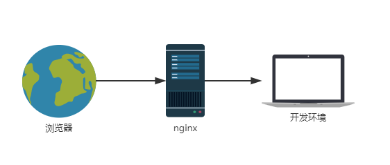
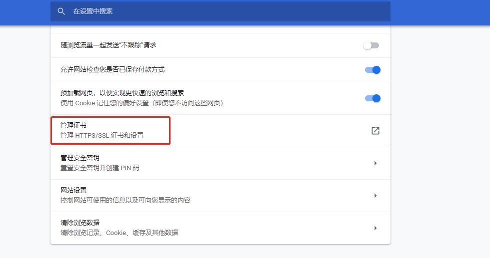
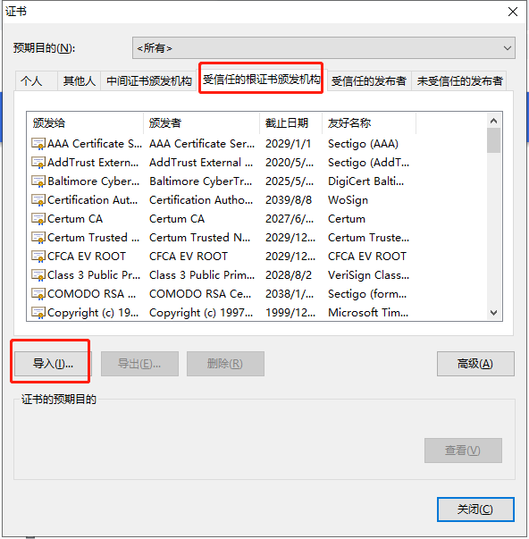
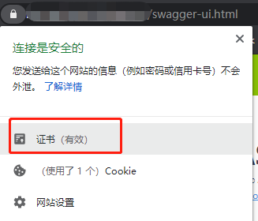
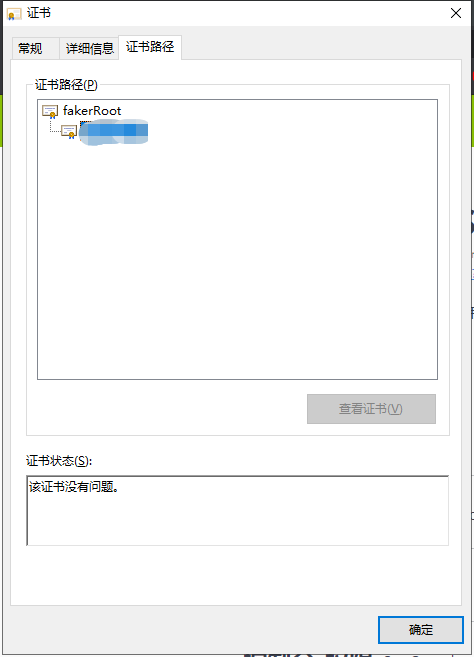

## 背景

现在公司项目都是前后端分离的方式开发，有些时候由于某些新需求开发或者 bug 修改，想要让前端直接连到我本地开发环境进行调试，而前端代码我并没有，只能通过前端部署的测试环境进行测试，最简单的办法就是直接改 host 把后端测试环境的域名指向我本地的 IP，这对于 HTTP 协议的服务来说是很轻易做到的，不过公司的测试环境全部上了 HTTPS，而我本地的服务是 HTTP 协议这样就算是改了 host 也会由于协议不同导致请求失败，所以需要将本地的服务升级成 HTTPS 才行。

<!-- more -->

## 方案

其实 springboot 本身就支持 HTTPS([howto-configure-ssl](https://docs.spring.io/spring-boot/docs/2.2.2.RELEASE/reference/html/howto.html#howto-configure-ssl))，但是这需要改项目代码不太优雅，于是就想直接用`nginx`反向代理到本地服务，这样在`nginx`层面做 HTTPS 就不需要改代码了，只需修改 host 将`后端测试环境域名`指向 `nginx` 服务的 IP 即可，而且可以适用于其它的 HTTP 服务开发调试。



### 签发证书

首先要生成一套证书用于 nginx 的 ssl 配置，直接使用`openssl`工具生成一套`根证书`和对应的`服务证书`。
> 注意将命令行中的`xxx.com`替换成真实的域名。

1. 根证书生成

```sh
# 生成一个RSA私钥
openssl genrsa -out root.key 2048
# 通过私钥生成一个根证书
openssl req -sha256 -new -x509 -days 365 -key root.key -out root.crt \
    -subj "/C=CN/ST=GD/L=SZ/O=lee/OU=work/CN=fakerRoot"
```

2. 服务器证书生成

```sh
# 生成一个RSA私钥
openssl genrsa -out server.key 2048
# 生成一个带SAN扩展的证书签名请求文件
openssl req -new \
    -sha256 \
    -key server.key \
    -subj "/C=CN/ST=GD/L=SZ/O=lee/OU=work/CN=xxx.com" \
    -reqexts SAN \
    -config <(cat /etc/pki/tls/openssl.cnf \
        <(printf "[SAN]\nsubjectAltName=DNS:*.xxx.com,DNS:*.test.xxx.com")) \
    -out server.csr
# 使用之前生成的根证书做签发
openssl ca -in server.csr \
    -md sha256 \
    -keyfile root.key \
    -cert root.crt \
    -extensions SAN \
    -config <(cat /etc/pki/tls/openssl.cnf \
        <(printf "[SAN]\nsubjectAltName=DNS:xxx.com,DNS:*.test.xxx.com")) \
    -out server.crt
```

如果上面步骤发送错误，可以[参考](https://monkeywie.github.io/2019/11/15/create-ssl-cert-with-san/#%E5%B8%B8%E8%A7%81%E9%94%99%E8%AF%AF)常见错误解决办法，成功之后就得到了三个关键文件：

- `root.crt`:根证书
- `server.key`:服务证书私钥
- `server.crt`:服务证书

> 注：生成的服务器证书域名要支持测试环境访问的域名，否则浏览器会提示证书不安全。

### nginx 配置

为了方便，直接使用`docker`启动了一个 nginx 容器进行访问，并将证书和配置文件挂载到对应的目录：

- nginx.conf

```
server {
    listen 443 ssl;
    server_name _;
    ssl_certificate "/usr/local/nginx/ssl/server.crt";
    ssl_certificate_key "/usr/local/nginx/ssl/server.key";
    location / {
        proxy_set_header X-Real-IP $remote_addr;
        proxy_set_header X-Forwarded-For $proxy_add_x_forwarded_for;
        proxy_set_header X-Forwarded-Proto $scheme;
        proxy_set_header Host $http_host;
        proxy_set_header X-NginX-Proxy true;
        proxy_set_header Upgrade $http_upgrade;
        proxy_set_header Connection "upgrade";
        proxy_pass http://127.0.0.1:3000;
        proxy_redirect off;
        proxy_http_version 1.1;
    }
}
```

通过配置`ssl_certificate`和`ssl_certificate_key`来指定服务器的证书和私钥，`proxy_pass`指定开发环境的访问地址。

- 启动

```sh
docker run -d --name https -p 443:443 -v ~/forword/ssl:/usr/local/nginx/ssl -v ~/forword/config/nginx.conf:/etc/nginx/conf.d/default.conf  nginx
```

将 nginx 配置和证书相关文件挂载至对应的目录，并暴露 443 端口，这样服务启动后即可通过 https 访问到本地开发环境了。

### 安装根证书

由于服务证书是自己签发的，并不会被浏览器所信任，所以需要将`根证书`安装至操作系统中。

1. 打开 chrome 浏览器->设置->高级->管理证书
   

2. 受信任的根证书颁发机构->导入
   

3. 选择之前生成的根证书`root.crt`导入即可

### 修改 host

在需要调试时，只需要将本地服务启动，再将 host 中将要测试的域名解析到`nginx`服务器的 IP，即可将前端请求转发到开发环境上，通过浏览器地址栏的`小锁图标`可以看到证书，已验证服务已经部署成功。





## 后记

本文中其实已经提到了两种解决方案了，其实还有其它的解决方案，例如使用`fidder`这种中间人攻击的方式来实现，这里就不做多叙了。
