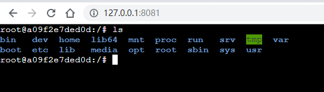
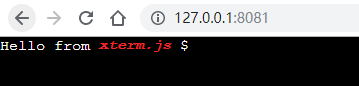

## 前言

在公司内部使用 Jenkins 做 CI/CD 时，经常会碰到项目构建失败的情况，一般情况下通过 Jenkins 的构建控制台输出都可以了解到大概发生的问题，但是有些特殊情况开发需要在 Jenkins 服务器上排查问题，这个时候就只能找运维去调试了，为了开发人员的体验就调研了下 web terminal，能够在构建失败时提供容器终端给开发进行问题的排查。

## 效果展示


支持颜色高亮，支持<kbd>tab</kbd>键补全，支持复制粘贴，体验基本上与平常的 terminal 一致。

<!-- more -->

## 基于 docker 的 web terminal 实现

### docker exec 调用

首先想到的就是通过`docker exec -it ubuntu /bin/bash`命令来开启一个终端，然后将标准输入和输出通过 `websocket` 与前端进行交互。

然后发现 docker 有提供 API 和 [SDK](https://docs.docker.com/develop/sdk/) 进行开发的，通过 `Go SDK`可以很方便的在 docker 里创建一个终端进程:

- 安装 sdk

```go
go get -u github.com/docker/docker/client@8c8457b0f2f8
```

这个项目新打的 tag 没有遵循 go mod server 语义，所以如果直接`go get -u github.com/docker/docker/client`默认安装的是 2017 年的打的一个 tag 版本，这里我直接在 master 分支上找了一个 commit ID，具体原因参考[issue](https://github.com/moby/moby/issues/39056)

- 调用 exec

```go
package main

import (
	"bufio"
	"context"
	"fmt"
	"github.com/docker/docker/api/types"
	"github.com/docker/docker/client"
)

func main() {
	// 初始化 go sdk
	ctx := context.Background()
	cli, err := client.NewClientWithOpts(client.FromEnv)
	if err != nil {
		panic(err)
	}

	cli.NegotiateAPIVersion(ctx)

	// 在指定容器中执行/bin/bash命令
	ir, err := cli.ContainerExecCreate(ctx, "test", types.ExecConfig{
		AttachStdin:  true,
		AttachStdout: true,
		AttachStderr: true,
		Cmd:          []string{"/bin/bash"},
		Tty:          true,
	})
	if err != nil {
		panic(err)
	}

	// 附加到上面创建的/bin/bash进程中
	hr, err := cli.ContainerExecAttach(ctx, ir.ID, types.ExecStartCheck{Detach: false, Tty: true})
	if err != nil {
		panic(err)
	}
	// 关闭I/O
	defer hr.Close()
	// 输入
	hr.Conn.Write([]byte("ls\r"))
	// 输出
	scanner := bufio.NewScanner(hr.Conn)
	for scanner.Scan() {
		fmt.Println(scanner.Text())
	}
}
```

这个时候 docker 的终端的输入输出已经可以拿到了，接下来要通过 websocket 来和前端进行交互。

### 前端页面

当我们在 linux terminal 上敲下`ls`命令时，看到的是：

```shell
root@a09f2e7ded0d:/# ls
bin   dev  home  lib64  mnt  proc  run   srv  tmp  var
boot  etc  lib   media  opt  root  sbin  sys  usr
```

实际上从标准输出里返回的字符串却是：

```shell
bin   dev  home  lib64  mnt  proc  run   srv  tmp  var
boot  etc  lib   media  opt  root  sbin  sys  usr
```

对于这种情况，已经有了一个叫`xterm.js`的库，专门用来模拟 Terminal 的，我们需要通过这个库来做终端的显示。

```js
var term = new Terminal();
term.open(document.getElementById("terminal"));
term.write("Hello from \x1B[1;3;31mxterm.js\x1B[0m $ ");
```

通过官方的例子，可以看到它会将特殊字符做对应的显示：


这样的话只需要在 websocket 连上服务器时，将获取到的终端输出使用`term.write()`写出来，再把前端的输入作为终端的输入就可以实现我们需要的功能了。

思路是没错的，但是没必要手写，`xterm.js`已经提供了一个 websocket 插件就是来做这个事的，我们只需要把标准输入和输出的内容通过 websocket 传输就可以了。

- 安装 xterm.js

```
npm install xterm
```

- 基于 vue 写的前端页面

```js
<template>
  <div ref="terminal"></div>
</template>

<script>
// 引入css
import "xterm/dist/xterm.css";
import "xterm/dist/addons/fullscreen/fullscreen.css";

import { Terminal } from "xterm";
// 自适应插件
import * as fit from "xterm/lib/addons/fit/fit";
// 全屏插件
import * as fullscreen from "xterm/lib/addons/fullscreen/fullscreen";
// web链接插件
import * as webLinks from "xterm/lib/addons/webLinks/webLinks";
// websocket插件
import * as attach from "xterm/lib/addons/attach/attach";

export default {
  name: "Index",
  created() {
    // 安装插件
    Terminal.applyAddon(attach);
    Terminal.applyAddon(fit);
    Terminal.applyAddon(fullscreen);
    Terminal.applyAddon(webLinks);

    // 初始化终端
    const terminal = new Terminal();
    // 打开websocket
    const ws = new WebSocket("ws://127.0.0.1:8000/terminal?container=test");
    // 绑定到dom上
    terminal.open(this.$refs.terminal);
    // 加载插件
    terminal.fit();
    terminal.toggleFullScreen();
    terminal.webLinksInit();
    terminal.attach(ws);
  }
};
</script>
```

### 后端 websocket 支持

在 go 的标准库中是没有提供 websocket 模块的，这里我们使用官方钦点的 websocket 库。

```go
go get -u github.com/gorilla/websocket
```

核心代码如下：

```go
// websocket握手配置，忽略Origin检测
var upgrader = websocket.Upgrader{
	CheckOrigin: func(r *http.Request) bool {
		return true
	},
}

func terminal(w http.ResponseWriter, r *http.Request) {
	// websocket握手
	conn, err := upgrader.Upgrade(w, r, nil)
	if err != nil {
		log.Error(err)
		return
	}
	defer conn.Close()

	r.ParseForm()
	// 获取容器ID或name
	container := r.Form.Get("container")
	// 执行exec，获取到容器终端的连接
	hr, err := exec(container)
	if err != nil {
		log.Error(err)
		return
	}
	// 关闭I/O流
	defer hr.Close()
	// 退出进程
	defer func() {
		hr.Conn.Write([]byte("exit\r"))
	}()

	// 转发输入/输出至websocket
	go func() {
		wsWriterCopy(hr.Conn, conn)
	}()
	wsReaderCopy(conn, hr.Conn)
}

func exec(container string) (hr types.HijackedResponse, err error) {
	// 执行/bin/bash命令
	ir, err := cli.ContainerExecCreate(ctx, container, types.ExecConfig{
		AttachStdin:  true,
		AttachStdout: true,
		AttachStderr: true,
		Cmd:          []string{"/bin/bash"},
		Tty:          true,
	})
	if err != nil {
		return
	}

	// 附加到上面创建的/bin/bash进程中
	hr, err = cli.ContainerExecAttach(ctx, ir.ID, types.ExecStartCheck{Detach: false, Tty: true})
	if err != nil {
		return
	}
	return
}

// 将终端的输出转发到前端
func wsWriterCopy(reader io.Reader, writer *websocket.Conn) {
	buf := make([]byte, 8192)
	for {
		nr, err := reader.Read(buf)
		if nr > 0 {
			err := writer.WriteMessage(websocket.BinaryMessage, buf[0:nr])
			if err != nil {
				return
			}
		}
		if err != nil {
			return
		}
	}
}

// 将前端的输入转发到终端
func wsReaderCopy(reader *websocket.Conn, writer io.Writer) {
	for {
		messageType, p, err := reader.ReadMessage()
		if err != nil {
			return
		}
		if messageType == websocket.TextMessage {
			writer.Write(p)
		}
	}
}
```

## 总结

以上就完成了一个简单的 docker web terminal 功能，之后只需要通过前端传递`container ID`或`container name`就可以打开指定的容器进行交互了。

完整代码：https://github.com/monkeyWie/docker-web-terminal
