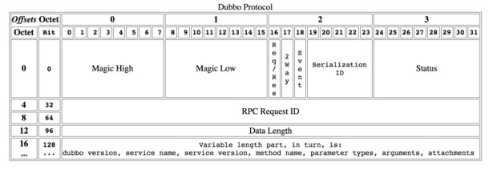

## 背景

由于公司内部所有服务都是跑在阿里云 k8s 上的，然后 dubbo 提供者默认向注册中心上报的 IP 都是`Pod IP`，这意味着在 k8s 集群外的网络环境是调用不了 dubbo 服务的，如果本地开发需要访问 k8s 内的 dubbo 提供者服务的话，需要手动把服务暴露到外网，我们的做法是针对每一个提供者服务暴露一个`SLB IP+自定义端口`，并且通过 dubbo 提供的`DUBBO_IP_TO_REGISTRY`和`DUBBO_PORT_TO_REGISTRY`环境变量来把对应的`SLB IP+自定义端口`注册到注册中心里，这样就实现了本地网络和 k8s dubbo 服务的打通，但是这种方式管理起来非常麻烦，每个服务都得自定义一个端口，而且每个服务之间端口还不能冲突，当服务多起来之后非常难以管理。

于是我就在想能不能像`nginx ingress`一样实现一个`七层代理+虚拟域名`来复用一个端口，通过目标 dubbo 提供者的`application.name`来做对应的转发，这样的话所有的服务只需要注册同一个`SLB IP+端口`就可以了，大大的提升便利性，一方调研之后发现可行就开撸了！

> 项目已开源：[https://github.com/monkeyWie/dubbo-ingress-controller](https://github.com/monkeyWie/dubbo-ingress-controller)

<!-- more -->

## 技术预研

### 思路

1. 首先 dubbo RPC 调用默认是走的`dubbo协议`，所以我需要先去看看协议里有没有可以利用做转发的报文信息，就是寻找类似于 HTTP 协议里的 Host 请求头，如果有的话就可以根据此信息做`反向代理`和`虚拟域名`的转发，在此基础之上实现一个类似`nginx`的`dubbo网关`。
2. 第二步就是要实现`dubbo ingress controller`，通过 k8s ingress 的 watcher 机制动态的更新`dubbo 网关`的虚拟域名转发配置，然后所有的提供者服务都由此服务同一转发，并且上报到注册中心的地址也统一为此服务的地址。

### 架构图


### dubbo 协议

先上一个官方的协议图：



可以看到 dubbo 协议的 header 是固定的`16个字节`，里面并没有类似于 HTTP Header 的可扩展字段，也没有携带目标提供者的`application.name`字段，于是我向官方提了个[issue](https://github.com/apache/dubbo/issues/9251)，官方的答复是通过消费者`自定义Filter`来将目标提供者的`application.name`放到`attachments`里，这里不得不吐槽下 dubbo 协议，扩展字段竟然是放在`body`里，如果要实现转发需要把请求报文全部解析完才能拿到想要报文，不过问题不大，因为主要是做给开发环境用的，这一步勉强可以实现。

### k8s ingress

k8s ingress 是为 HTTP 而生的，但是里面的字段够用了，来看一段 ingress 配置：

```yaml
apiVersion: extensions/v1beta1
kind: Ingress
metadata:
  name: user-rpc-dubbo
  annotations:
    kubernetes.io/ingress.class: "dubbo"
spec:
  rules:
    - host: user-rpc
      http:
        paths:
          - backend:
              serviceName: user-rpc
              servicePort: 20880
            path: /
```

配置和 http 一样通过`host`来做转发规则，但是`host`配置的是目标提供者的`application.name`，后端服务是目标提供者对应的`service`，这里有一个比较特殊的是使用了一个`kubernetes.io/ingress.class`注解，这个注解可以指定此`ingress`对哪个`ingress controller`生效，后面我们的`dubbo ingress controller`就只会解析注解值为`dubbo`的 ingress 配置。

## 开发

前面的技术预研一切顺利，接着就进入开发阶段了。

### 消费者自定义 Filter

前面有提到如果请求里要携带目标提供者的`application.name`，需要消费者`自定义Filter`，代码如下：

```java
@Activate(group = CONSUMER)
public class AddTargetFilter implements Filter {

  @Override
  public Result invoke(Invoker<?> invoker, Invocation invocation) throws RpcException {
    String targetApplication = StringUtils.isBlank(invoker.getUrl().getRemoteApplication()) ?
        invoker.getUrl().getGroup() : invoker.getUrl().getRemoteApplication();
    // 目标提供者的application.name放入attachment
    invocation.setAttachment("target-application", targetApplication);
    return invoker.invoke(invocation);
  }
}
```

这里又要吐槽一下，dubbo 消费者首次访问时会发起一个获取 metadata 的请求，这个请求通过`invoker.getUrl().getRemoteApplication()`是拿不到值的，通过`invoker.getUrl().getGroup()`才能拿到。

### dubbo 网关

这里就要开发一个类似`nginx`的`dubbo网关`，并实现七层代理和虚拟域名转发，编程语言直接选择了 go，首先 go 做网络开发心智负担低，另外有个 dubbo-go 项目，可以直接利用里面的解码器，然后 go 有原生的 k8s sdk 支持，简直完美！

思路就是开启一个`TCP Server`，然后解析 dubbo 请求的报文，把`attachment`里的`target-application`属性拿到，再反向代理到真正的 dubbo 提供者服务上，核心代码如下：

```go
routingTable := map[string]string{
  "user-rpc": "user-rpc:20880",
  "pay-rpc":  "pay-rpc:20880",
}

listener, err := net.Listen("tcp", ":20880")
if err != nil {
  return err
}
for {
  clientConn, err := listener.Accept()
  if err != nil {
    logger.Errorf("accept error:%v", err)
    continue
  }
  go func() {
    defer clientConn.Close()
    var proxyConn net.Conn
    defer func() {
      if proxyConn != nil {
        proxyConn.Close()
      }
    }()
    scanner := bufio.NewScanner(clientConn)
    scanner.Split(split)
    // 解析请求报文，拿到一个完整的请求
    for scanner.Scan() {
      data := scanner.Bytes()
      // 通过dubbo-go提供的库把[]byte反序列化成dubbo请求结构体
      buf := bytes.NewBuffer(data)
      pkg := impl.NewDubboPackage(buf)
      pkg.Unmarshal()
      body := pkg.Body.(map[string]interface{})
      attachments := body["attachments"].(map[string]interface{})
      // 从attachments里拿到目标提供者的application.name
      target := attachments["target-application"].(string)
      if proxyConn == nil {
        // 反向代理到真正的后端服务上
        host := routingTable[target]
        proxyConn, _ = net.Dial("tcp", host)
        go func() {
          // 原始转发
          io.Copy(clientConn, proxyConn)
        }()
      }
      // 把原始报文写到真正后端服务上，然后走原始转发即可
      proxyConn.Write(data)
    }
  }()
}

func split(data []byte, atEOF bool) (advance int, token []byte, err error) {
	if atEOF && len(data) == 0 {
		return 0, nil, nil
	}

	buf := bytes.NewBuffer(data)
	pkg := impl.NewDubboPackage(buf)
	err = pkg.ReadHeader()
	if err != nil {
		if errors.Is(err, hessian.ErrHeaderNotEnough) || errors.Is(err, hessian.ErrBodyNotEnough) {
			return 0, nil, nil
		}
		return 0, nil, err
	}
	if !pkg.IsRequest() {
		return 0, nil, errors.New("not request")
	}
	requestLen := impl.HEADER_LENGTH + pkg.Header.BodyLen
	if len(data) < requestLen {
		return 0, nil, nil
	}
	return requestLen, data[0:requestLen], nil
}
```

### dubbo ingress controller 实现

前面已经实现了一个`dubbo网关`，但是里面的虚拟域名转发配置(`routingTable`)还是写死在代码里的，现在要做的就是当检测到`k8s ingress`有更新时，动态的更新这个配置就可以了。

首先先简单的说明下`ingress controller`的原理，拿我们常用的`nginx ingress controller`为例，它也是一样通过监听`k8s ingress`资源变动，然后动态的生成`nginx.conf`文件，当发现配置发生了改变时，触发`nginx -s reload`重新加载配置文件。

里面用到的核心技术就是[informers](https://github.com/kubernetes/client-go/tree/master/informers)，利用它来监听`k8s资源`的变动，示例代码：

```go
// 在集群内获取k8s访问配置
cfg, err := rest.InClusterConfig()
if err != nil {
  logger.Fatal(err)
}
// 创建k8s sdk client实例
client, err := kubernetes.NewForConfig(cfg)
if err != nil {
  logger.Fatal(err)
}
// 创建Informer工厂
factory := informers.NewSharedInformerFactory(client, time.Minute)
handler := cache.ResourceEventHandlerFuncs{
  AddFunc: func(obj interface{}) {
    // 新增事件
  },
  UpdateFunc: func(oldObj, newObj interface{}) {
    // 更新事件
  },
  DeleteFunc: func(obj interface{}) {
    // 删除事件
  },
}
// 监听ingress变动
informer := factory.Extensions().V1beta1().Ingresses().Informer()
informer.AddEventHandler(handler)
informer.Run(ctx.Done())
```

通过实现上面的三个事件来动态的更新转发配置，每个事件都会携带对应的`Ingress`对象信息过来，然后进行对应的处理即可：

```go
ingress, ok := obj.(*v1beta12.Ingress)
if ok {
  // 通过注解过滤出dubbo ingress
  ingressClass := ingress.Annotations["kubernetes.io/ingress.class"]
  if ingressClass == "dubbo" && len(ingress.Spec.Rules) > 0 {
    rule := ingress.Spec.Rules[0]
    if len(rule.HTTP.Paths) > 0 {
      backend := rule.HTTP.Paths[0].Backend
      host := rule.Host
      service := fmt.Sprintf("%s:%d", backend.ServiceName+"."+ingress.Namespace, backend.ServicePort.IntVal)
      // 获取到ingress配置中host对应的service，通知给dubbo网关进行更新
      notify(host,service)
    }
  }
}
```

### docker 镜像提供

k8s 之上所有的服务都需要跑在容器里的，这里也不例外，需要把`dubbo ingress controller`构建成 docker 镜像，这里通过两阶段构建优化，来减小镜像体积：

```dockerfile
FROM golang:1.17.3 AS builder
WORKDIR /src
COPY . .
ENV GOPROXY https://goproxy.cn
ENV CGO_ENABLED=0
RUN go build -ldflags "-w -s" -o main cmd/main.go

FROM debian AS runner
ENV TZ=Asia/shanghai
WORKDIR /app
COPY --from=builder /src/main .
RUN chmod +x ./main
ENTRYPOINT ["./main"]
```

### yaml 模板提供

由于要在集群内访问 k8s API，需要给 Pod 进行授权，通过`K8S rbac`进行授权，并以`Deployment`类型服务进行部署，最终模板如下：

```yaml
apiVersion: v1
kind: ServiceAccount
metadata:
  name: dubbo-ingress-controller
  namespace: default

---
kind: ClusterRole
apiVersion: rbac.authorization.k8s.io/v1beta1
metadata:
  name: dubbo-ingress-controller
rules:
  - apiGroups:
      - extensions
    resources:
      - ingresses
    verbs:
      - get
      - list
      - watch

---
kind: ClusterRoleBinding
apiVersion: rbac.authorization.k8s.io/v1beta1
metadata:
  name: dubbo-ingress-controller
roleRef:
  apiGroup: rbac.authorization.k8s.io
  kind: ClusterRole
  name: dubbo-ingress-controller
subjects:
  - kind: ServiceAccount
    name: dubbo-ingress-controller
    namespace: default

---
apiVersion: apps/v1
kind: Deployment
metadata:
  namespace: default
  name: dubbo-ingress-controller
  labels:
    app: dubbo-ingress-controller
spec:
  selector:
    matchLabels:
      app: dubbo-ingress-controller
  template:
    metadata:
      labels:
        app: dubbo-ingress-controller
    spec:
      serviceAccountName: dubbo-ingress-controller
      containers:
        - name: dubbo-ingress-controller
          image: liwei2633/dubbo-ingress-controller:0.0.1
          ports:
            - containerPort: 20880
```

后期需要的话可以做成`Helm`进行管理。

## 后记

至此`dubbo ingress controller`实现完成，可以说麻雀虽小但是五脏俱全，里面涉及到了`dubbo协议`、`TCP协议`、`七层代理`、`k8s ingress`、`docker`等等很多内容，这些很多知识都是在`云原生`越来越流行的时代需要掌握的，开发完之后感觉受益匪浅。

关于完整的使用教程可以通过[github](https://github.com/monkeyWie/dubbo-ingress-controller#%E4%BD%BF%E7%94%A8%E8%AF%B4%E6%98%8E)查看。

> 参考链接：
> - [dubbo 协议](https://dubbo.apache.org/zh/docs/concepts/rpc-protocol/#protocol-spec)
> - [dubbo-go](https://github.com/apache/dubbo-go)
> - [使用多个-ingress-控制器](https://kubernetes.io/zh/docs/concepts/services-networking/ingress-controllers/#%E4%BD%BF%E7%94%A8%E5%A4%9A%E4%B8%AA-ingress-%E6%8E%A7%E5%88%B6%E5%99%A8)
> - [使用 Golang 自定义 Kubernetes Ingress Controller](https://www.qikqiak.com/post/custom-k8s-ingress-controller-with-go/)
