## 前言

github page 在国内访问速度非常慢，而且近期 github.io 的域名经常被干扰解析成`127.0.0.1`，迫于无奈在网上找到了一个能白嫖加速 github page 的办法，就是套一层 cloudflare CDN，虽然它在国内没有 CDN 节点，但是整体效果是完爆 github.io，不过要注意的是免费版本是有请求次数限制的，每天 10W 次，当然这足够我的小博客使用了，这里记录一下操作步骤。

## 准备

### 准备域名

虽然说是白嫖，但是还是得买个域名，不过域名很便宜，我的域名`monkeywie.cn`买了 10 年也就 300 多块钱，买好域名之后现在一般会要求实名认证，所以先完成实名认证，示例图：
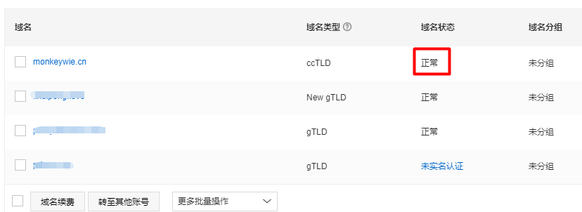

### 设置 github page

通过 github 仓库中的设置页面找到对应的设置，把要用到的域名配置上去，示例图：
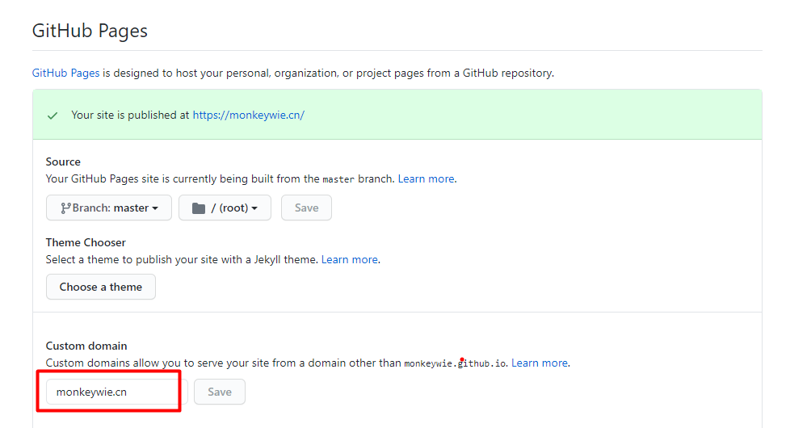

保存之后 github 会`自动`的在仓库根目录里生成一个`CNAME`文件，里面存储着域名配置信息，示例图：
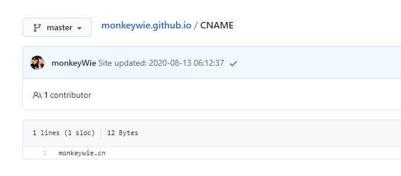

### 设置域名解析

通过域名提供商，修改刚刚的域名解析，通过 A 记录分别解析到以下 4 个 IP：

```
185.199.108.153
185.199.109.153
185.199.110.153
185.199.111.153
```

示例图：
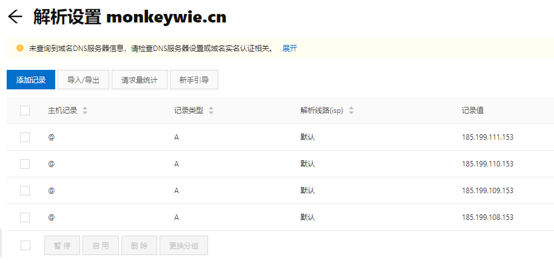

设置完之后通过命令行验证：

```
$ dig monkeywie.cn +noall +answer
> monkeywie.cn     3600    IN A     185.199.108.153
> monkeywie.cn     3600    IN A     185.199.109.153
> monkeywie.cn     3600    IN A     185.199.110.153
> monkeywie.cn     3600    IN A     185.199.111.153
```

当记录全部解析生效时，就可以通过`http://monkeywie.cn`访问到博客了，这个时候再开启`HTTPS`，示例图：

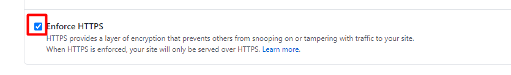

然后 github 会自动签发提供给`monkeywie.cn`域名使用的 SSL 证书，等待一段时间后，就可以通过`HTTPS`访问博客了。

### 使用 cloudflare CDN

上面的步骤全部就绪之后，就可以开始白嫖之路了

1. 先通过[https://dash.cloudflare.com/sign-up](https://dash.cloudflare.com/sign-up)链接进行注册
2. 添加站点，把对应的域名填写进去：
   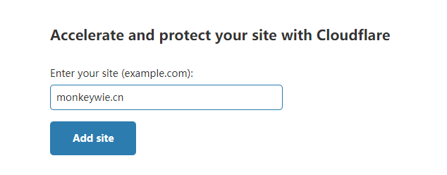
3. 提交之后会自动扫描域名对应的解析记录：
   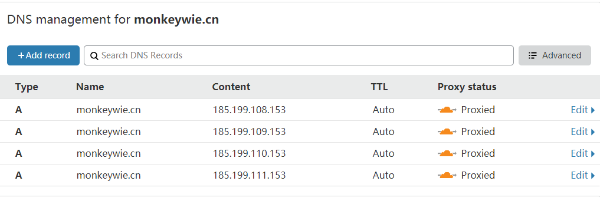
4. 查看 cloudfalre 对应的 NS 记录：
   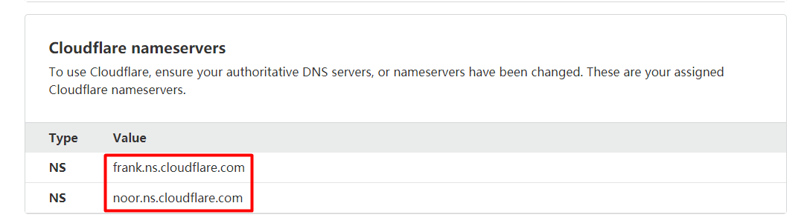
5. 通过域名的运营商修改对应的 NS 记录，这里每个运营商的修改方式都不一样，我这里是用的阿里云的：
   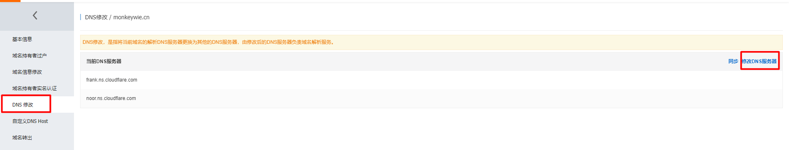
   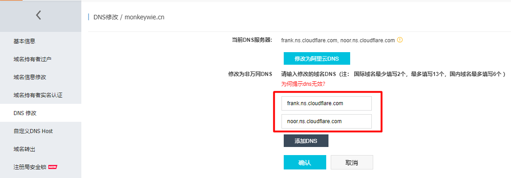

这样就设置完毕了，等一段时间再用命令行验证一下：

```
$ dig monkeywie.cn +noall +answer
> monkeywie.cn.		600	IN	A	104.28.28.212
> monkeywie.cn.		600	IN	A	172.67.169.202
> monkeywie.cn.		600	IN	A	104.28.29.212
```

可以看到 dns 解析的 ip 已经变了，已经被 cloudflare 接管了，
然后清除下浏览器 DNS 缓存，chrome 浏览器输入`chrome://net-internals/#dns`进入清除页：
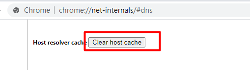

再次访问`https://monkeywie.cn`，F12 打开网络面板可以看到已经用上了 CDN 了：
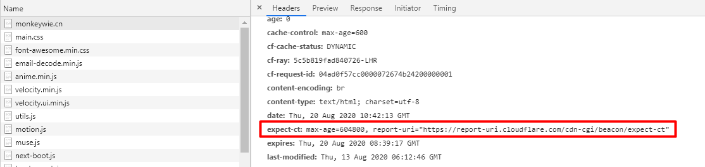

## 后记

一直白嫖一直爽，但是`cloudflare`不一定一直会提供免费版的，如果有一天它挂了，只需要把 DNS 的 NS 解析记录再还原回去就行了。
