## Fidder 简介

`Fiddler`是一个用于 HTTP 调试的代理服务器应用程序，最初由微软 Internet Explorer 开发团队的前程序经理 Eric Lawrence 编写。通过`Fiddler`的代理服务器，可以捕获`HTTP`和`HTTPS`协议流量，并且可对`HTTP`请求和响应做出修改，使用`Fiddler`可以很方便的对`HTTP`协议进行分析和调试。

## 工作原理

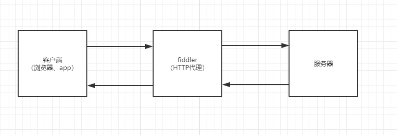
客户端的请求经过 Fiddler 的代理服务器转发，再由`Fidder`对目标服务器进行请求，得到响应之后再返回给客户端，在整个通讯过程中 Fidder 是一个中间人的角色，可以捕获到所有的请求和响应报文。

<!-- more -->

## 下载

`Fidder` 是一款免费的应用，可以直接通过[官网](https://www.telerik.com/download/fiddler)下载，目前只支持 windows 操作系统(官网已经有 mac 和 linux 的 beta 版本)，不过本文只针对 windows 操作系统 下的 fiddler 使用。

## 基本使用

在下载并安装完成之后，运行`Fidder`就会启动一个`8888`端口的 HTTP 代理服务器，并且默认配置下在启动完之后会自动修改`IE`浏览器中的 HTTP 代理，如果不需要可以在设置(`Tools-Options`)里面关掉此功能(推荐使用`Chrome浏览器`+`SwitchyOmega插件`来进行浏览器代理的设置)。
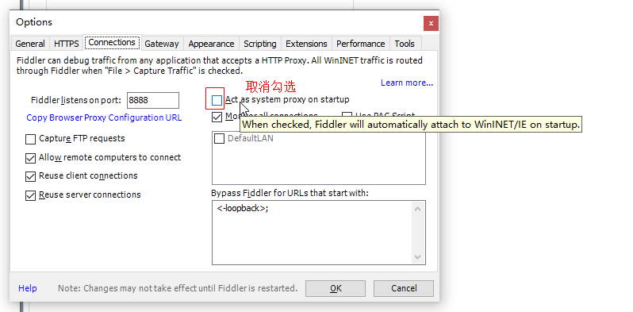

运行完之后可以看到如下界面，软件的左侧`会话列表面板`中会列出所有捕获的 HTTP 请求，当选中一个请求之后，右侧就会列出该请求的详细数据。
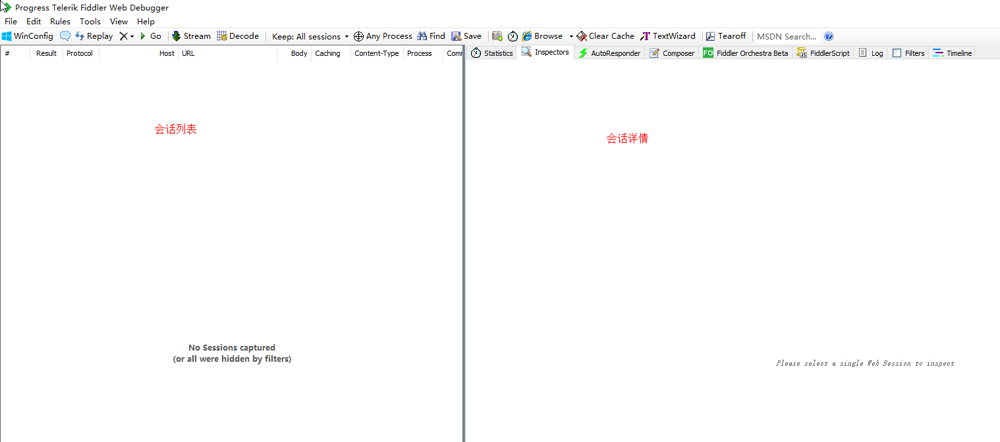

### 嗅探 HTTP 报文

嗅探报文时只需要为待调试的应用程序设置 HTTP 代理就可以在`Fidder`中看到 HTTP 报文了，这里就以`Chrome`为例来演示一下。

首先给 Chrome 浏览器设置`127.0.0.1:8888`的 HTTP 代理，这里使用`SwitchyOmega插件`来进行代理设置：
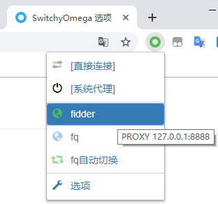

如果不安装插件也可以直接通过`设置-高级-打开代理设置`中进行代理设置：
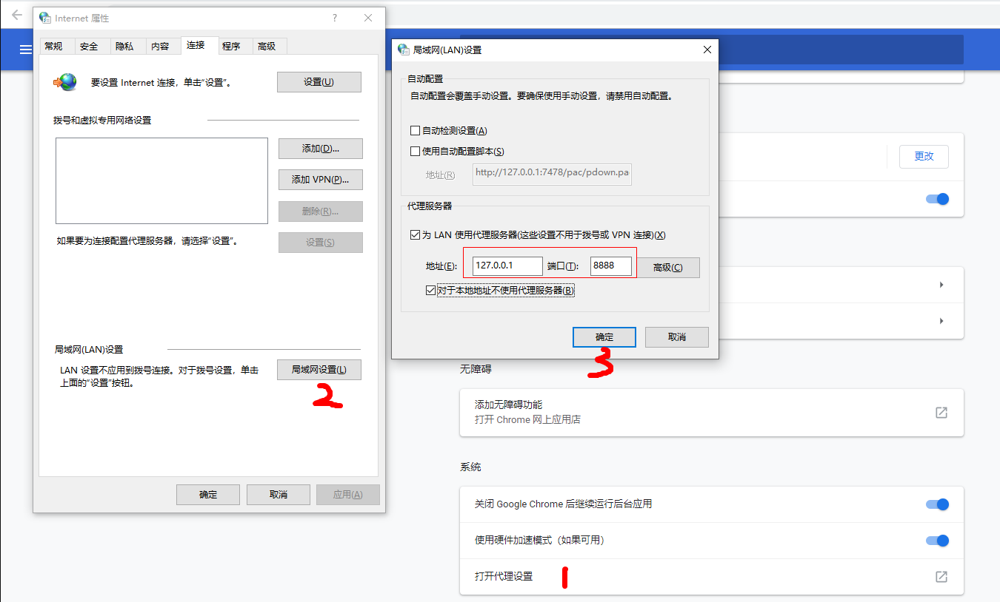

然后通过浏览器访问[http://www.apache.org](http://www.apache.org)，就可以在`Fiddler`中看到刚刚的 HTTP 报文：
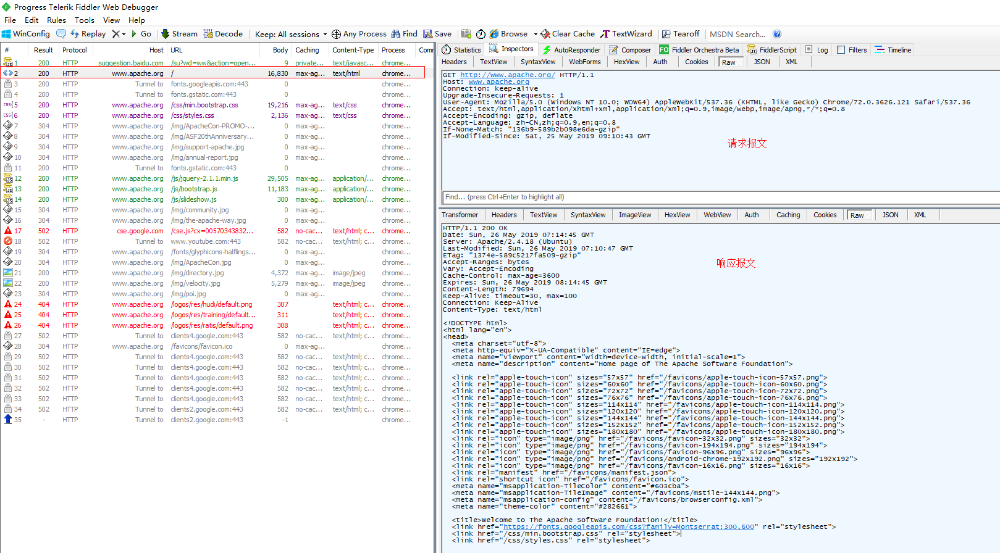

上图中选中的都是`Raw`选项卡，即展示原始的 HTTP 报文内容，其它选项卡即根据报文做对应的视图展示，这里就不一一介绍了。

### 解码压缩报文

现在大多数 HTTP 服务器都开启了`gzip、deflate`之类的压缩功能，在 fiddler 中默认捕获的响应是不会解码这些压缩报文的，需要手动解码或者设置 fiddler 自动解码，如下图：
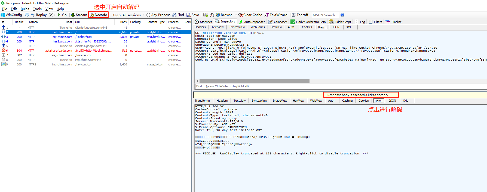

### 过滤报文

在 fiddler 中默认是显示所有捕获到的 HTTP 请求，但有的时候不需要看到这么多不关心的请求，对此 fiddler 提供了`filter`功能可以自定义过滤出需要关心的请求。

通过右侧面板-filter 选项，即可进入`filter`配置页面，可以支持各种各样的过滤规则，这里展示下按域名过滤，可以看到只显示了对应域名下的请求：
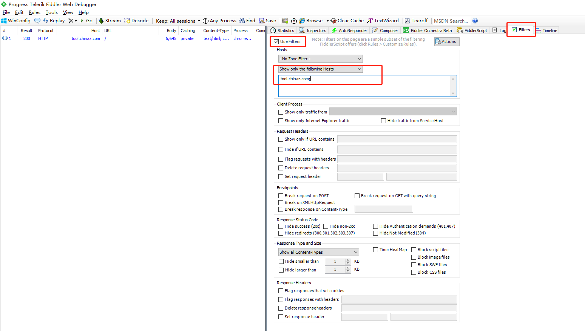

## 高级功能

### HTTPS 支持

默认情况情况下`Fidder`是不支持嗅探`HTTPS`报文的，需要在设置里手动开启，通过`Tools-Options`打开设置面板，切换到`https`标签页进行以下配置：
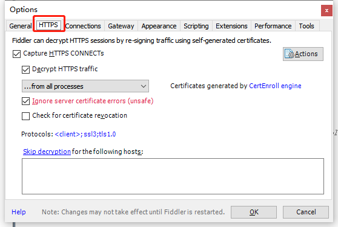

在首次开启`HTTPS`支持时，会提示安装一个 Fidder 生成的`CA根证书`，安装完之后才能支持 HTTPS 的报文嗅探:
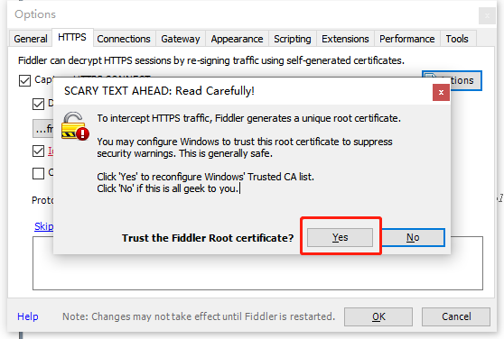

然后再访问下`https://www.baidu.com`，可以看到已经嗅探到了`HTTPS`的明文：
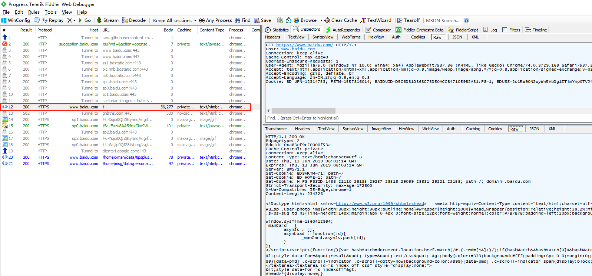

### AutoResponder
使用`AutoResponder`可以通过配置对应的规则自动替换响应内容，在右侧面板中的`AutoResponder`选项卡中进行配置：
