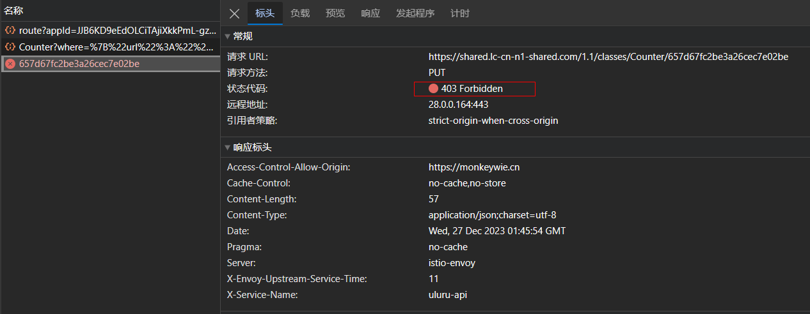
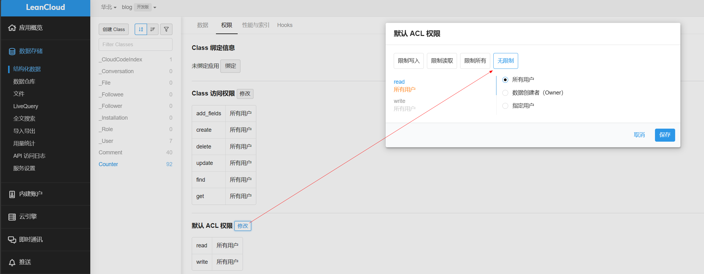
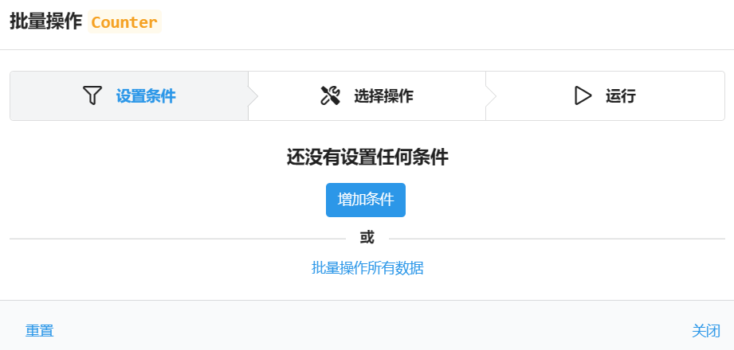
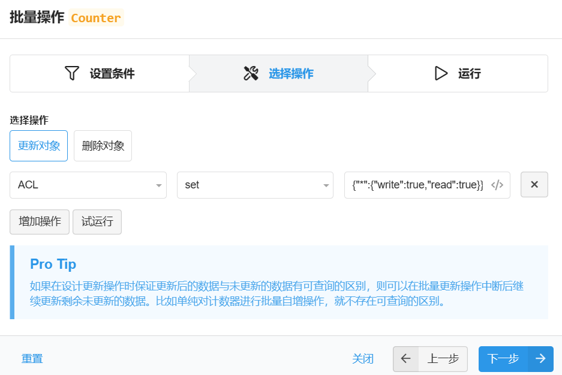

不知道从什么时候开始，新写的文章阅读数量一直是`1`，一直没有去管，今天把问题解决了，记录下希望能帮到有同样问题的人。

## 问题原因

Next 中内置的`leancloud_visitors`插件是用`leancloud`的`存储`功能来实现的，类似一个`mongodb`，不知道什么时候开始默认把权限变成了`只读`，所以每次更新统计数的时候都会报`403`权限问题，通过网络请求可以看到：

<!--more-->

## 解决方案

### 修改默认权限为无限制

登录`leancloud`控制台，找到`数据存储 -> 结构化数据`，然后找到`Counter`表，点击`权限`，修改默认 ACL 权限为`无限制`：

### 批量更新已存在的数据

把之前表里只读的数据批量更新为`无限制`，选择所有数据，点击`批量操作 -> 批量操作所有数据`：

选择更新`ACL`为`{"*":{"write":true,"read":true}}`，然后批量执行即可。

