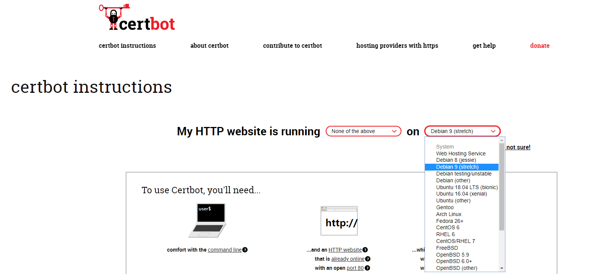
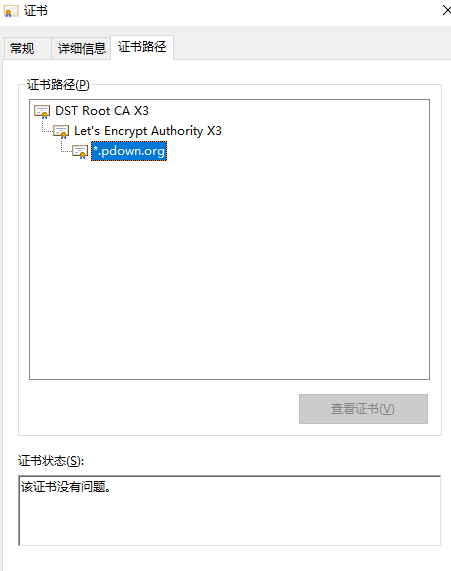
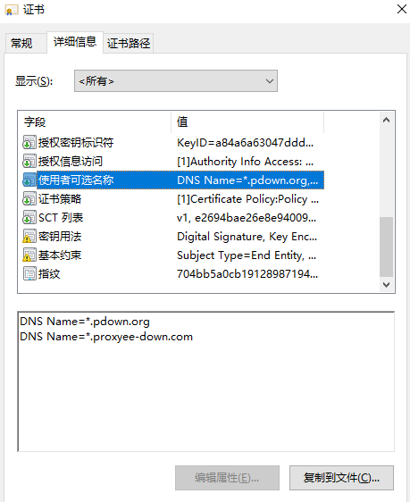

## 前言

众所周知 HTTPS 是保证 HTTP 通讯安全的协议，网站启用 HTTPS 可以避免很多安全性的问题， 而且 Chrome 浏览器 从 68 版本开始直接将 HTTP 网站标记为不安全了。

所以把网站升级成 HTTPS 自然是大势所趋，不过启用 HTTPS 有个最重要的问题是 HTTPS 证书`要花钱`！如果每年额外花钱去购买 HTTPS 证书，那也是一笔很大的开销。那么有没有免费的`HTTPS`证书可以用呢，查了下资料有个叫[`Let’s Encrypt`](https://letsencrypt.org)的项目就提供了免费签发 HTTPS 证书的服务，这里记录下如何使用`Let’s Encrypt`来签发证书。

<!-- more -->

## certbot 介绍

`certbot`是用于从 Let's Encrypt 获取证书的命令行工具，代码开源在[github](https://github.com/certbot/certbot/)上。

使用`certbot`命令行工具可以轻松的实现`HTTPS证书`签发，在签发证书之前，需要证明签发的域名是属于你控制的，目前`certbot`有两种验证方式：

1. HTTP
   HTTP 方式就是`certbot`会生成一个特定的文件名和文件内容，要求放在你对应域名下对应路径(`/.well-known/acme-challenge/`)下，然后`certbot`再通过 HTTP 请求访问到此文件，并且文件内容与生成时候的一致。</br></br>

   例如：`certbot`生成文件名`check`和内容`!@#$%^`，你需要申请的域名为`baidu.com`，则`certbot`访问`http://baidu.com/.well-known/acme-challenge/check`来校验是否与生成的内容一致。

2. DNS
   DNS 则是`certbot`生成一段特定的文本，要求在你对应域名中配置一条对应子域名(`_acme-challenge`)的`TXT`类型解析记录。</br></br>

   例如：`certbot`生成内容`!@#$%^`，你需要申请的域名为`baidu.com`，则需要添加一条`_acme-challenge.baidu.com`的`TXT`类型解析记录，值为之前生成的内容。

在域名验证通过之后，`certbot`就可以签发`HTTPS`证书了，注意在此验证步骤基础上，`certbot`提供了很多开箱即用的自动验证方案，但是都不符合我的需求，原因是我需要支持`通配符`域名的证书，但是这种证书只支持`DNS`验证方式，而官方提供的`DNS`插件中并没有支持我用的`阿里云DNS`，所以只能自己去实现 阿里云的 DNS 自动校验。

## 使用 certbot 签发 HTTPS 证书

通过[官网教程](https://certbot.eff.org)可以选择对应操作系统，并获取安装步骤：



这里我选择的`Debian 9`，根据官网的提示进行安装：

```shell
sudo apt-get install certbot -t stretch-backports
```

`注：如果install失败可以先执行下 apt-get update`

开始签发证书

```
certbot certonly --cert-name pdown.org -d *.pdown.org,*.proxyee-down.com --manual --register-unsafely-without-email  --preferred-challenges dns --server https://acme-v02.api.letsencrypt.org/directory
```

这里签发了一个支持`*.pdown.org`和`*.proxyee-down.com`通配符域名的证书，注意如果是通配符域名证书需要指定`--server https://acme-v02.api.letsencrypt.org/directory`

示例：

```
Saving debug log to /var/log/letsencrypt/letsencrypt.log
Plugins selected: Authenticator manual, Installer None
Registering without email!

- - - - - - - - - - - - - - - - - - - - - - - - - - - - - - - - - - - - - - - -
Please read the Terms of Service at
https://letsencrypt.org/documents/LE-SA-v1.2-November-15-2017.pdf. You must
agree in order to register with the ACME server at
https://acme-v02.api.letsencrypt.org/directory
- - - - - - - - - - - - - - - - - - - - - - - - - - - - - - - - - - - - - - - -
(A)gree/(C)ancel: A
Obtaining a new certificate
Performing the following challenges:
dns-01 challenge for pdown.org
dns-01 challenge for proxyee-down.com

- - - - - - - - - - - - - - - - - - - - - - - - - - - - - - - - - - - - - - - -
NOTE: The IP of this machine will be publicly logged as having requested this
certificate. If you're running certbot in manual mode on a machine that is not
your server, please ensure you're okay with that.

Are you OK with your IP being logged?
- - - - - - - - - - - - - - - - - - - - - - - - - - - - - - - - - - - - - - - -
(Y)es/(N)o: Y

- - - - - - - - - - - - - - - - - - - - - - - - - - - - - - - - - - - - - - - -
Please deploy a DNS TXT record under the name
_acme-challenge.pdown.org with the following value:

Axdqtserd184wvJc86Dxen386UXqbK2wrgb-*******

Before continuing, verify the record is deployed.
- - - - - - - - - - - - - - - - - - - - - - - - - - - - - - - - - - - - - - - -
Press Enter to Continue
```

这里会生成一串随机字符并阻塞住，需要去设置一条对应的 TXT 类型的 DNS 解析记录再继续，在设置好之后可以用`nslookup`进行本地验证：

```
nslookup -type=txt _acme-challenge.pdown.org
服务器:  UnKnown
Address:  192.168.200.200

非权威应答:
_acme-challenge.pdown.org       text =

        "Tit0SAHaO3MVZ4S-d6CjKLv6Z-********"
```

本地验证通过之后按回车键继续，接着 Let's Encrypt 就会校验这个 DNS 解析记录是否正确，校验通过后就会进行下一个域名的验证直到全部验证通过。

```
Waiting for verification...
Cleaning up challenges

IMPORTANT NOTES:
 - Congratulations! Your certificate and chain have been saved at:
   /etc/letsencrypt/live/pdown.org/fullchain.pem
   Your key file has been saved at:
   /etc/letsencrypt/live/pdown.org/privkey.pem
   Your cert will expire on 2019-12-02. To obtain a new or tweaked
   version of this certificate in the future, simply run certbot
   again. To non-interactively renew *all* of your certificates, run
   "certbot renew"
 - If you like Certbot, please consider supporting our work by:

   Donating to ISRG / Let's Encrypt:   https://letsencrypt.org/donate
   Donating to EFF:                    https://eff.org/donate-le
```

当验证通过的时候会输出证书生成的目录，里面会包含证书和对应的私钥，这里目录是`/etc/letsencrypt/live/pdown.org/`。

证书截图：




这样证书就生成好了，之后只需要把证书和私钥配置到`nginx`中就可以用`https`访问了。

## 使用 certbot hook 自动续签

上面证书虽然是生成好了，但是证书的有效期只有三个月，意味着每过三个月就得重新签发一个新的证书，一不注意证书就过期了，而且每次手动签发都非常的繁琐需要去手动设置 DNS 解析，所以`certbot`提供了一种自动续签的方案：hook

在创建证书的时候`certbot`提供了两个`hook`参数：

- manual-auth-hook
  指定用于验证域名的脚本文件
- manual-cleanup-hook
  指定用于清理的脚本文件，即验证完成之后

通过自定义这两个脚本就可以做到自动续签了，文档参考[pre-and-post-validation-hooks](https://certbot.eff.org/docs/using.html#pre-and-post-validation-hooks)。

在此基础上，官方已经提供了很多云厂商的自动续签方案，但是我用的阿里云官方并没有提供，于是参照官网文档，写了一个基于阿里云的自动续签脚本，在验证域名的脚本中通过阿里提供的 DNS API 添加一条域名解析记录，在验证完成之后再把刚刚那条域名解析记录删除，命令行调用如下：

```
certbot certonly --cert-name pdown.org -d *.pdown.org,*.proxyee-down.com --manual --register-unsafely-without-email --manual-auth-hook /path/to/dns/authenticator.sh --manual-cleanup-hook /path/to/dns/cleanup.sh --preferred-challenges dns --server https://acme-v02.api.letsencrypt.org/directory
```

为了方便使用，提供了一个`docker镜像`，通过环境变量将阿里云 API 调用的 AK 传递就可以生成和续签证书了。

- 启动容器

```
docker run \
--name cert \
-itd \
-v /etc/letsencrypt:/etc/letsencrypt \
-e ACCESS_KEY_ID=XXX \
-e ACCESS_KEY_SECRET=XXX \
liwei2633/certbot-aliyun
```

- 首次创建证书

```
docker exec -it cert ./create.sh *.pdown.org
```

创建过程中会等待一段时间，来确保 dns 记录生效，完成之后在`/etc/letsencrypt/live`目录下可以找到对应的证书文件

- 续签证书

```
docker exec cert ./renew.sh
```

代码开源在[github](https://github.com/monkeyWie/certbot-dns-aliyun)，欢迎 start。
