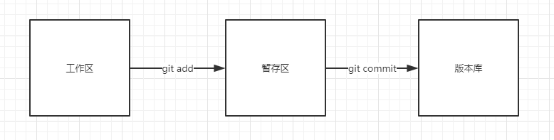

### 概念

git 在本地有三个工作区域：

1. 工作区
2. 暂存区
3. 版本库

它们之间的转化关系如下图：


<!-- more -->

### 还原工作区已修改的文件

```sh
#还原指定文件
git checkout -- 文件名
#还原所有文件
git checkout .
#删除所有工作区没有add的文件
git clean -fd
```

### 暂存区 -> 工作区

```sh
#在工作区删除
git rm -f 文件名
#保留在工作区
git rm --cache 文件名
#撤销所有已经add的文件
git reset
```

### 版本库 -> 暂存区

```sh
#通过git log查看提交记录，并记录下要回滚到的CommitId
git log
#回滚到指定的commit，工作区和暂存区保留修改
git reset CommitId --soft
```

### 版本库 -> 工作区

```sh
#通过git log查看提交记录，并记录下要回滚到的CommitId
git log
#回滚到指定的commit，工作区保留修改
git reset CommitId --mixed
#默认模式就是mixed
git reset CommitId
#回滚到指定的commit，工作区不保留修改
git reset --hard
#回滚到指定的commit，并且将回滚的内容当做一次commit
git revert CommitId
```

### 远程仓库回滚
```sh
#将上面回滚的记录强制推到远程分支上即可
git push -f
```

### 储藏

有时间会有一种情况，当我们在写需求的时候代码还没写完，突然来了个紧急的 BUG 要修复，这个时候我们就可以把我们现在写的代码储藏起来，并且从开发分支上拉一个新的分支去修复 bug，当修完 bug 时再切回我们刚刚写需求的分支。

```sh
#储藏
git stash
#还原
git stash pop
```

### git log显示优化
```sh
#注册git logp命令
git config --global alias.logp "log --color --graph --pretty=format:'%Cred%h%Creset -%C(yellow)%d%Creset %s %Cgreen(%cr) %C(bold blue)<%an>%Creset' --abbrev-commit --"
#查看log
git logp
```
