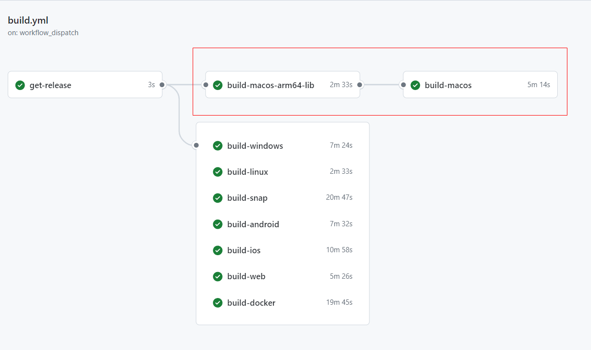

## 前言

之前苦于`github action`不支持`macOS arm`架构，导致我为了打`gopped macos`包煞费苦心，我在 linux 上用`xgo`交叉编译出来`macos arm64`的动态库，然后在`macOS x64`上再打包成`macos amd64`的动态库，最后把两个架构的动态库合并成一个`universal binary`包，来同时支持`Intel`和`Apple Silicon`架构，如今`github action`终于支持`macOS arm`架构了，这下可以省去很多麻烦了。

<!-- more -->

## 开始改造

gopeed 目前的构建依赖图是这样的：



可以看到需要先编译出`macos arm64`的动态库，之前这里是用`xgo`交叉编译的，代码如下：

```yml
build-macos-arm64-lib:
  if: ${{ github.event.inputs.platform == 'all' || github.event.inputs.platform == 'macos' }}
  runs-on: ubuntu-latest
  needs: [get-release]
  steps:
    - uses: actions/checkout@v3
    - uses: actions/setup-go@v4
      with:
        go-version: ${{ env.GO_VERSION }}
    - name: Build
      env:
        VERSION: ${{ needs.get-release.outputs.version }}
      run: |
        go install src.techknowlogick.com/xgo@latest
        xgo -go go-$GO_VERSION.x --targets=darwin/arm64 -tags="nosqlite" -ldflags="-w -s -X github.com/GopeedLab/gopeed/pkg/base.Version=$VERSION" -buildmode=c-shared -pkg=bind/desktop -out=libgopeed .
        mv libgopeed-*.dylib libgopeed.dylib
    - uses: actions/upload-artifact@v3
      with:
        name: macos-arm64-lib
        path: libgopeed.dylib
```

现在有了`macOS arm`架构的支持，我们可以直接用`macos-latest-arm`来构建`macos arm64`的动态库，代码如下：

```yml
build-macos-arm64-lib:
  if: ${{ github.event.inputs.platform == 'all' || github.event.inputs.platform == 'macos' }}
  runs-on: macos-latest
  needs: [get-release]
  steps:
    - uses: actions/checkout@v3
    - uses: actions/setup-go@v4
      with:
        go-version: ${{ env.GO_VERSION }}
    - name: Build
      env:
        VERSION: ${{ needs.get-release.outputs.version }}
      run: |
        go build -tags nosqlite -ldflags="-w -s -X github.com/GopeedLab/gopeed/pkg/base.Version=$VERSION" -buildmode=c-shared -o libgopeed.dylib github.com/GopeedLab/gopeed/bind/desktop
    - uses: actions/upload-artifact@v3
      with:
        name: macos-arm64-lib
        path: libgopeed.dylib
```

这样一下简单了很多，而且节省了大量的构建时间，因为`xgo`这货要拉个很大的镜像，然后再编译，速度真的很慢，目前基本上是从 3 分钟缩短到了 30 秒，非常不错。
