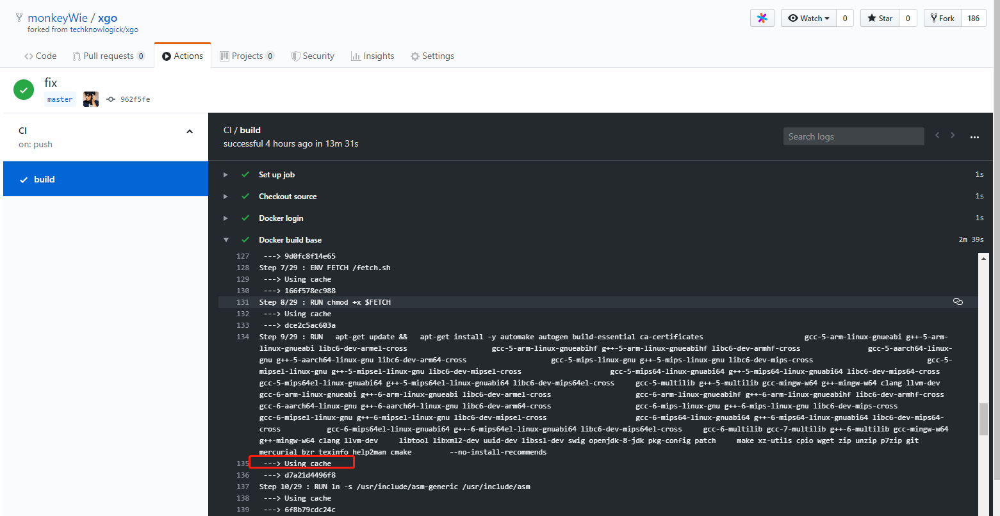

## 前言

当初学习 go 语言的原因之一就是看中了 go 可以直接编译成机器码运行，并且支持跨操作系统的交叉编译，这对开发跨操作系统软件提供了极大的便利，这篇文章目的就是记录下 go 是如何交叉编译的。

## 交叉编译

go 语言里交叉编译支持非常多的操作系统，可以通过`go tool dist list`命令来查看支持的操作系统列表。

<!-- more-->

```sh
$ go tool dist list
aix/ppc64
android/386
android/amd64
android/arm
android/arm64
darwin/386
darwin/amd64
darwin/arm
darwin/arm64
dragonfly/amd64
freebsd/386
freebsd/amd64
freebsd/arm
illumos/amd64
js/wasm
linux/386
linux/amd64
linux/arm
linux/arm64
linux/mips
linux/mips64
linux/mips64le
linux/mipsle
linux/ppc64
linux/ppc64le
linux/s390x
nacl/386
nacl/amd64p32
nacl/arm
netbsd/386
netbsd/amd64
netbsd/arm
netbsd/arm64
openbsd/386
openbsd/amd64
openbsd/arm
openbsd/arm64
plan9/386
plan9/amd64
plan9/arm
solaris/amd64
windows/386
windows/amd64
windows/arm
```

编译的时候只需要指定环境变量`GOOS`(系统内核)和`GOARCH`(CPU 架构)即可进行交叉编译。

### 示例

- Windows 上编译 Mac 和 Linux 上 64 位可执行程序

```bat
SET CGO_ENABLED=0
SET GOOS=darwin
SET GOARCH=amd64
go build main.go

SET CGO_ENABLED=0
SET GOOS=linux
SET GOARCH=amd64
go build main.go
```

- Linux 上编译 Mac 和 Windows 上 64 位可执行程序

```sh
CGO_ENABLED=0 GOOS=darwin GOARCH=amd64 go build main.go
CGO_ENABLED=0 GOOS=windows GOARCH=amd64 go build main.go
```

- Mac 上编译 Linux 和 Windows 上 64 位可执行程序

```sh
CGO_ENABLED=0 GOOS=linux GOARCH=amd64 go build main.go
CGO_ENABLED=0 GOOS=windows GOARCH=amd64 go build main.go
```

### cgo 程序交叉编译

上面的示例都是基于程序里没有使用`cgo`的情况下进行的，可以看到`CGO_ENABLED=0`这个选项就是关闭`cgo`，因为 go 的交叉编译是不支持`cgo`的，如果程序里使用到了`cgo`时要进行交叉编译就没这么简单了，需要安装一个跨平台的 C/C++ 编译器才可能实现交叉编译。

好在已经有大佬把常用的编译环境都做成到 docker 镜像了，并且提供命令行工具让我们很方便的进行交叉编译，这个工具就是[https://github.com/karalabe/xgo](https://github.com/karalabe/xgo)，但是此仓库作者好像不怎么更新了，并且不支持`go mod`，于是我找到了另一位大佬的 fork: [https://github.com/techknowlogick/xgo](https://github.com/techknowlogick/xgo)，支持`go mod`并且支持最新的`go 1.13`版本。

### xgo 示例

首先要保证机器上有安装 `golang` 和 `docker`，接着按照教程来进行。

1. 拉取镜像

镜像比较大，1 个多 G，拉取要一点时间

```
docker pull techknowlogick/xgo:latest
```

2. 安装 xgo

```
go get src.techknowlogick.com/xgo
```

3. 准备代码

这里引用了`go-sqlite3`这个库，里面用到了`cgo`。

```go
package main

import (
	"database/sql"
	"fmt"
	"log"
	"os"

	_ "github.com/mattn/go-sqlite3"
)

func main() {
	os.Remove("./foo.db")

	db, err := sql.Open("sqlite3", "./foo.db")
	if err != nil {
		log.Fatal(err)
	}
	defer db.Close()

	sqlStmt := `
	create table foo (id integer not null primary key, name text);
	delete from foo;
	`
	_, err = db.Exec(sqlStmt)
	if err != nil {
		log.Printf("%q: %s\n", err, sqlStmt)
		return
	}

	tx, err := db.Begin()
	if err != nil {
		log.Fatal(err)
	}
	stmt, err := tx.Prepare("insert into foo(id, name) values(?, ?)")
	if err != nil {
		log.Fatal(err)
	}
	defer stmt.Close()
	for i := 0; i < 100; i++ {
		_, err = stmt.Exec(i, fmt.Sprintf("こんにちわ世界%03d", i))
		if err != nil {
			log.Fatal(err)
		}
	}
	tx.Commit()

	rows, err := db.Query("select id, name from foo")
	if err != nil {
		log.Fatal(err)
	}
	defer rows.Close()
	for rows.Next() {
		var id int
		var name string
		err = rows.Scan(&id, &name)
		if err != nil {
			log.Fatal(err)
		}
		fmt.Println(id, name)
	}
	err = rows.Err()
	if err != nil {
		log.Fatal(err)
	}

	stmt, err = db.Prepare("select name from foo where id = ?")
	if err != nil {
		log.Fatal(err)
	}
	defer stmt.Close()
	var name string
	err = stmt.QueryRow("3").Scan(&name)
	if err != nil {
		log.Fatal(err)
	}
	fmt.Println(name)

	_, err = db.Exec("delete from foo")
	if err != nil {
		log.Fatal(err)
	}

	_, err = db.Exec("insert into foo(id, name) values(1, 'foo'), (2, 'bar'), (3, 'baz')")
	if err != nil {
		log.Fatal(err)
	}

	rows, err = db.Query("select id, name from foo")
	if err != nil {
		log.Fatal(err)
	}
	defer rows.Close()
	for rows.Next() {
		var id int
		var name string
		err = rows.Scan(&id, &name)
		if err != nil {
			log.Fatal(err)
		}
		fmt.Println(id, name)
	}
	err = rows.Err()
	if err != nil {
		log.Fatal(err)
	}
}
```

4. 编译

在项目目录下运行，编译 Mac,Windows,Linux 下的 64 位可执行程序,`-ldflags="-w -s"`选项可以减小编译后的程序体积。

```sh
xgo -targets=darwin/amd64,windows/amd64,linux/amd64 -ldflags="-w -s" .
```

这样使用`xgo`轻松就完成了多操作系统的交叉编译，并且`xgo`还有很多的特性，可以自行去 github 上看看。

## 使用 xgo 碰到的问题

上面提到使用`techknowlogick/xgo`可以解决 go mod 交叉编译的问题，但是默认只会编译项目根目录下的 `main.go` 文件，例如：

```
.
├── main.go
└── README.md
```

但是我需要编译指定目录下的`main.go`文件，例如：

```
.
├── cmd
│   └── main.go
├── main.go
└── README.md
```

需要编译 cmd/main.go，通过查看 xgo 源码可以看到有个`-pkg`的参数就是用于指定编译路径的，遂尝试使用`-pkg`进行交叉编译：

```
xgo -targets=darwin/amd64,windows/amd64,linux/amd64 -ldflags="-w -s" -pkg=cmd/main.go .
```

然而并没有编译成功，然后去看了一下源码，最后在[build.sh:154](https://github.com/techknowlogick/xgo/blob/master/docker/base/build.sh#L154)这行代码发现，如果启用了 go mod 的话，pkg 参数就会失效，为什么要这样做我也没太明白，不过既然知道原因了那就 [fork](https://github.com/monkeyWie/xgo) 一份修复吧。

最终代码为：

```sh
# Go module-based builds error with 'cannot find main module'
# when $PACK is defined
if [[ "$USEMODULES" = true ]]; then
  NAME=`sed -n 's/module\ \(.*\)/\1/p' /source/go.mod`
fi

# Support go module package
PACK_RELPATH="./$PACK"
```

顺便把所有的 Dockerfile 更新了一遍，把过时的`MAINTAINER`替换成`LABEL MAINTAINER=""`，接着就开始构建 docker 镜像：

```
docker build -t liwei2633/xgo:base docker/base
```

但是由于国内的网络问题，经常有请求超时导致构建失败，所以一次都没构建成功过，然后想起来前几天申请的`github actions`内测资格通过了，可以试试`github actions`,因为`github actions`用的国外网络环境，应该构建不成问题,于是按照官方文档写了一个构建配置`.github/workflows/main.yml`：

```
name: CI

# 当master分支有push时，并且docker/base目录下文件发生变动时触发构建
on:
  push:
    branches:
      - master
    paths:
      - "docker/base/*"

jobs:
  build:
    runs-on: ubuntu-latest

    steps:
	  # 拉取源码
      - name: Checkout source
        uses: actions/checkout@v1
	  # 登录docker hub
      - name: Docker login
        run: docker login -u liwei2633 -p ${{ secrets.DOCKER_HUB_PWD }}
      - name: Docker build base
        run: |
          docker build -t liwei2633/xgo:base ./docker/base
          docker push liwei2633/xgo:base
      - name: Docker build other
        run: |
          docker build -t liwei2633/xgo:go-1.12.10 ./docker/go-1.12.10
          docker push liwei2633/xgo:go-1.12.10
          docker build -t liwei2633/xgo:go-1.12.x ./docker/go-1.12.x
          docker push liwei2633/xgo:go-1.12.x
          docker build -t liwei2633/xgo:go-1.13.1 ./docker/go-1.13.1
          docker push liwei2633/xgo:go-1.13.1
          docker build -t liwei2633/xgo:go-1.13.x ./docker/go-1.13.x
          docker push liwei2633/xgo:go-1.13.x
          docker build -t liwei2633/xgo:go-latest ./docker/go-latest
          docker push liwei2633/xgo:go-latest
```

然后推送代码触发构建，这次构建成功了，但是非常的耗时大概要 30 多分钟，得想办法优化优化，由于`github actions`是不支持缓存的，即每次构建都是一个全新的虚拟机，没法入手，只能通过 docker 的缓存机制来进行优化了，通过 google 发现有一个`--cache-from`的构建参数，可以指定构建缓存镜像来源，于是构建流程改造成先`pull`历史镜像，再指定历史镜像作为构建缓存镜像来进行构建，具体脚本如下：

```
docker pull liwei2633/xgo:base
docker build --cache-from=liwei2633/xgo:base -t liwei2633/xgo:base ./docker/base
docker push liwei2633/xgo:base

```

这样的话因为下载镜像的耗时远比 Dockerfile 里的各种`apt-get install`耗时要小，所以如果有了第一次构建的镜像之后，就可以通过 docker 的缓存机制来跳过许多耗时的步骤，就比如 xgo 中 Dockerfile 的一个`RUN`语句：

```docker
RUN \
  apt-get update && \
  apt-get install -y automake autogen build-essential ca-certificates                    \
    gcc-5-arm-linux-gnueabi g++-5-arm-linux-gnueabi libc6-dev-armel-cross                \
    gcc-5-arm-linux-gnueabihf g++-5-arm-linux-gnueabihf libc6-dev-armhf-cross            \
    gcc-5-aarch64-linux-gnu g++-5-aarch64-linux-gnu libc6-dev-arm64-cross                \
    gcc-5-mips-linux-gnu g++-5-mips-linux-gnu libc6-dev-mips-cross                       \
    gcc-5-mipsel-linux-gnu g++-5-mipsel-linux-gnu libc6-dev-mipsel-cross                 \
    gcc-5-mips64-linux-gnuabi64 g++-5-mips64-linux-gnuabi64 libc6-dev-mips64-cross       \
    gcc-5-mips64el-linux-gnuabi64 g++-5-mips64el-linux-gnuabi64 libc6-dev-mips64el-cross \
    gcc-5-multilib g++-5-multilib gcc-mingw-w64 g++-mingw-w64 clang llvm-dev             \
    gcc-6-arm-linux-gnueabi g++-6-arm-linux-gnueabi libc6-dev-armel-cross                \
    gcc-6-arm-linux-gnueabihf g++-6-arm-linux-gnueabihf libc6-dev-armhf-cross            \
    gcc-6-aarch64-linux-gnu g++-6-aarch64-linux-gnu libc6-dev-arm64-cross                \
    gcc-6-mips-linux-gnu g++-6-mips-linux-gnu libc6-dev-mips-cross                       \
    gcc-6-mipsel-linux-gnu g++-6-mipsel-linux-gnu libc6-dev-mipsel-cross                 \
    gcc-6-mips64-linux-gnuabi64 g++-6-mips64-linux-gnuabi64 libc6-dev-mips64-cross       \
    gcc-6-mips64el-linux-gnuabi64 g++-6-mips64el-linux-gnuabi64 libc6-dev-mips64el-cross \
    gcc-6-multilib gcc-7-multilib g++-6-multilib gcc-mingw-w64 g++-mingw-w64 clang llvm-dev \
    libtool libxml2-dev uuid-dev libssl-dev swig openjdk-8-jdk pkg-config patch \
    make xz-utils cpio wget zip unzip p7zip git mercurial bzr texinfo help2man cmake     \
    --no-install-recommends
```

这种情况下使用缓存无疑可以节省非常多的时间，修改之后提交，再看看构建记录：


可以看到已经走了缓存，最终耗时在 10 分钟左右节省了 2/3 的时间，`github actions`真香！！！

最后把[xgo.go](https://github.com/monkeyWie/xgo/blob/master/xgo.go)代码修改一下，顺带修复了个 BUG(docker image 检测问题)，推到 github 上。

测试使用：

```
go get github.com/monkeyWie/xgo
xgo -targets=windows/amd64,linux/amd64,darwin/amd64 -ldflags="-w -s" -pkg=cmd/main.go .
```

成功编译，完结撒花！

## 后记

感谢 [https://github.com/karalabe/xgo](https://github.com/karalabe/xgo)和[https://github.com/techknowlogick/xgo](https://github.com/techknowlogick/xgo)为 go 交叉编译做出的贡献，然后就是`github actions`真香，希望可以早日推出正式版。
