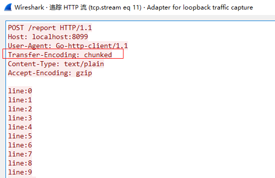
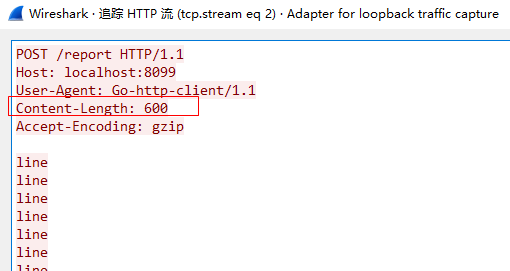

### 背景

最近在开发一个功能时，需要通过 http 协议上报大量的日志内容，但是在 Go 标准库里的 http client 的 API 是这样的：

```go
http.NewRequest(method, url string, body io.Reader)
```

body 是通过`io.Reader`接口来传递，并没有暴露一个`io.Writer`接口来提供写入的办法，先来看看正常情况下怎么写入一个`body`，示例：

```go
buf := bytes.NewBuffer([]byte("hello"))
http.Post("localhost:8099/report","text/pain",buf)
```

需要先把要写入的数据放在`Buffer`中，放内存缓存着，但是我需要写入`大量`的数据，如果都放内存里肯定要 OOM 了，http client 并没有提供`流式写入`的方法，我这么大的数据量直接用`Buffer`肯定是不行的，最后在 google 了一番之后找到了解决办法。

<!--more-->

### 使用 io.pipe

调用`io.pipe()`方法会返回`Reader`和`Writer`接口实现对象，通过`Writer`写数据，`Reader`就可以读到，利用这个特性就可以实现流式的写入，开一个协程来写，然后把`Reader`传递到方法中，就可以实现 http client body 的流式写入了。

- 代码示例：

```go
pr, rw := io.Pipe()
// 开协程写入大量数据
go func(){
    for i := 0; i < 100000; i++ {
        rw.Write([]byte(fmt.Sprintf("line:%d\r\n", i)))
    }
    rw.Close()
}()
// 传递Reader
http.Post("localhost:8099/report","text/pain",pr)
```

### 源码阅读

#### 目的

了解 go 中 http client 对于 body 的传输是如何处理的。

#### 开始

在构建 Request 的时候，会断言 body 参数的类型，当类型为`*bytes.Buffer`、`*bytes.Reader`、`*strings.Reader`的时候，可以直接通过`Len()`方法取出长度，用于`Content-Length`请求头，相关代码[net/http/request.go#L872-L914](https://github.com/golang/go/blob/6be4a5eb4898c7b5e7557dda061cc09ba310698b/src/net/http/request.go#L872-L914)：

```go
if body != nil {
    switch v := body.(type) {
    case *bytes.Buffer:
        req.ContentLength = int64(v.Len())
        buf := v.Bytes()
        req.GetBody = func() (io.ReadCloser, error) {
            r := bytes.NewReader(buf)
            return ioutil.NopCloser(r), nil
        }
    case *bytes.Reader:
        req.ContentLength = int64(v.Len())
        snapshot := *v
        req.GetBody = func() (io.ReadCloser, error) {
            r := snapshot
            return ioutil.NopCloser(&r), nil
        }
    case *strings.Reader:
        req.ContentLength = int64(v.Len())
        snapshot := *v
        req.GetBody = func() (io.ReadCloser, error) {
            r := snapshot
            return ioutil.NopCloser(&r), nil
        }
    default:
    }
    if req.GetBody != nil && req.ContentLength == 0 {
        req.Body = NoBody
        req.GetBody = func() (io.ReadCloser, error) { return NoBody, nil }
    }
}
```

在链接建立的时候，会通过`body`和上一步中得到的`ContentLength`来进行判断，如果`body!=nil`并且`ContentLength==0`时，可能就会启用`Chunked`编码进行传输，相关代码[net/http/transfer.go#L82-L96](https://github.com/golang/go/blob/6be4a5eb4898c7b5e7557dda061cc09ba310698b/src/net/http/transfer.go#L82-L96)：

```go
case *Request:
    if rr.ContentLength != 0 && rr.Body == nil {
        return nil, fmt.Errorf("http: Request.ContentLength=%d with nil Body", rr.ContentLength)
    }
    t.Method = valueOrDefault(rr.Method, "GET")
    t.Close = rr.Close
    t.TransferEncoding = rr.TransferEncoding
    t.Header = rr.Header
    t.Trailer = rr.Trailer
    t.Body = rr.Body
    t.BodyCloser = rr.Body
    // 当body为非nil，并且ContentLength==0时，这里返回-1
    t.ContentLength = rr.outgoingLength()
    // TransferEncoding没有手动设置，并且请求方法为PUT、POST、PATCH时，会启用chunked编码传输
    if t.ContentLength < 0 && len(t.TransferEncoding) == 0 && t.shouldSendChunkedRequestBody() {
        t.TransferEncoding = []string{"chunked"}
    }
```

#### 验证(一)

按照对源码的理解，可以得知在使用`io.pipe()`方法进行流式传输时，会使用`chunked`编码进行传输，通过以下代码进行验证：

- 服务端

```go
func main(){
	http.HandleFunc("/report", func(writer http.ResponseWriter, request *http.Request) {

	})
	http.ListenAndServe(":8099", nil)
}
```

- 客户端

```go
func main(){
    pr, rw := io.Pipe()
    go func(){
        for i := 0; i < 100; i++ {
            rw.Write([]byte(fmt.Sprintf("line:%d\r\n", i)))
        }
        rw.Close()
    }()
    http.Post("localhost:8099/report","text/pain",buf)
}
```

先运行服务端，然后运行客户端，并且使用`WireShake`进行抓包分析，结果如下：



可以看到和预想的结果一样。

#### 验证(二)

在数据量大的时候`chunked`编码会增加额外的开销，包括编解码和额外的报文开销，能不能不用`chunked`编码来进行`流式传输`呢？通过源码可以得知，当`ContentLength`不为 0 时，如果能预先计算出待传输的`body size`，是不是就能避免`chunked`编码呢？思路就到这，接着就是写代码验证：

- 服务端

```go
func main(){
	http.HandleFunc("/report", func(writer http.ResponseWriter, request *http.Request) {

	})
	http.ListenAndServe(":8099", nil)
}
```

- 客户端

```go
count := 100
line := []byte("line\r\n")
pr, rw := io.Pipe()
go func() {
    for i := 0; i < count; i++ {
        rw.Write(line)
    }
    rw.Close()
}()
// 构造request对象
request, err := http.NewRequest("POST", "http://localhost:8099/report", pr)
if err != nil {
    log.Fatal(err)
}
// 提前计算出ContentLength
request.ContentLength = int64(len(line) * count)
// 发起请求
http.DefaultClient.Do(request)
```

抓包结果：


可以看到确实直接使用的`Content-Length`进行传输，没有进行`chunked`编码了。

### 总结

本文的目的主要是记录 go 语言中`http client`如何进行流式的写入，并通过阅读源码了解`http client`内部对 body 的写入是如何进行处理的，通过两个验证可以得知，如果能提前计算出`ContentLength`并且对性能要求比较苛刻的情况下，可以通过手动设置`ContentLength`来优化性能。
