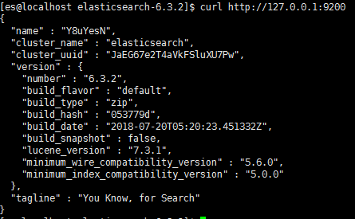

## 前言

最近心血来潮，准备学习下开源届首选的搜索引擎`Elasticsearch`，在了解相关概念之后就准备在虚拟机装上试一试了。

## 下载安装包

在[Elasticsearch 官网](https://www.elastic.co/downloads/elasticsearch)下载，下载完后解压至任意目录。

## 启动

```
./bin/elasticsearch
#后台运行
./bin/elasticsearch -d
```

然而并没有就这么容易启动就成功，下面一一排查启动故障。

## 排查启动故障

1.  启动报 OOM 内存溢出
    **原因**：elasticsearch 默认的 jvm 堆内存大小为 1GB，而我虚拟机分配的内存也才 1GB，启动时系统分配不了这么大的堆内存所以直接内存溢出了。  
    **解决办法**：把堆内存调小点，修改./config/jvm.options 文件，把堆内存设置为 512MB。
    ```
    -Xms512m
    -Xmx512m
    ```
2.  不能以 root 用户启动
    **原因**：elasticsearch 为了安全性默认不允许 root 用户来启动。  
    **解决办法**：
    1.  在启动参数中添加`-Des.insecure.allow.root=true`，但是我测试了根本没效果，原来是 elasticsearch5.x 版本把这个属性给去掉了，也就是说绝对禁止 root 用户运行了，这个是相关[PR](https://github.com/elastic/elasticsearch/pull/18694/files)。
    2.  添加一个用户来运行
        ```
        #添加一个用户名为es
        useradd es
        #把elasticsearch目录的所属用户和组设置为es
        chown -R es:es ./
        #切换到es用户
        su es
        #运行
        ./bin/elasticsearch
        ```
3.  max file descriptors [4096] for elasticsearch process is too low, increase to at least [65536]
    **原因**：elasticsearch 启动时检测到用户最大文件描述符限制低于 65536 而抛出的异常。  
    **解决办法**：修改 es 用户最大文件描述符限制
    ```
    #切换到root用户
    su root
    #修改对应文件
    vi /etc/security/limits.conf
    ```
    在最后添加两行内容，设置 es 用户最大文件描述符限制为 65536
    ```
    es soft nofile 65536
    es hard nofile 65536
    ```
4.  max number of threads [3802] for user [es] is too low, increase to at least [4096]
    **原因**：elasticsearch 启动时检测到用户最大的线程数限制低于 4096 而抛出的异常。
    **解决办法**：修改 es 用户最大的线程数限
    ```
    #切换到root用户
    su root
    #修改对应文件
    vi /etc/security/limits.d/20-nproc.conf
    ```
    可以看到 root 用户是无限制的，而*代表的其他用户限制是 4096。(*很奇怪既然是 4096 为什么上面提示说最大线程数是 3802 呢？\*)，先不管原因了搜到了解决方案在下面加一行。
    ```
    *          hard    nproc     4096
    ```
5.  max virtual memory areas vm.max_map_count [65530] is too low, increase to at least [262144]
    **原因**：elasticsearch 启动时检测到系统最大虚拟内存低于 262144 而抛出的异常。
    **解决办法**：修改系统最大虚拟内存
    ```
    vi /etc/sysctl.conf
    ```
    修改或添加 vm.max_map_count 参数
    ```
    vm.max_map_count=262144
    ```
    刷新配置
    ```
    sysctl -p
    ```

## 启动成功

启动成功之后访问`http://127.0.0.1:9200`，就可以看到服务器相关信息了。

默认情况下是服务器是监听`127.0.0.1`，如果让别的网段访问到的话需要修改`./config/elasticsearch.yml`文件。
```
#配置所有网段可以访问
network.host: 0.0.0.0
```