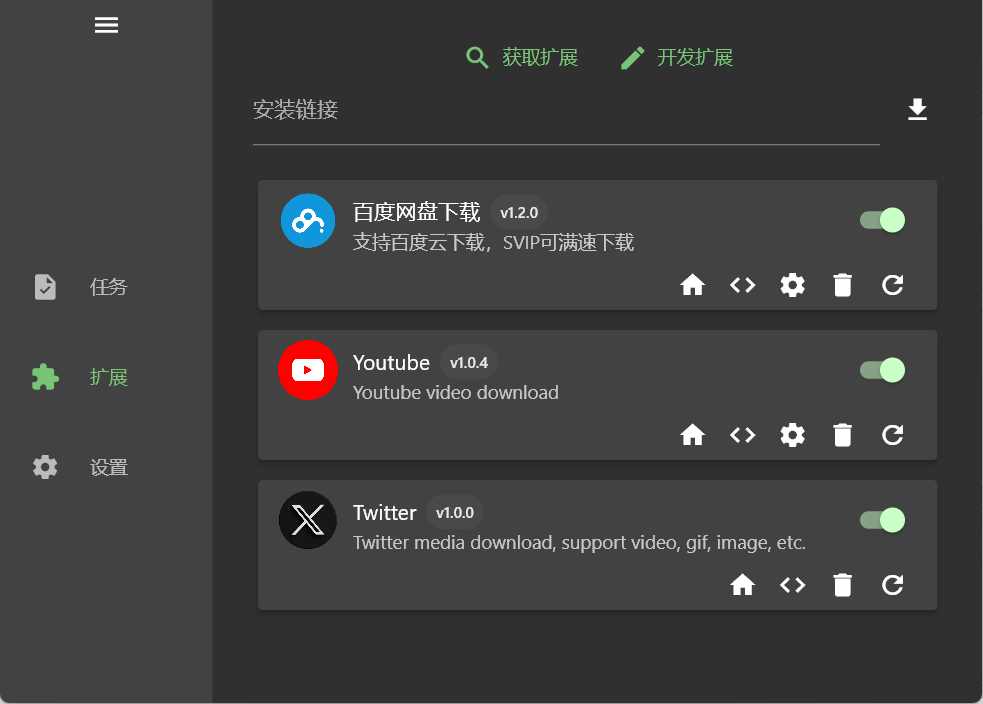
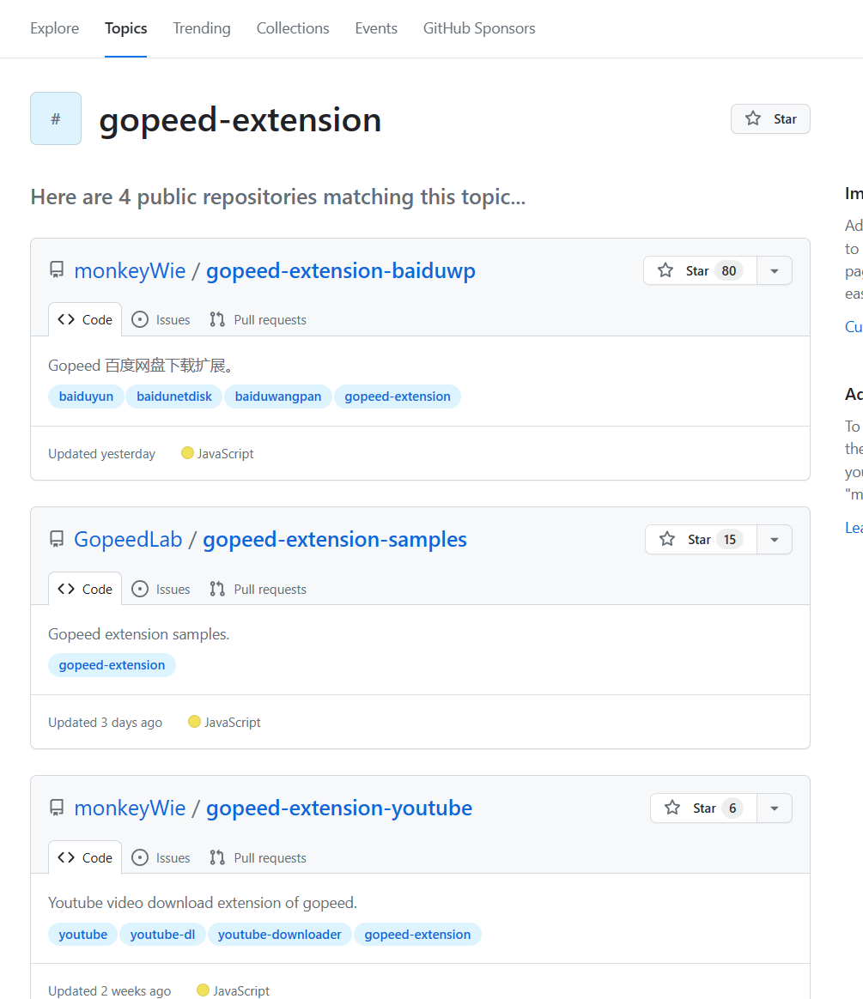
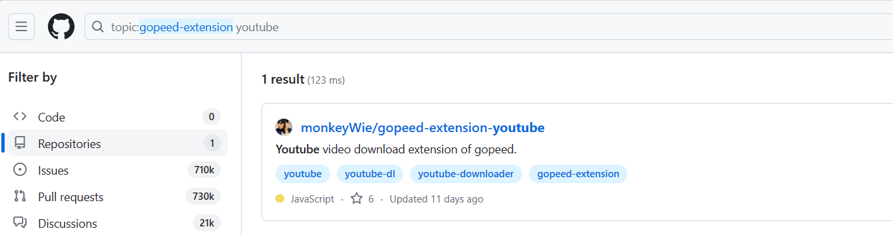
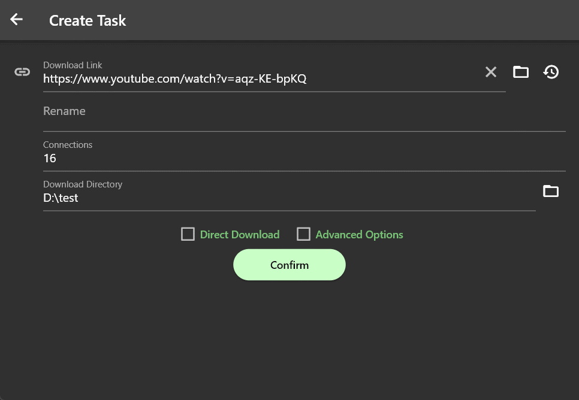
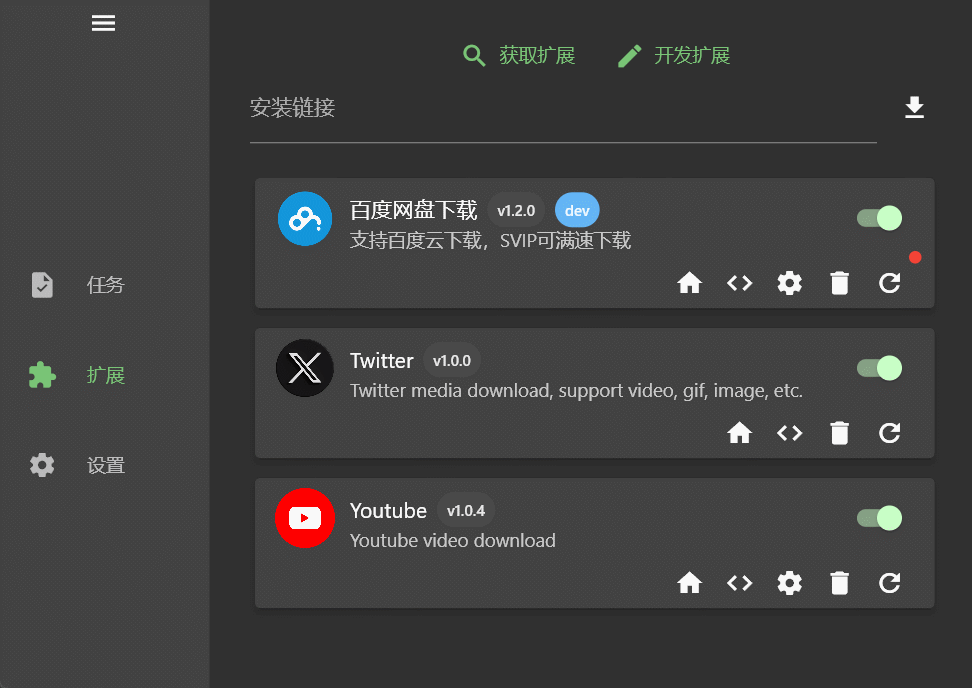
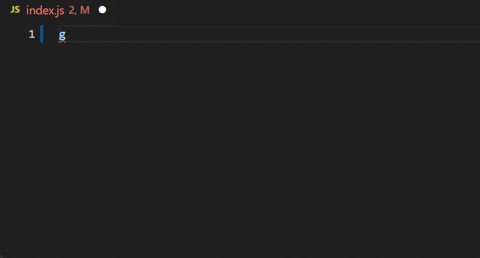

## 前言

前一段时间给我的开源下载器 [Gopeed](https://github.com/GopeedLab/gopeed) 实现了一套扩展系统，相关设计草案可以在[这里](https://github.com/GopeedLab/gopeed/issues/107)查看，基于这套扩展系统可以很方便的通过`javascript`来实现一些定制化的功能，目前已经实现的扩展有：



- [百度网盘扩展](https://github.com/monkeyWie/gopeed-extension-baiduwp)
- [油管扩展](https://github.com/monkeyWie/gopeed-extension-youtube)
- [推特扩展](https://github.com/monkeyWie/gopeed-extension-twitter)

然后重点是这些扩展也是全平台支持的，这意味着你可以在`windows`、`mac`、`linux`、`android`、`ios`、`web`平台上安装和使用这些扩展，是不是很酷？接下来就来介绍下我是如何实现这套扩展系统的。

<!--more-->

## 扩展系统设计

从大体上来说，扩展系统分为四个部分：

- 扩展标准
- 扩展脚本引擎
- 扩展管理器
- 扩展开发工具包

### 扩展标准

要实现一个扩展系统，首先要定义一个扩展标准，这个标准包括扩展的目录结构、扩展的配置文件、扩展的脚本文件等等，这一部分我参照（抄）了`Chrome`的扩展标准，即扩展由一个文件夹组成，文件夹中必须包含一个`manifest.json`声明文件，最简单的扩展目录结构如下：

```
├── index.js
└── manifest.json
```

#### 去中心化设计

市面上大多数软件的扩展系统都是中心化的，比如：`Chrome 扩展`、`VS Code 扩展`，这样的好处是可以很方便检索和分发扩展，不过我觉得`Gopeed`作为一个下载器，中心化的扩展系统一点也没有`BitTorrent`协议的去中心化精神，而且我也不想去维护一个中心化的扩展仓库，所以我决定基于`git`来实现一个去中心化的扩展系统。

`git`作为一个分布式版本控制系统，完美契合了去中心化的需求，每个扩展都是一个`git`仓库，扩展的安装和更新都是通过`git clone`来实现，这样只需要把扩展托管到`github`、`gitlab`、`gitee`等平台上，就可以实现扩展的分发和更新了。

#### 巧妙利用 Topic 分发扩展

去中心化之后没有一个类似扩展商店的平台来分发扩展，那么用户要怎么找到扩展呢？这里巧妙利用了`Github Topic`功能，只要给扩展项目仓库打上`gopeed-extension`的主题标签，然后通过[topics/gopeed-extension](https://github.com/topics/gopeed-extension)就可以让用户找到你的扩展了：



有个问题就是没法通过关键字来搜索扩展，庆幸的是`Github`有着强大的搜索功能，可以通过`topic`和关键字进行搜索，例如：搜索`youtube`关键字，输入`topic:gopeed-extension youtube`，就可以找到`youtube`相关的扩展了：



#### 扩展配置文件

扩展配置文件是一个`json`文件，用来声明扩展的一些基本信息，例如：扩展的名称、版本、描述、图标、脚本文件等等，这里我贴一个上面`Youtube`扩展的配置文件：

```json
{
  "name": "youtube",
  "author": "monkeyWie",
  "title": "Youtube",
  "description": "Youtube video download",
  "icon": "icon.png",
  "version": "1.0.4",
  "homepage": "https://github.com/monkeyWie/gopeed-extension-youtube",
  "repository": {
    "url": "https://github.com/monkeyWie/gopeed-extension-youtube"
  },
  "scripts": [
    {
      "event": "onResolve",
      "match": {
        "urls": [
          "*://youtube.com/watch/*",
          "*://m.youtube.com/watch/*",
          "*://www.youtube.com/watch/*"
        ]
      },
      "entry": "dist/index.js"
    }
  ],
  "settings": [
    {
      "name": "quality",
      "title": "Quality",
      "description": "Video quality",
      "type": "string",
      "value": "highest",
      "options": [
        {
          "label": "Highest",
          "value": "highest"
        },
        {
          "label": "Lowest",
          "value": "lowest"
        }
      ]
    }
  ]
}
```

配置里有几个关键字段：

- `name`：扩展的名称。
- `author`：扩展的作者。
- `repository`：扩展的仓库地址，用来检测扩展是否有更新。
- `scripts`：扩展的脚本文件，用来配置脚本的入口和匹配规则。
- `settings`：扩展的设置声明，在下载器中生成对应的界面提供给用户进行设置。

#### 扩展重名问题

由于扩展是去中心化的，就有可能存在扩展重名的问题，所以我在扩展的配置文件里增加了一个`author`字段，用来区分扩展的作者，通过`name`和`author`来作为扩展的一个唯一标识，例如：

```json
{
  "name": "youtube",
  "author": "monkeyWie"
}
```

这个扩展的唯一标识是`monkeyWie@youtube`，这样就可以降低扩展重名的概率了，当然这并不能完全避免扩展重名的问题，不过先这样吧，以后如果扩展数量真的多到一定程度了，再考虑其他的解决方案。

#### monorepo 支持

考虑到有可能在一个仓库里开发多个扩展，所以我也对这种情况进行了支持，通过`repository`里的`path`字段来支持`monorepo`，例如：

```json
{
  "repository": {
    "url": "https://github.com/GopeedLab/gopeed-extension-samples",
    "path": "github-release-sample"
  }
}
```

然后在安装扩展的时候只需要用`#`来拼接`url`和`path`即可，例如：

```
https://github.com/GopeedLab/gopeed-extension-samples#github-release-sample
```

#### 扩展脚本执行入口

现在有了脚本，但是还需要配置一个脚本的运行入口，也就是脚本在什么时候才会被执行，目前我定了三个入口：

- `onResolve`：当解析一个下载链接时触发。
- `onStart`：当开始下载时触发。
- `onError`：当下载失败时触发。

执行入口有了，但是你肯定不希望脚本在所有的下载任务中都执行，所以还需要配置一个匹配规则，目前支持两种匹配规则：

- `urls`：按下载链接匹配，规则和 chrome 扩展的[匹配规则](https://developer.chrome.com/docs/extensions/mv3/match_patterns/)一致。
- `labels`：按下载任务标签匹配。

拿上面`Youtube`扩展来举例，这个扩展的脚本入口配置如下：

```json
{
  "scripts": [
    {
      "event": "onResolve",
      "match": {
        "urls": [
          "*://youtube.com/watch/*",
          "*://m.youtube.com/watch/*",
          "*://www.youtube.com/watch/*"
        ]
      },
      "entry": "dist/index.js"
    }
  ]
}
```

表示当解析一个`Youtube`的视频链接时，就会执行`dist/index.js`脚本，效果如下：



#### 扩展设置

有时候扩展需要用户提供一些基本的设置，比如`Cookie`、`默认清晰度`等等，所以我设计了一套标准化的扩展声明，用来声明扩展的设置，这样下载器就可以根据声明来生成对应的界面，让用户进行设置，然后在扩展脚本里可以获取到用户设置的值，这样就可以实现一些定制化的功能了。

还是拿上面的`Youtube`扩展来举例，这个扩展的设置声明如下：

```json
{
  "settings": [
    {
      "name": "quality",
      "title": "Quality",
      "description": "Video quality",
      "type": "string",
      "value": "highest",
      "options": [
        {
          "label": "Highest",
          "value": "highest"
        },
        {
          "label": "Lowest",
          "value": "lowest"
        }
      ]
    }
  ]
}
```

表示这个扩展有一个`quality`的设置，类型是`string`，默认值是`highest`，用户可以在`highest`和`lowest`中选择一个，然后在扩展脚本里获取用户设置的值，这样就可以实现根据用户设置的清晰度来下载视频了，效果如下：



### 扩展脚本引擎

要支持灵活的扩展开发需求，肯定是需要一个图灵完备的脚本编程语言，常用的有`lua`、`python`、`javascript`等，这里我选择了`javascript`，因为`javascript`是一门非常流行的脚本语言，而且有着非常丰富的生态，当然还有个很重要的原因就是有一个非常优秀的`javascript`解释器库 [goja](https://github.com/dop251/goja)，性能非常好，而且支持完整的`ES5.1`标准和大部分`ES6+`标准，得益于它是纯`golang`实现的，所以可以很方便的进行跨平台编译。

#### 注入全局对象

`goja`只是一个纯粹的`javascript`解释器，它不像在`浏览器`或者`Node.js`环境一样内置了特殊的`API`，比如`XMLHttpRequest`、`fetch`、`setTimeout`等等，所以我需要在`golang`中实现这些`API`，然后注入到全局对象中，这样才能让扩展脚本能像在浏览器环境一样使用这些`API`。

当然我不可能完全模拟一个`浏览器`环境，目前只实现了一些常用的`API`，例如：`XMLHttpRequest`、`fetch`、`setTimeout`、`setInterval`、`crypto`、`Buffer`、`console`等等，这样就得到了一个阉割版的`浏览器`环境的`javascript`解释器。

这里有个很有意思的地方，其中`XMLHttpRequest`是用`golang`实现的，然后`fetch`是通过`whatwg-fetch`这个 npm 包做的`polyfill`，不得不感叹`js`还是好玩，各种奇技淫巧，而且偷偷告诉你，`react-native`也是用`whatwg-fetch`来实现的`fetch`，别问我怎么知道的，因为我就是借鉴（抄）的它。

> 关于这部分具体实现，大家如果有兴趣可以看下[源码](https://github.com/GopeedLab/gopeed/tree/main/pkg/download/engine)。

#### 脚本引擎和 Golang 的交互

脚本引擎准备好了，回到之前脚本入口配置，每当满足匹配规则时，就会执行对应的脚本，这里就需要脚本引擎和 Golang 的交互了，我需要把`Golang`中的对象传递给脚本引擎，然后脚本引擎访问和修改这些对象，这样就可以实现脚本和 Golang 的交互了。

比如在`onResovle`入口中，我需要把`Golang`中的`Request`对象传递给脚本引擎，先来看看扩展的脚本：

```js
gopeed.events.onResolve((ctx) => {
  ctx.res = {
    name: "example",
    files: [
      {
        name: "index.html",
        req: {
          url: "https://example.com",
        },
      },
    ],
  };
});
```

脚本引擎执行`gopeed.events.onResolve()`来注册一个回调函数，然后在`Golang`中获取到回调函数，并在执行的时候把上下文`ctx`作为参数传递进去，示例代码如下：

```go
type Request struct {
  URL     string `json:"url"`
}

type FileInfo struct {
	Name string `json:"name"`
	Path string `json:"path"`
	Size int64  `json:"size"`

	Req *Request `json:"req"`
}

type Resource struct {
  Name string `json:"name"`
	Size int64  `json:"size"`
	Files []*FileInfo `json:"files"`
}

type OnResolveContext struct {
	Req *Request  `json:"req"`
	Res *Resource `json:"res"`
}

// 当触发解析任务时，执行扩展脚本，以下为伪代码
func (d *Download) Resolve(req *Request) *Response{
  // 1. 按照规则匹配生效的扩展
  ext := d.matchExt(req)
  if ext != nil {
    // 2. 注入 gopeed 全局对象
    gopeed := &Gopeed{
      events: map[string]goja.Callable
    }
    d.engine.Set("gopeed", gopeed)
    // 3. 执行扩展脚本拿到回调函数
    d.engine.RunScript(ext.script)
    onResolve := gopeed.events["onResolve"]
    // 4. 执行回调函数，传入上下文参数
    ctx := &OnResolveContext{
      Req: &Request{
        URL: "https://example.com",
      },
    }
    d.engine.CallFunction(onResolve, ctx)
    // 5. 获取上下文结果进行处理
    if ctx.Res != nil {
      // 如果扩展脚本返回了解析结果，就直接返回
      return ctx.Res
    }
  }

  // ... 正常解析逻辑
}
```

以上就是一个扩展脚本的执行流程，这里只是举例了`onResolve`入口，其他入口的执行流程也是类似的。

### 扩展管理器

扩展的基本功能已经有了，接下来就需要一个扩展管理器来管理扩展的安装、更新、卸载等等。

#### 安装扩展

前面说过，扩展是通过`git clone`来进行安装的，这里我通过[go-git](https://github.com/go-git/go-git)这个库来进行`git`相关操作，步骤如下：

1. 通过`git clone`把扩展仓库克隆到本地临时目录。
2. 读取`manifest.json`配置文件，解析扩展的基本信息。
3. 如果是一个有效的扩展项目，就把扩展移动到下载器扩展文件夹下，并按照扩展的唯一标识重命名扩展文件夹。
4. 把扩展信息写入到本地数据库中。

#### 更新扩展

更新扩展和安装扩展步骤类似，区别就是第 3 步做`diff`操作，找出需要新增、修改、删除的文件，然后进行相应的操作。

> 这里可能会有人疑问为啥不直接用 git pull 来做更新，因为考虑到要支持直接通过本地文件夹安装扩展，而这种方式安装的扩展不一定是个 git 仓库，所以就自己实现了一套更新逻辑，也就是说我只依赖 git clone 来作为一种扩展安装方式，这样的话抛开 git 扩展系统也是可以正常工作的。

#### 卸载扩展

这个就比较简单了，只需要把扩展文件夹删除，然后从数据库中删除扩展信息即可。

### 扩展开发工具包

前面说过扩展引擎是一个阉割版的`浏览器`环境，并且只支持部分`es6+`语法，如果是纯手写`javascript`来开发扩展，那么开发体验肯定是非常糟糕的，就像在`IE 8`上用着`es5`语法开发一样，所以为了能提升扩展开发体验，我开发了一个配套的[javascript 库](https://github.com/GopeedLab/gopeed-js)，这个库是由`pnpm monorepo`管理的，里面包含多个`npm`包，接下来我会一一介绍。

#### [脚手架](https://github.com/GopeedLab/gopeed-js/tree/main/packages/create-gopeed-ext)

首先是一个脚手架，用来初始化一个扩展项目，只需要执行以下命令即可快速初始化一个扩展项目：

```bash
npx create-gopeed-ext@latest

√ Project name (gopeed-extension-demo) ...
√ Choose a template » Webpack

Success! Created gopeed-extension-demo at D:\code\study\js\gopeed-extension-demo
Inside that directory, you can run several commands:

  git init
    Initialize git repository

  npm install
    Install dependencies

  npm run dev
    Compiles and hot-reloads for development.

  npm run build
    Compiles and minifies for production.

We suggest that you begin by typing:

  cd gopeed-extension-demo

Happy coding!
```

里面提供了两种模板：

- Webpack：

  内置了`webpack`+`babel`+`eslint`+`prettier`的模版，对于有前端开发经验的同学来说应该很熟悉了，有了`webpack`+`babel`，可以随意使用最新的`es`语法开发扩展，而且还可以使用`npm`包，webpack 配置好了[GopeedPolyfillPlugin](https://github.com/GopeedLab/gopeed-polyfill-webpack-plugin)，它会自动垫片上`node`环境下才有的`API`，比如`http`、`path`等等，这样就可以在扩展脚本里使用这些`API`了。

- Pure：
  纯`javascript`的模版，没有任何依赖，适合那些不想用装`node`环境的同学，当然只适合开发一些简单的扩展，如果要用到`npm`包，还是推荐用`Webpack`模版。

#### [扩展类型声明](https://github.com/GopeedLab/gopeed-js/tree/main/packages/gopeed)

没有类型提示的开发体验是非常糟糕的，我用`typescript`写了一个配套的类型声明库，这样在`vscode`里就可以有完整的类型提示了，由于我注入的是全局对象，在`typescript`中需要这样声明：

```ts
declare global {
  const gopeed: Gopeed;
}
```

在安装完依赖之后，无需显示引用就可以获得类型提示，效果如下：



#### [Polyfill 插件](https://github.com/GopeedLab/gopeed-polyfill-webpack-plugin)

此仓库`fork`自[node-polyfill-webpack-plugin](https://github.com/Richienb/node-polyfill-webpack-plugin)，用于垫片`node`环境的 API，比如`http`、`path`等等，在`webpack`生态中这已经是一套非常成熟的垫片方案了，但是由于`Gopeed`的扩展环境并不是真正的`浏览器环境`，所以在使用这些垫片方案时碰到了一些问题，比如说有个`vm`模块，它是`node`环境下用来环境隔离的，基于浏览器环境的垫片实现是通过`iframe`来实现的，但是`Gopeed`扩展环境是没有`iframe`的，导致此垫片方案都不适用，我就`fork`了一份来为`Gopeed`定制了一套`vm`垫片方案，当然我还修改了部分垫片实现，使其更适合`Gopeed`的扩展环境。

总的来说就是我要让`Gopeed`扩展环境尽可能对齐`浏览器`环境，然后其它的都通过垫片来实现，如果有需要特殊处理的垫片，就做定制化开发处理，有了这套垫片方案，就可以愉快的使用大部分`npm`包了，目前我开发的几个扩展都是基于`npm`包来实现的，效果还是不错的。

后续如果有更多的垫片需求，我会继续完善这个库。

## 结语

我花费了大量的时间和精力来实现这套扩展系统，希望`Gopeed`能像油猴那样有一个完善的扩展生态，目前我开发的几个扩展只是抛砖引玉，毕竟我一个人的力量还是有限的，希望能有更多感兴趣的同学参与进来开发扩展，让`Gopeed`的功能更加强大，最后的最后，希望大家能给 [Gopeed](https://github.com/GopeedLab/gopeed) 点个`star`支持一下，十分感谢！

### 相关链接

- [Gopeed](https://github.com/GopeedLab/gopeed)
- [Gopeed 扩展开发指南](https://docs.gopeed.com/zh/dev-extension.html)
