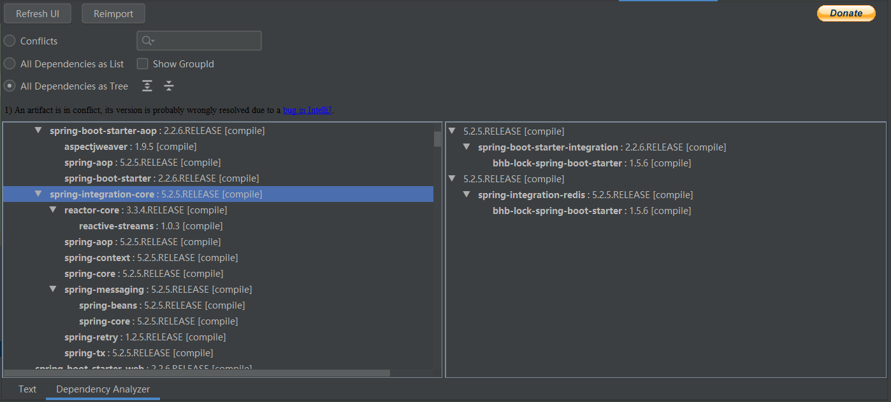
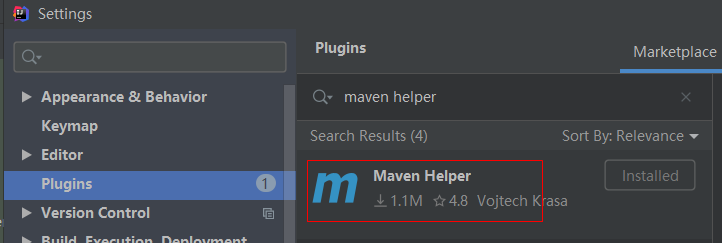
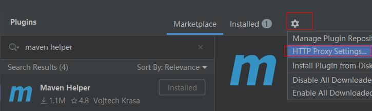
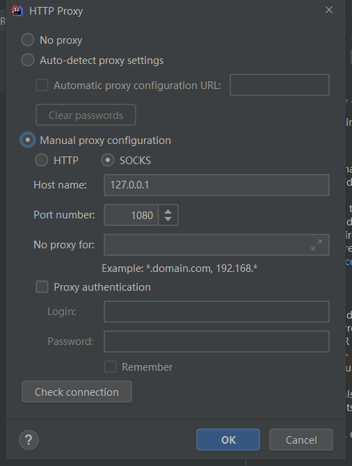
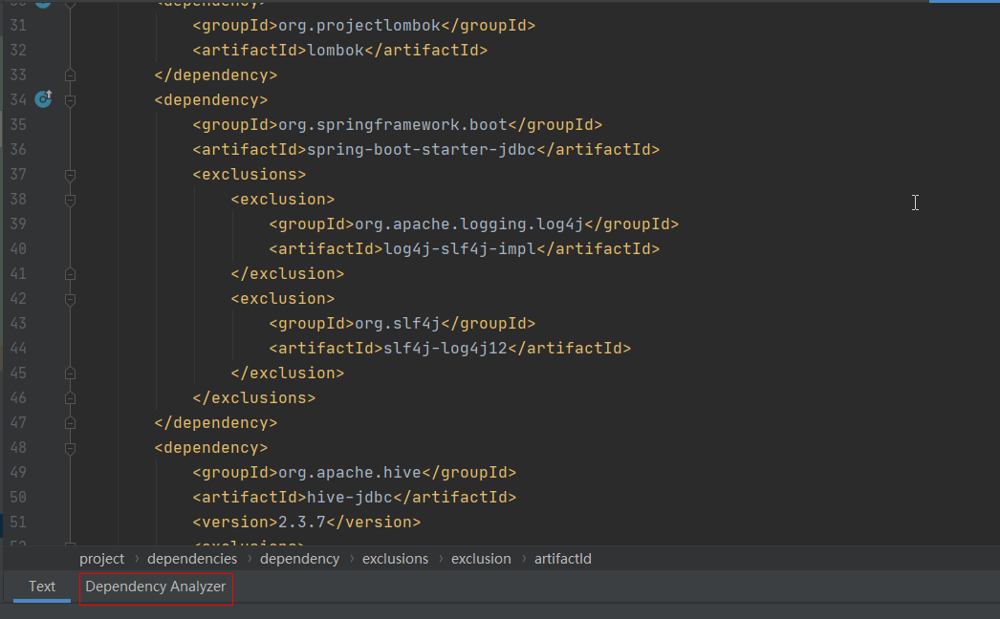
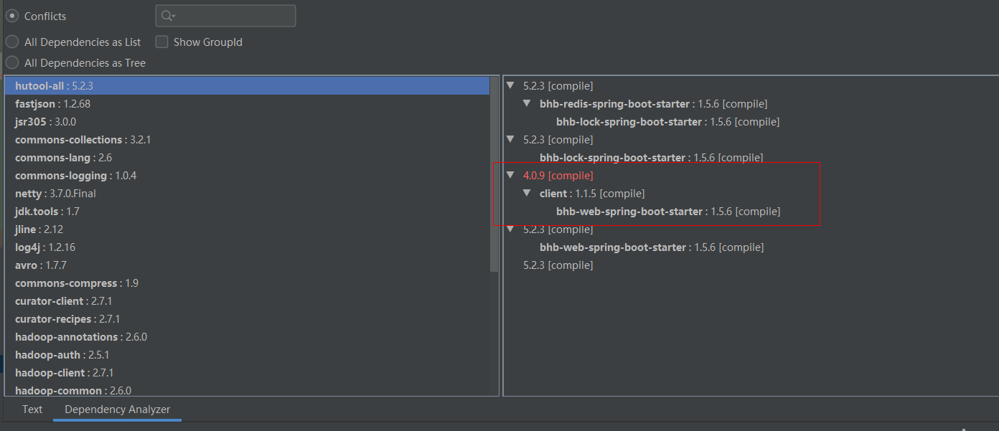
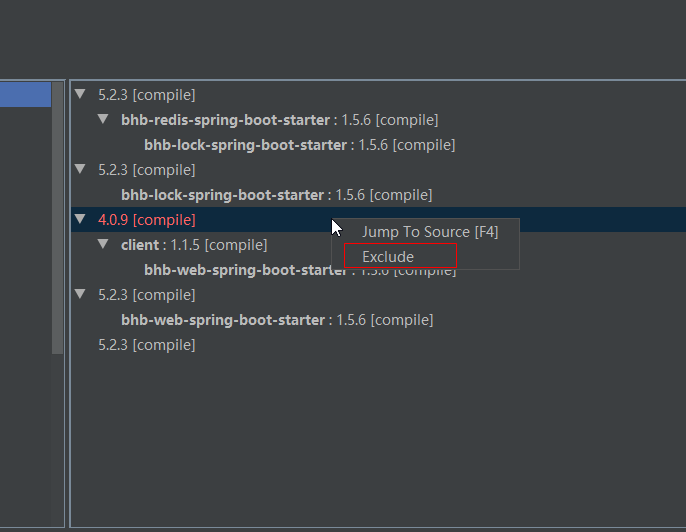

### Maven-Helper 插件介绍

这个插件能可以通过 UI 界面的方式来查看 maven 项目的依赖关系，当然还有最重要的功能`解决依赖冲突`，使用起来非常的方便，效果图：

在开发 JAVA 项目的时候，经常会由于 maven 依赖冲突导致项目启动失败，这个时候往往会懵逼，到底哪个依赖冲突了，需要排除哪个子依赖，有了这个插件之后就可以很快的定位到冲突的组件，并进行排除。

<!--more-->

### 安装

首先进入 IDEA plugins 市场，搜索`Maven Helper`进行安装：

这里需要注意的是国内网络连接 jetbrains 服务器会比较慢，可能需要梯子，通过右上角的设置按钮进行代理设置：

安装完成之后重启 IDEA，打开项目里的`pom.xml`文件，就可以看到左下角有一个`Dependency Analyzer`选项卡，点进去就可以看到界面了：

### 排除冲突

选中`Conflicts`插件就会列出有冲突的依赖，然后选择某个依赖就可以看到详细信息：

可以看到这个例子，在此项目中有两个`hutool-all`版本，如果项目启动失败提示跟此依赖有关的话，就可以通过右键指定版本进行排除：

点击`Exclude`之后，插件自动会在`pom.xml`文件中添加`<exclusion>`相关代码，进行子依赖的排除。

