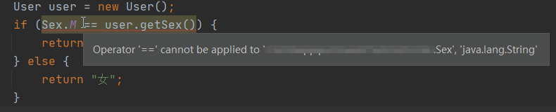

在业务开发中经常会使用枚举来定义一些业务常量，这确实可以让我们的代码变的干净和优雅，但是如果枚举使用不当的话很可能就会发生问题，这里分享一些关于枚举最佳实践。

<!--more-->

## 使用枚举定义数据库表字段

在`JPA`或者`ORM`框架中，一般都是支持通过枚举来定义一个表字段，例如有一个用户表(user)，其中有一个性别字段(sex)，这个时候我们就可以通过枚举来定义 sex，代码如下：

- 定义枚举类

```java
public enum Sex{
  M,F
}
```

- 定义实体类

```java
@Data
public class User{
  private Sex sex;
}
```

这样就可以提供在编译时检测，确保`sex`字段值只能是`M`或`F`，从而提升代码的健壮性。

## 使用==来比较枚举值

很多时候我们在对枚举值做判断的时候可能是用的`equals`，但是这样其实是有风险的，例如：

```java
// 根据性别枚举显示对应的中文描述
if (Sex.M.equals(user.getSex())) {
  return "男";
} else {
  return "女";
}
```

上面这段代码正常情况下是没有任何问题的，但是如果有一天需要把`User`类的`sex`属性类型调整为`String`，代码如下：

```java
@Data
public class User{
  //类型替换为String
  private String sex;
}
```

因为`equals`方法的参数是`Object`类型，导致类型重构后根本得不到编译器的反馈，上面那判断逻辑代码并不会报错，这会极容易导致遗漏修改，然后所有人都成了性别`女`，为了避免类似这种问题，所以推荐使用`==`去做枚举比较，代码如下：

```java
if (Sex.M == user.getSex()) {
  return "男";
} else {
  return "女";
}
```

这样在类型重构的时候就会得到编译时的报错反馈，从而确保重构之后的代码正确性。



## 使用枚举实现单例

`《effective java》`作者极力推荐使用枚举来实现单例，因为它具备以下特点：

- 写法简洁，代码短小精悍
- 线程安全
- 防止反序列化和反射的破坏

代码示例：

```java
public enum EnumSingleton {
    INSTANCE;

    public EnumSingleton getInstance(){
        return INSTANCE;
    }

    public void hello(){
        System.out.println("hello world");
    }
}

public static void main(String[] args) {
    EnumSingleton.INSTANCE.hello();
}
```


