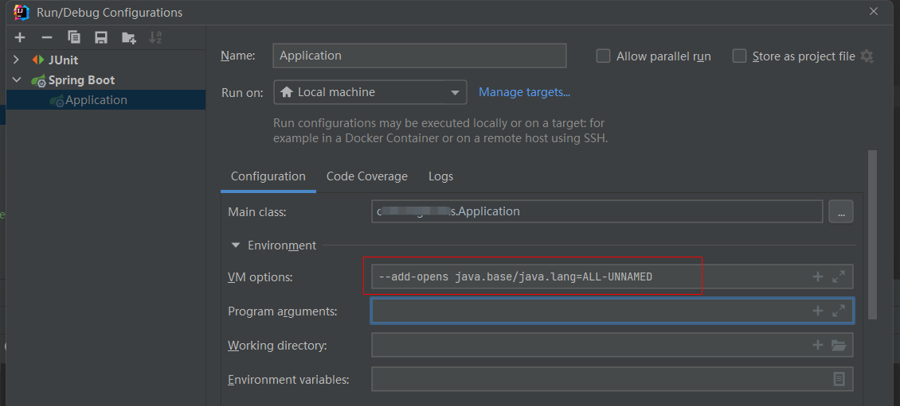

## 前言

最近在给公司新架构做技术选型，刚好 Java 17 也正式发布一段日子了，而且是`LTS`长期支持版本，就想着直接用起来吧，里面有些特性还是非常好用的，比如：

- [JEP 378](https://openjdk.java.net/jeps/378)：文本块支持
- [JEP 395](https://openjdk.java.net/jeps/395)：Record 类型
- [JEP 286](https://openjdk.java.net/jeps/286)：变量类型推导
- More...

<!-- more -->

## 遇到的问题

其中最主要的原因就是 Java 模块化之后，有些 jdk 内部的类不能被访问了，但是在 Java 16 之前都只是警告，而在 Java 16 之后则会直接报错，目前依赖了`cglib`和`javassist`的框架可能都会因此导致项目无法启动，抛出如下异常：

```log
Caused by: java.lang.reflect.InaccessibleObjectException: Unable to make protected final java.lang.Class java.lang.ClassLoader.defineClass(java.lang.String,byte[],int,int,java.security.ProtectionDomain) throws java.lang.ClassFormatError accessible: module java.base does not "opens java.lang" to unnamed module @39aeed2f
	at java.base/java.lang.reflect.AccessibleObject.checkCanSetAccessible(AccessibleObject.java:357)
	at java.base/java.lang.reflect.AccessibleObject.checkCanSetAccessible(AccessibleObject.java:297)
	at java.base/java.lang.reflect.Method.checkCanSetAccessible(Method.java:199)
	at java.base/java.lang.reflect.Method.setAccessible(Method.java:193)
	at net.sf.cglib.core.ReflectUtils$1.run(ReflectUtils.java:61)
	at java.base/java.security.AccessController.doPrivileged(AccessController.java:554)
	at net.sf.cglib.core.ReflectUtils.<clinit>(ReflectUtils.java:52)
	at net.sf.cglib.core.KeyFactory$Generator.generateClass(KeyFactory.java:243)
	at net.sf.cglib.core.DefaultGeneratorStrategy.generate(DefaultGeneratorStrategy.java:25)
	at net.sf.cglib.core.AbstractClassGenerator.generate(AbstractClassGenerator.java:332)
```

从 Java 16 开始，[JEP 396](https://openjdk.java.net/jeps/396)会默认把`--illegal-access`参数设置为`deny`，即默认禁用访问封装的包以及反射其他模块，这样就会导致上面的异常，在此之前该参数默认值一直都是`--illegal-access=permit`，只会产生警告，而不会报错，所以如果是 Java 16 的话需要在执行 Java 程序时把`--illegal-access`设置为`permit`，这样就可以解决问题，示例：

```sh
java -jar --illegal-access=permit app.jar
```

从 Java 17 开始就更狠了，[JEP 403](https://openjdk.java.net/jeps/403)直接把`--illegal-access`参数移除了，如果需要启用访问封装的包，需要在执行 Java 程序时加上`--add-opens java.base/java.lang=ALL-UNNAMED`选型，示例：

```sh
java -jar --add-opens java.base/java.lang=ALL-UNNAMED app.jar
```

如果是在 IDEA 中运行需要配置对应的 VM 参数，示例：



虽然说加完参数之后是可以跑起来，但是我认为这是一个破坏性的改动，因为这样的话，如果有一天 Java 版本变化了，参数又失效了，那么所有的项目都需要更新，这样会导致项目的维护成本大大增加，所以这里不建议使用。

## 开源框架升级进度跟踪

那么有没有办法不加启动参数就能正常运行呢，答案是肯定的，只不过需要等开源框架全换算 Java 17 的新 API，目前我跟踪到的两个项目都还没有适配 Java 17。

### Spring

SpringBoot 2.5.0 开始支持 Java 17，没啥问题。

### apollo 配置中心

apollo 目前的 master 分支代码是已经适配好了，但是还没有正式发版，比较奇怪的事是， apollo 之前[升级](https://github.com/apolloconfig/apollo/pull/3646)了底层依赖包来适配 Java 17，但是后来又[回滚](https://github.com/apolloconfig/apollo/commit/a10da56e97a585ee960c4967843287bc0bcfc176)回来了，不知道是出于什么原因。

### dubbo

dubbo 有个[issue 7593](https://github.com/apache/dubbo/issues/7593)四月份就提出来了，但是一直没人跟进。

## 总结

一顿操作下来发现不行，最终还是先换成了 Java 15，待时机成熟的时候再升级到 Java 17。
