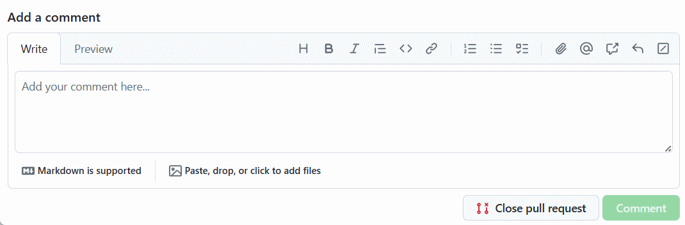
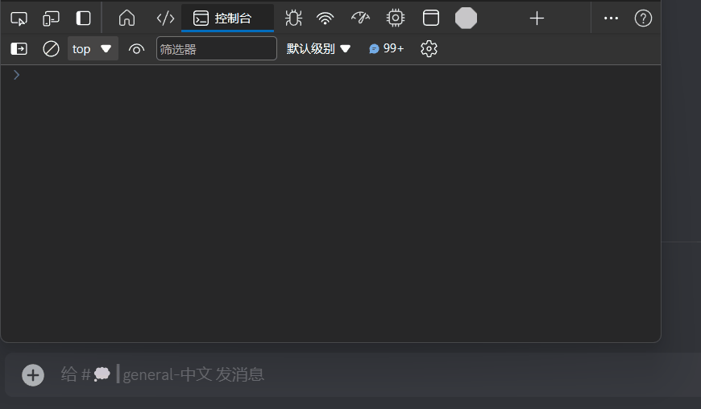
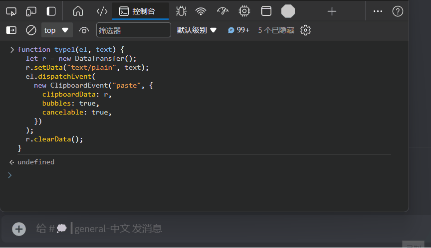
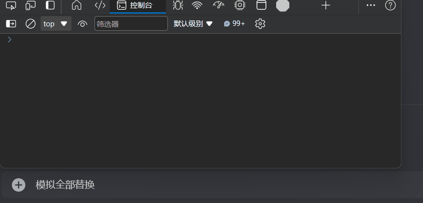

最近发现了一个`沉浸式翻译`的神奇功能，就是在输入框输入中文的时候敲三下空格就可以自动翻译成英文，这功能真的挺方便的，效果如下图：



这直接引起了我的好奇心，要知道模拟文本输入是一个很麻烦的事情，记得之前有一次我想用`油猴`来做一个`discord`自动发消息水经验的脚本，但是卡在了模拟输入这一步，最后就放弃了。

于是就去`discord`试了下`沉浸式翻译`的这个功能，发现是可以正常运作的，这我就不得不好好研究下了。

<!-- more -->

## 无用的尝试

众所周知`html`里只有两种输入方式，一种是`input | textarea`，还有另一种是`contenteditable=ture`的`div`，通过`F12`可以看到`discord`的输入框是一个`contenteditable div`，直接在控制台运行代码如下：

```javascript
var input = document.querySelector("div.markup_a7e664.editor__66464");
input.textContent = "测试";
```

效果如下，可以看到输入框里的内容已经被修改了，但是消息并不能发出去也不能被删除：



说明事情并没有那么简单，很多情况下输入框都会有一些`js`的事件监听，比如`input`、`keydown`、`keyup`、`keypress`等，这些事件监听会影响到输入框的行为，所以直接修改`textContent`这条路行不通。

同样的在现代化的前端框架中，输入框都是通过`input`事件做双向绑定的，这样的输入框也是无法通过修改`input.value`来达到模拟输入目的。

也就是说要达到模拟键盘输入的目的，不止需要修改输入框的内容，还需要触发一系列相关的事件才行，想想就觉得头大，不过既然`沉浸式翻译`能做到，那说明一定有办法，接下来就研究下它咋做到的。

## 源码之下无秘密

`沉浸式翻译`自从被收购之后就没有开源了，但是谁叫它是`js`写的呢，直接把扩展里的`content_script.js`拿出来分析，虽然是混淆过的但是问题不大，具体代码阅读过程这里就不展开了，总之最后定位到了几个关键函数，这里反混淆加工一下贴出来：

```javascript
/**
 * 方式一：下发粘贴文本事件进行输入
 */
function type1(el, text) {
  let r = new DataTransfer();
  r.setData("text/plain", text);
  el.dispatchEvent(
    new ClipboardEvent("paste", {
      clipboardData: r,
      bubbles: true,
      cancelable: true,
    })
  );
  r.clearData();
}

/**
 * 方式二：调用insertText命令进行输入
 */
function type2(el, text) {
  el.select();
  document.execCommand("insertText", false, text);
}

/**
 * 方式三：改变输入框的value值并下发input事件进行输入
 */
function type3(el, text) {
  el.value = e.text;
  el.dispatchEvent(
    new Event("input", {
      bubbles: true,
    })
  );
}

/**
 * 方式四：下发textInput事件进行输入
 */
function type4(el, text) {
  let n = document.createEvent("TextEvent");
  if (n.initTextEvent) {
    n.initTextEvent("textInput", true, true, window, text);
    el.dispatchEvent(n);
  }
}
```

一共有这四种方式，然后逐一进行尝试，这样来提高兼容性，我测试了下`discord`的输入框是可以通过`type1`方式进行模拟输入的，效果如下图：



但是这样只能`append`文本，如果要把文本完全替换掉还需要先选中所有文本再调用，相关代码也贴一下：

```javascript
function selectAll(el) {
  el.focus();
  let t = window.getSelection();
  if (!t) return;
  let n = document.createRange();
  n.selectNodeContents(el);
  t.removeAllRanges();
  t.addRange(n);
}
```

最终的效果如下：



## 使用现成的库

上面的代码虽然可以实现模拟键盘输入，但是实现的还是比较粗糙，可能会有一些兼容性问题，所以我`google`了一下，发现了一个现成的库[user-event](https://github.com/testing-library/user-event)，这个库的介绍如下：

```
user-event tries to simulate the real events that would happen in the browser as the user interacts with it. For example userEvent.click(checkbox) would change the state of the checkbox.
```

也就是说它在模拟输入的时候会把所有的事件都模拟出来，就像真实的用户输入一样，这样可以最大程度上提高兼容性，使用起来也非常简单，直接`npm install @testing-library/user-event`安装即可，然后在代码中引入即可快速实现：

```javascript
import userEvent from "@testing-library/user-event";

const user = userEvent.setup();
await user.keyboard("测试");
```

不过有一点要吐槽的是这个库不支持`umd`引入，如果是油猴之类的脚本的话就不太方便了，得上`webpack`才行。

## 总结

模拟键盘输入是一个比较麻烦的事情，不过通过一些技巧还是可以实现的，不过要注意兼容性问题，最好使用现成的库来实现，这样可以提高开发效率，减少不必要的麻烦。