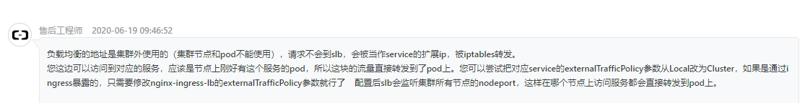
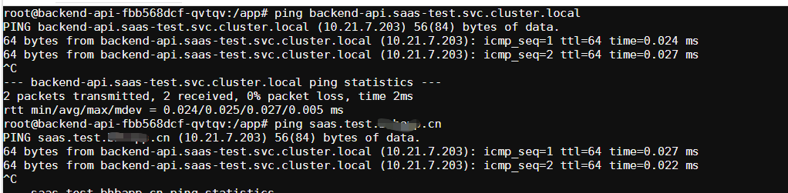

### 背景

在一次升级阿里云 k8s 版本之后暴露出来一个问题，一般在 k8s 集群中都会使用`service域名`来进行服务之间访问，但是为了在本地开发时能访问到这些服务，又会通过`ingress`暴露在外网中，这样在开发的时候就可以直接使用的`ingress`暴露的外网域名进行访问。

按理说本地开发环境的时候使用`外网域名`，在部署到 k8s 的时候应该使用 k8s 内部的`service域名`就什么事都没有了，然而在没有强约束的情况下很多项目`调用集群内部服务的时候还是使用的外网域名`，然而这样可能会导致服务调用失败，没想到吧。对此我们咨询了阿里云，给我们的回答是：


好吧，按着提示把`externalTrafficPolicy`选项修改为`Cluster`，确实问题解决了，但是这样一改又把`源IP`丢失了，在后端服务中获取的`IP`都变成了`Node IP`，这肯定也不行。

<!--more-->

所以目前只有一种解决方案，就是把所有项目中通过`外网域名`访问内部服务的域名全部修改成 k8s 内部的`service域名`。

对此有两种实施方案：

1. 把所有项目都与对应的开发一一对接，然后通过环境变量将`外网域名`设置为`service域名`。
2. 通过配置`coredns`，实现将外网域名`CNAME`到`service域名`上。

方案一对于项目少的情况比较好实施，由于我们集群的服务比较多，施成本会非常高，所以还是去调研了方案二。

### coredns 配置

在 coredns 官网查阅资料之后，得知可以使用[rewrite](https://coredns.io/plugins/rewrite/)插件来实现`CNAME`，测试如下：

- 配置`www.baidu.com` CNAME 到`www.taobao.com`

```sh
.:53 {
    rewrite name www.baidu.com www.taobao.com
    forward . 114.114.114.114
    reload
}
```

- 效果

```
dig @localhost www.baidu.com

; <<>> DiG 9.11.3-1ubuntu1.11-Ubuntu <<>> @localhost www.baidu.com
; (1 server found)
;; global options: +cmd
;; Got answer:
;; ->>HEADER<<- opcode: QUERY, status: NOERROR, id: 45042
;; flags: qr rd ra; QUERY: 1, ANSWER: 3, AUTHORITY: 0, ADDITIONAL: 1

;; OPT PSEUDOSECTION:
; EDNS: version: 0, flags:; udp: 4096
;; QUESTION SECTION:
;www.baidu.com.                 IN      A

;; ANSWER SECTION:
www.baidu.com.          364     IN      CNAME   www.taobao.com.danuoyi.tbcache.com.
www.baidu.com.          33      IN      A       113.96.109.101
www.baidu.com.          33      IN      A       113.96.109.100

;; Query time: 39 msec
;; SERVER: 127.0.0.1#53(127.0.0.1)
;; WHEN: Sun Jun 28 14:47:34 CST 2020
;; MSG SIZE  rcvd: 161
```

可以看到已经成功实现了。

### 实施

接着就是配置 k8s 集群中的`coredns`来实现目的了，`coredns`通过配置项`coredns`中 key 为`Corefile`的配置来挂载成`Corefile`，所以只需要修改该配置项即可。

```
.:53 {
    cache 30
    errors
    health
    kubernetes cluster.local in-addr.arpa ip6.arpa {
        pods insecure
        fallthrough in-addr.arpa ip6.arpa
    }
    rewrite name saas.test.xxx.cn backend-api.saas-test.svc.cluster.local
    loadbalance
    loop
    prometheus :9153
    forward . /etc/resolv.conf
    reload
    ready
}
```

注意第 9 行，`saas.test.xxx.cn`是一个外网域名，对应的 service 域名是`backend-api.saas-test.svc.cluster.local`，修改好之后等待一分钟左右，`coredns`的 reload 插件会自动进行热加载，然后进入 pod 中测试看看是否生效。



可以看到`backend-api.saas-test.svc.cluster.local`解析出来的 ip 是`10.21.7.203`，`saas.test.xxx.cn`解析出来的 ip 也是`10.21.7.203`，这样的话在集群里通过外网域名请求其实也和直接访问 service 域名一致了。

接下来只需通过命令`kubectl get ingress --all-namespaces`把所有 ingress 暴露的外网域名和对应的 service 进行关联，并生成对应的配置加入`Corefile`中即可。
