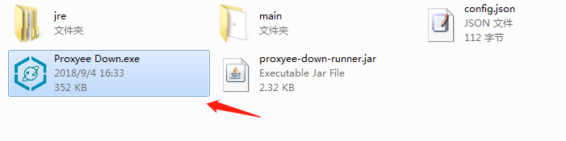
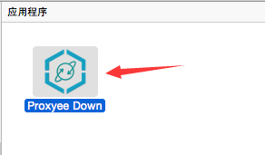
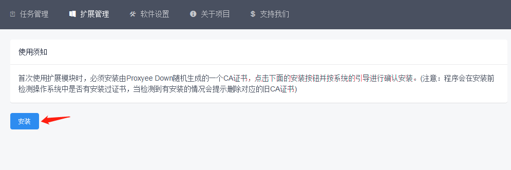
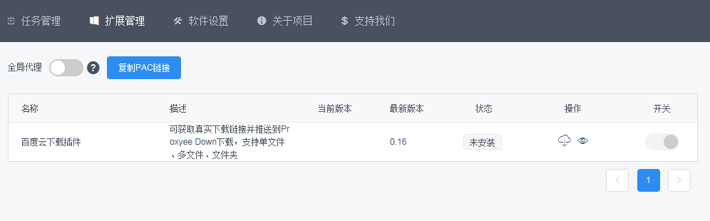
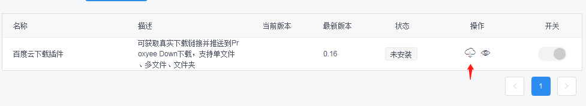
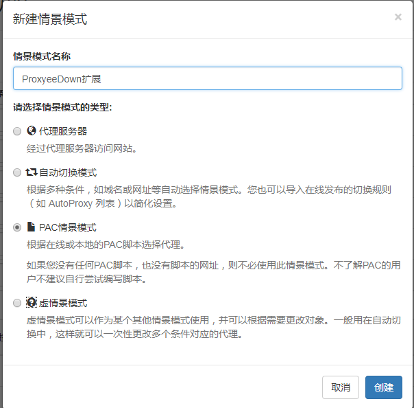
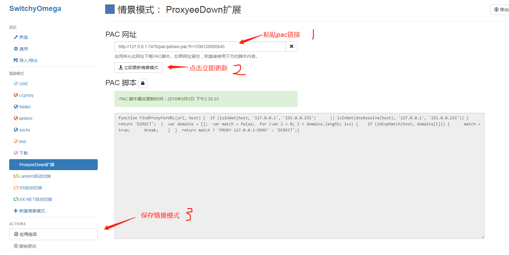
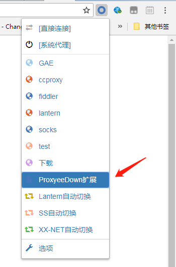

在经历了近半年的时间之后，Proxyee Down 终于迎来了 3.0 版本,新版本改动非常的大同时进步也非常的大，来看看 3.0 版本的新特性吧。

## 新特性

1. UI 界面完全重构。
2. 使用全新的[下载核心](https://github.com/proxyee-down-org/pdown-core)，稳定性和下载速度全面提升，现在下载完的连接会去支持没下载完的连接，而不是和老版本一样下载完了就停止了。
3. 去除老版本自带的百度云下载插件，新增扩展模块，在扩展商城里可以下载各种各样的扩展而不是仅限于百度云下载插件，支持第三方开发扩展([参与开发](https://github.com/proxyee-down-org/proxyee-down-extension))。
4. 加入限速功能，包括单任务限速和全局限速。
5. 加入同时下载任务数设置功能。
6. 启动速度大幅度提高
7. 加入国际化支持(欢迎提交 PR)
8. 文件夹选择器使用操作系统原生选择器，支持局域网共享文件夹、移动硬盘、U 盘。
9. 移除老版本自带的百度云解压工具(之后会单独开发一款解压工具从下载器里独立出来)
10. mac 系统打包成原生 app 应用，而不是像之前一样用批处理文件启动。

## 软件下载

- [windows](http://api.pdown.org/download/release?os=windows)
- [mac](http://api.pdown.org/download/release?os=mac)
- [linux](https://github.com/proxyee-down-org/proxyee-down/releases)

## 使用说明

- windows:  
  下载好 windows 版本的压缩包之后，解压至任意目录，会得到一个文件夹，执行文件夹里面的`Proxyee Down.exe`文件即可。  
  (_注：360 可能会报毒，需要加入白名单_)
  
- mac:  
  下载好 mac 版本的压缩包之后，解压至任意目录，会得到一个`Proxyee Down`App，双击运行即可。  
  (_注：mac 系统切换代理和安装证书需要管理员权限，所以在启动时会提示输入密码_)
  
- linux:  
  linux 系统目前没有打原生包，要自行下载 jar 包运行，需安装 JRE 或 JDK(_要求版本不低于 1.8_)，下载完成后在命令行中运行：
  ```
  java -jar proxyee-down-main.jar
  ```
  (_注：如果使用 openjdk 的话需要安装 openjfx_)

### 任务模块

用于管理下载任务，可以在此页面创建、查看、删除、暂停、恢复下载任务。

#### 相关

- [创建任务进阶教程](https://github.com/proxyee-down-org/proxyee-down/blob/v2.5/.guide/common/create/read.md)
- [刷新任务下载链接](https://github.com/proxyee-down-org/proxyee-down/blob/v2.5/.guide/common/refresh/read.md)

### 扩展模块

在开启扩展模块时一定要手动安装一个由 Proxyee Down 随机生成的一个 CA 证书用于`HTTPS MITM`的支持。

#### 安装证书

进入扩展页面，如果软件检测到没有安装 Proxyee Down CA 证书时，会有对应的安装提示，接受的话点击安装按照系统指引即可安装完毕。


#### 扩展商店

安装完证书后会进入扩展商店页面，目前扩展商店只有一款百度云下载扩展，以后会陆续开发更多的扩展(_例如：各大网站的视频下载扩展、其他网盘的下载扩展等等_)。


#### 扩展安装

在操作栏找到安装按钮，点击安装即可安装扩展。


#### 全局代理

全局代理默认是不开启的，开启 Proxyee Down 会根据启用的扩展进行对应的系统代理设置，可能会与相同机制的软件发生冲突(_例如：SS、SSR_)。
如果不使用全局代理，可以点击`复制PAC链接`，配合[SwitchyOmega 插件](https://www.switchyomega.com/)来使用。

#### 相关

- SwitchyOmega 设置教程

  1. 新建情景模式，选择 PAC 情景模式类型。
     
  2. 把复制的 PAC 链接粘贴进来并点击立即更新情景模式然后保存。
     
  3. 切换情景模式进行下载  
     

- 参与扩展开发  
  详见[proxyee-down-extension](https://github.com/proxyee-down-org/proxyee-down-extension)

- 扩展实现原理  
  扩展功能是由 MITM(中间人攻击)技术实现的，使用[proxyee](https://github.com/monkeyWie/proxyee)框架拦截和修改`HTTP`、`HTTPS`的请求和响应报文，从而实现对应的扩展脚本注入。

## 鸣谢

谢谢一直以来大家对本软件的支持和认可，相信在你们的反馈和支持下本软件会做的越来越好！
