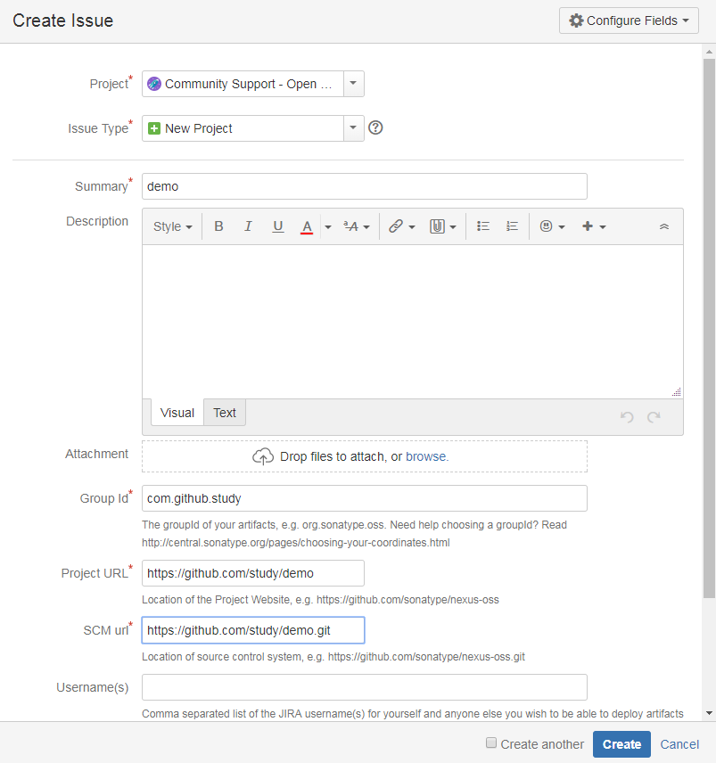
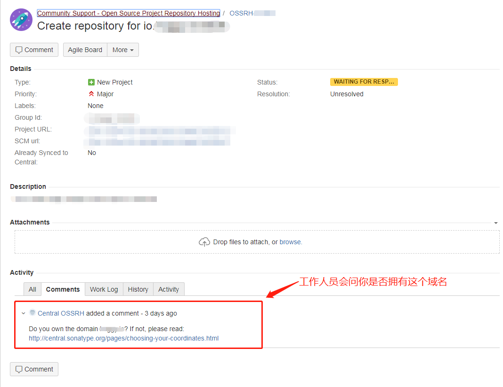
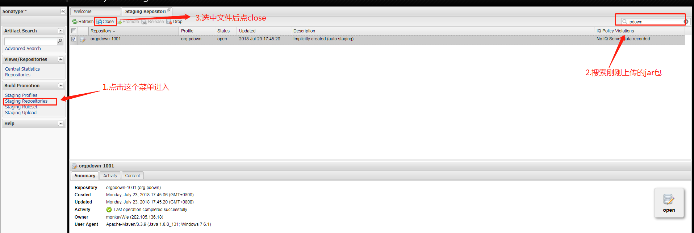
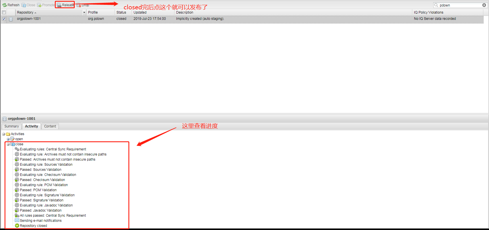

## 前言
我们知道在maven中引入第三方jar包是非常简单的，只需要使用groupId+artifactId+version就能从maven仓库中下载下来对应的jar包。
>例如：引入fastjson的jar包
```
<dependency>
  <groupId>com.alibaba</groupId>
  <artifactId>fastjson</artifactId>
  <version>1.2.46</version>
</dependency>
```
那如果想要发布自己的jar包到maven仓库应该如何操作呢。

## 创建issue
要发布jar包到maven仓库首先需要人工审核，在审核过了的话才可以进行后续发布jar包的操作。首先需要在[https://issues.sonatype.org/secure/Dashboard.jspa](https://issues.sonatype.org/secure/Dashboard.jspa)上注册一个账号，登录之后点击**Create**,在弹出来的界面中填写响应的信息
>
>- Project选择Community Support，Issue type选择New Project。
>- 注意Group Id，如果有对应域名的话则使用域名对应的Group Id(例如netty项目的域名是netty.io，则Group Id为io.netty)，没有的域名的话最好就填**com.github.xxx**，因为在issue里会有人问你是否拥有Group Id对应的域名，没有的话是审核不过的，而托管在github上的话就可以直接使用github的域名来完成审核。

## issue审核
创建成功后等1-2个小时左右就会有工作人员评论issue，问你是否持有域名。
>

如果是用**com.github.xxx**的Group Id，就回复要使用**com.github.xxx**作为你的域名，否则有域名就回复有就好,接着等待工作人员确认(我等了一天)，确认成功之后issue的状态就会变成`RESOLVED`，这个时候就有资格上传jar包到maven仓库了。

## gpg管理密钥
在上传jar包之前，先要生成gpg工具生成RSA密钥对，并把公钥上传到公共密钥服务器，这样在发布jar包的时候能校验用户的身份。
1. 下载gpg工具，下载地址：[https://www.gnupg.org/download/index.html](https://www.gnupg.org/download/index.html)，下载对应操作系统的版本然后进行安装。
2. 验证安装和上传生成的公钥
  * 验证gpg是否安装成功
    ```
    gpg --version
    ```

  * 生成RAS密钥对
    ```
    gpg --gen-key
    ```
    接着需要填写名字和邮箱等等基本信息，这些都不是重点，最主要的是有个`Passphase`的选项在填完之后记下来，到时候发布jar包的时候要用到。

  * 查看生成的密钥，并上传至密钥服务器
    需要上传到服务器的就是pub里的公钥串`FC27E7C61FC5D176DD7F67198C6EFA8E944CD6BA`。
    ```
    gpg --list-keys
    ```
    ```
    ----------------------------------------------
    pub   rsa2048 2018-07-19 [SC] [expires: 2020-07-18]
          FC27E7C61FC5D176DD7F67198C6EFA8E944CD6BA
    uid           [ultimate] liwei <liwei2633@163.com>
    sub   rsa2048 2018-07-19 [E] [expires: 2020-07-18]
    ```
    上传公钥至密钥服务器，国内我测试了的服务器基本就这个`hkp://keyserver.ubuntu.com:11371`能用。
    ```
    gpg --keyserver hkp://keyserver.ubuntu.com:11371 --send-keys FC27E7C61FC5D176DD7F67198C6EFA8E944CD6BA
    ```
    上传完后验证是否成功
    ```
    gpg --keyserver hkp://keyserver.ubuntu.com:11371 --revc-keys FC27E7C61FC5D176DD7F67198C6EFA8E944CD6BA
    ```
    验证成功
    ```
    gpg: Total number processed: 1
    gpg:              unchanged: 1
    ```

## maven配置
1. 修改项目中的`pom.xml`文件，添加部署相关配置，这里引用贴下我的配置，只需要替换下相应的内容就好。
  ```xml
  <name>pdown-core</name>
  <description>HTTP high speed downloader</description>
  <url>https://github.com/proxyee-down-org/pdown-core</url>

  <licenses>
    <license>
      <name>The MIT License (MIT)</name>
      <url>http://opensource.org/licenses/mit-license.php</url>
    </license>
  </licenses>

  <developers>
    <developer>
      <name>monkeyWie</name>
      <email>liwei2633@163.com</email>
    </developer>
  </developers>

  <scm>
    <connection>scm:git:https://github.com/proxyee-down-org/pdown-core.git</connection>
    <developerConnection>scm:git:https://github.com/proxyee-down-org/pdown-core.git</developerConnection>
    <url>https://github.com/proxyee-down-org/pdown-core</url>
  </scm>

  <profiles>
    <profile>
      <id>release</id>
      <build>
        <plugins>
          <!--Compiler-->
          <plugin>
            <groupId>org.apache.maven.plugins</groupId>
            <artifactId>maven-compiler-plugin</artifactId>
          </plugin>
          <!-- Source -->
          <plugin>
            <groupId>org.apache.maven.plugins</groupId>
            <artifactId>maven-source-plugin</artifactId>
            <executions>
              <execution>
                <phase>package</phase>
                <goals>
                  <goal>jar-no-fork</goal>
                </goals>
              </execution>
            </executions>
          </plugin>
          <!-- Javadoc -->
          <plugin>
            <groupId>org.apache.maven.plugins</groupId>
            <artifactId>maven-javadoc-plugin</artifactId>
            <executions>
              <execution>
                <phase>package</phase>
                <goals>
                  <goal>jar</goal>
                </goals>
              </execution>
            </executions>
          </plugin>
          <!-- GPG mvn clean deploy -P release -Dgpg.passphrase=YourPassphase-->
          <plugin>
            <groupId>org.apache.maven.plugins</groupId>
            <artifactId>maven-gpg-plugin</artifactId>
            <executions>
              <execution>
                <id>sign-artifacts</id>
                <phase>verify</phase>
                <goals>
                  <goal>sign</goal>
                </goals>
              </execution>
            </executions>
          </plugin>
        </plugins>
      </build>
      <distributionManagement>
        <repository>
          <id>releases</id>
          <url>https://oss.sonatype.org/service/local/staging/deploy/maven2/</url>
        </repository>
        <snapshotRepository>
          <id>snapshots</id>
          <url>https://oss.sonatype.org/content/repositories/snapshots/</url>
        </snapshotRepository>
      </distributionManagement>
    </profile>
  </profiles>
  ```
2. 把之前创建issue时注册的账号配置到maven的配置文件里，找到maven安装目录下`conf/setting.xml`文件，在`<servers>`标签里添加。
  ```xml
  <server>
    <id>releases</id>
    <username></username>
    <password></password>
  </server>
  <server>
    <id>snapshots</id>
    <username></username>
    <password></password>
  </server>
  ```
把用户名和密码填好即可。

## 部署jar包
1. 使用下面的命令行，会需要输入之前用gpg生成密钥时输入的Passphase，也有可能会弹窗出来提示输入Passphase。  
(*我这加了-Dgpg.passphrase=YourPassphase选项并没有生效，还是会弹窗出来提示输入Passphase*)
  ```
  mvn clean deploy -P release -Dgpg.passphrase=YourPassphase
  ```
2. 如果部署成功的话使用创建issue的帐号登录这个网址[https://oss.sonatype.org/](https://oss.sonatype.org/)，然后看图操作。
  
3. close完了系统会验证jar包，点击刷新可以看到最新的进度，当全部验证通过的时候，状态会变成`closed`,然后再选中文件`Release`就发布完成了。然后等个几个小时就可以在中央仓库搜索到自己发布的jar包了。
  
