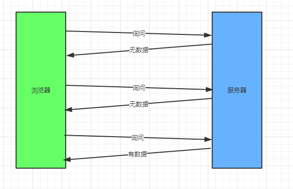
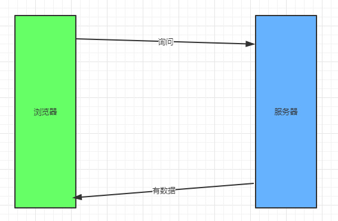
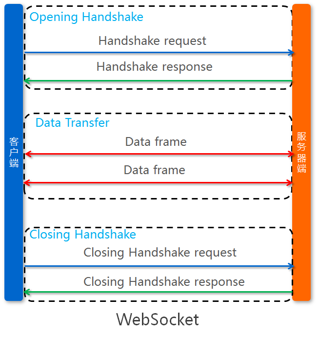

## 前言

websocket 作为现代浏览器的长连接标准，可以很好的解决浏览器与服务器实时通讯的问题，那么在 websocket 出现之前是怎么解决这个问题的呢？首先来回顾一下在此之前浏览器和服务器的"长连接"之路。

## 回顾

在 websocket 协议出来之前，主要是有三种方向去实现类似 websocket 的功能的。

### Flash

flash 支持 socket 通讯功能，基于 flash 可以很简单的实现与服务器建立通讯。

- 优点：开发简单、兼容性高
- 缺点：需要浏览器启用 flash 功能，并且逐渐被浏览器淘汰

### AJAX Polling

浏览器使用 ajax 去轮询服务器，服务器有内容就返回，轮询也分为短轮询和长轮询。

<!-- more -->

#### 短轮询

短轮询即浏览器通过 ajax 按照一定时间的间隔去请求服务器，服务器会立即响应，不管有没有可用数据。

- 流程图：
  

- 优点：短链接、服务器处理方便。
- 缺点：实时性低、很多无效请求、性能开销大

#### 长轮询

长短轮询则是浏览器通过 ajax 与服务器建立连接，服务器在没有数据返回时一直阻塞着，直到有数据之后才返回响应。

- 流程图：
  

- 优点：实时性高
- 缺点：每个连接只能返回一次数据

### COMET

comet 也是常用的一种服务器推送技术，主要的原理是通过`HTTP Chunked`响应，将消息源源不断的推送给浏览器，通常情况下服务器返回的响应内容都是定长的，会使用`Content-Length`来指定响应报文的长度，而`Chunked`编码的响应则是通过一种特殊的编码，只要浏览器没有遇到结束标识，就会边解析边执行对应的响应内容。

- chunked 编码报文示例:

```http
HTTP/1.1 200 OK
Content-Type: text/html
Date: Thu, 08 Aug 2019 02:50:06 GMT
Transfer-Encoding: chunked

11
callback('data1')
11
callback('data2')
0

```

报文格式为：

```http
<length>\r\n
<chunk data>\r\n
<length>\r\n
<chunk data>\r\n
...
0\r\n
```

由 16 进制的数字来标识一个`chunk data`数据的长度，在读取到`0\r\n`时结束，通过一直读取`chunk data`来执行 js 代码，从而向客户端推送数据。

- go 语言实现：

```go
func main() {
	http.HandleFunc("/push", func(w http.ResponseWriter, r *http.Request) {
		w.Header().Set("Content-Type", "text/html")
		flusher := w.(http.Flusher)
		w.Write([]byte("<script>console.log('data1')</script>"))
		flusher.Flush()
		// 延迟一秒，以便观察浏览器的边解析边执行
		time.Sleep(time.Second)
		w.Write([]byte("<script>console.log('data2')</script>"))
		flusher.Flush()
	})
	log.Fatal(http.ListenAndServe(":8080", nil))
}
```

#### 通过 iframe 实现

iframe 实现是通过隐藏一个`<iframe>`，通过`iframe`连接到服务器，服务器响应带有`<script>`标签的内容，通过动态执行 js 代码从而实现服务器推送数据。

**前端示例：**

```html
<!doctype html>
<html>
<iframe style="visibility: hidden;" src="/push">
</html>
```

- 优点：兼容性高、实时性高、支持多次推送
- 缺点：一些浏览器会一直处于加载状态

#### 通过 ajax 实现

ajax 实现是通过`onreadystatechange`回调，每次读取到一个`chunk data`时，都会执行一次`readyState=3`为的回调，通过这个机制也可以实现服务器推送数据。

**前端示例：**

```html
<!DOCTYPE html>
<html>
  <script>
    var xhr = new XMLHttpRequest();
    xhr.open("GET", "/push", true);
    var received = 0;
    xhr.onreadystatechange = function() {
      if (xhr.readyState == 3) {
        // 由于取responseText会把之前的响应一起拿到，所以要进行切分处理
        var response = xhr.responseText.substring(received);
        received += response.length;
        console.log(response);
      }
    };
    xhr.send();
  </script>
</html>
```

- 优点：实时性高、支持多次推送、浏览器不会处于加载状态
- 缺点：兼容性低，一些浏览器不支持 readyState=3 回调

## Websocket

Websocket 是一种与 HTTP 不同的协议，两者都位与 OSI 模型的应用层， IETF 标准为[RFC 6455](https://tools.ietf.org/html/rfc6455)。

WebSocket 是 HTML5 提供的一种在单个 TCP 连接上进行全双工通讯的协议。浏览器和服务器只需要做一个 HTTP 握手的动作，然后浏览器和服务器之间就形成了一条快速通道。两者之间就直接可以数据互相传送。

Websocket 和之前的方案最大的区别是，它是可以支持双向通讯的。而之前的技术实现上如果客户端需要发送一个新的请求，就需要创建一个新的连接。

### 示例：

- 浏览器
  浏览器上使用 Websocket 非常简单，下面看一段示例代码：

```js
var ws = new WebSocket("wss://echo.websocket.org");

// 连接成功
ws.onopen = function(evt) {
  console.log("Connection open ...");
  // 发送数据
  ws.send("Hello WebSockets!");
};

// 接收数据
ws.onmessage = function(evt) {
  console.log("Received Message: " + evt.data);
  ws.close();
};

// 连接关闭
ws.onclose = function(evt) {
  console.log("Connection closed.");
};
```

- 服务器

现在基本上所有的服务器开发语言都有对 websocket 的支持，下面来看一段 go 编写的 websocket 服务器的示例代码，使用的是`github.com/gorilla/websocket`库：

```go
var upgrader = websocket.Upgrader{
	CheckOrigin: func(r *http.Request) bool {
		return true
	},
}

http.HandleFunc("/ws", func (w http.ResponseWriter, r *http.Request){
    // websocket握手处理
	conn, err := upgrader.Upgrade(w, r, nil)
	if err != nil {
		log.Error(err)
		return
	}
	defer conn.Close()
    // 发送数据
    conn.WriteMessage(websocket.TextMessage,[]byte("hello"))
    // 接收数据
	for {
		mt, b, err := conn.ReadMessage()
		if err != nil {
			return
		}
		if mt == websocket.TextMessage {
			log.Printf("Received Message: %s\n",string(b))
		}
	}
})
log.Fatal(http.ListenAndServe(":8080", nil))
```

### 实现原理

#### 流程图：



#### 握手

通过上面流程图可以看到，在建立 Websocket 连接时首先需要客户端和服务器需要完成一次握手，握手请求是使用 HTTP 协议，下面看一个例子：

- Handshake request

```http
GET ws://localhost:8800/ HTTP/1.1
Host: localhost
Connection: Upgrade
Upgrade: websocket
Origin: http://www.websocket-test.com
Sec-WebSocket-Version: 13
Sec-WebSocket-Key: GbHJKViBFhiUi4yT7CK3gA==
```

请求详解：

1. GET 请求的地址是以 ws://开头的地址。
2. 请求头 Connection: Upgrade 表示这个连接需要升级。
3. 请求头 Upgrade: websocket 表示升级到 websocket 协议。
4. 请求头 Sec-WebSocket-Key 是用于标识这个连接，在服务器响应时需要通过这个 key 来做对应匹配，以防止恶意的连接，或者无意的连接。
5. 请求头 Sec-WebSocket-Version 指定了客户端 WebSocket 的协议版本。

- Handshake response

```http
HTTP/1.1 101 Switching Protocols
Upgrade: websocket
Connection: Upgrade
Sec-WebSocket-Accept: BcfEmZdVyUas6UtFTbjKohgqBs8=
```

响应详解：

根据规范，在服务器接收到 websocket 握手请求时，如果支持客户端对应 WebSocket 协议版本时，同样需要返回`Upgrade: websocket`和`Connection: Upgrade`响应头，并且返回对应的`Sec-WebSocket-Accept`响应头。

`Sec-WebSocket-Accept`的值通过握手请求中的`Sec-WebSocket-Key`计算出来，计算公式为：

1. 将 Sec-WebSocket-Key 跟 258EAFA5-E914-47DA-95CA-C5AB0DC85B11 拼接。
2. 通过 SHA1 计算出摘要，并转成 base64 字符串。

伪代码：

```js
base64(sha1(`${Sec - WebSocket - Key}258EAFA5-E914-47DA-95CA-C5AB0DC85B11`));
```

#### 通讯格式

在握手完成之后即可开始双向通讯了，通讯报文格式如下：

```
 0                   1                   2                   3
 0 1 2 3 4 5 6 7 8 9 0 1 2 3 4 5 6 7 8 9 0 1 2 3 4 5 6 7 8 9 0 1
+-+-+-+-+-------+-+-------------+-------------------------------+
|F|R|R|R| opcode|M| Payload len |    Extended payload length    |
|I|S|S|S|  (4)  |A|     (7)     |             (16/64)           |
|N|V|V|V|       |S|             |   (if payload len==126/127)   |
| |1|2|3|       |K|             |                               |
+-+-+-+-+-------+-+-------------+ - - - - - - - - - - - - - - - +
|     Extended payload length continued, if payload len == 127  |
+ - - - - - - - - - - - - - - - +-------------------------------+
|                               |Masking-key, if MASK set to 1  |
+-------------------------------+-------------------------------+
| Masking-key (continued)       |          Payload Data         |
+-------------------------------- - - - - - - - - - - - - - - - +
:                     Payload Data continued ...                :
+ - - - - - - - - - - - - - - - - - - - - - - - - - - - - - - - +
|                     Payload Data continued ...                |
+---------------------------------------------------------------+
```

1.  FIN: 占 1 个 bit

    0：不是消息的最后一个分片

    1：是消息的最后一个分片

2.  RSV1, RSV2, RSV3：各占 1 个 bit

    一般情况下全为 0。当客户端、服务端协商采用 WebSocket 扩展时，这三个标志位可以非0，且值的含义由扩展进行定义。

3.  Opcode: 4 个 bit

    %x0：表示一个延续帧。当 Opcode 为 0 时，表示本次数据传输采用了数据分片，当前收到的数据帧为其中一个数据分片；

    %x1：表示这是一个文本帧（frame）；

    %x2：表示这是一个二进制帧（frame）；

    %x3-7：保留的操作代码，用于后续定义的非控制帧；

    %x8：表示连接断开；

    %x9：表示这是一个 ping 操作；
    
    %xA：表示这是一个 pong 操作；

    %xB-F：保留的操作代码，用于后续定义的控制帧。

4.  Mask: 1 个 bit

    表示是否要对数据载荷进行掩码异或操作。

    0：否

    1：是

5.  Payload length: 7bit or 7 + 16bit or 7 + 64bit

    表示传输数据的长度

    当 length == [0,126)：数据的长度为 length 字节；

    当 length == 126：后续 2 个字节代表一个 16 位的无符号整数，该无符号整数的值为数据的长度；

    当 length == 127：后续 8 个字节代表一个 64 位的无符号整数（最高位为 0），该无符号整数的值为数据的长度。

    > 这么定义的目的是在传输数据量小的时候可以节省网络传输开销。

6.  Masking-key: 0 or 4bytes

    当 Mask 为 1，则携带了 4 字节的 Masking-key；

    当 Mask 为 0，则没有 Masking-key。

    > 掩码的作用并不是为了防止数据泄密，而是为了防止早期版本的协议中存在的代理缓存污染攻击（proxy cache poisoning attacks）等问题。

7.  Payload Data: 传输的数据

#### 掩码算法

在前面可以看到`mask`和`mask key`，当`mask`为 1 时表示数据需要通过掩码处理，并且在报文中会带上一个 4 个字节长度的`mask key`，掩码算法为：

1. `originalData` 作为原始的 Payload Data 数据，类型是[]byte
2. `transformedData` 作为掩码处理后的数据，类型是[]byte
3. `key` 作为 mask key，类型是[]byte
4. `i`作为 originalData 读取 的下标
5. `j`作为 key 读取 的下标，公式为：i % 4
6. transformedData[i] = originalData[i] ^ key[j]

完整示例，java 版：

```java
public static void mask(byte[] key,byte[] data){
    for (int i = 0; i < data.length; i++) {
        int j = i%4;
        data[i] = (byte) (data[i]^key[j]);
    }
}
```

## 附录

最后，厚颜无耻的推荐一下我的开源项目，一个用 netty 开发的 websocket 服务器：[https://github.com/monkeyWie/simple-websocket-server](https://github.com/monkeyWie/simple-websocket-server)，感兴趣的童鞋可以看看。
