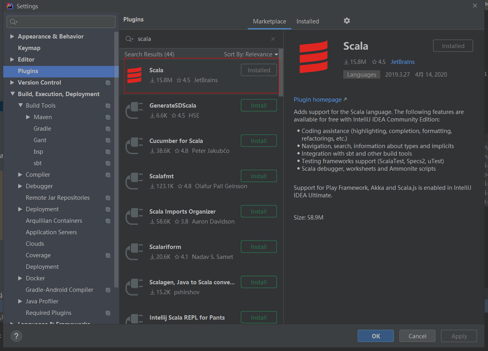
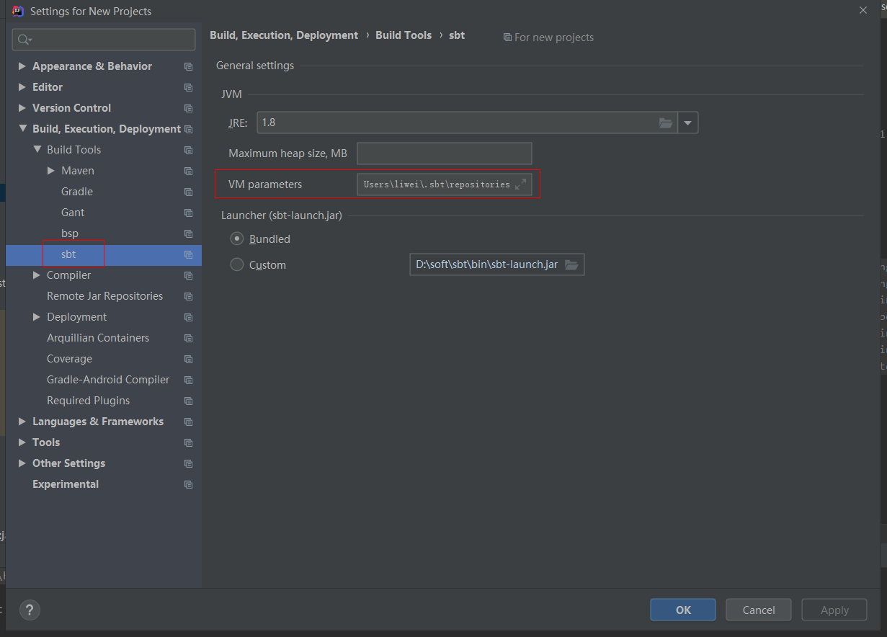
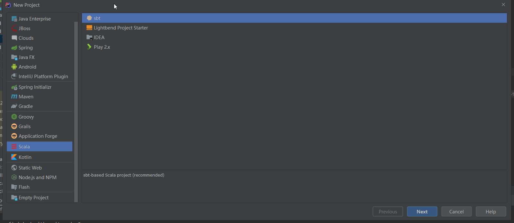
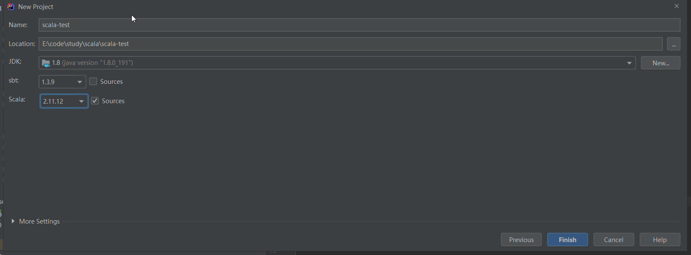
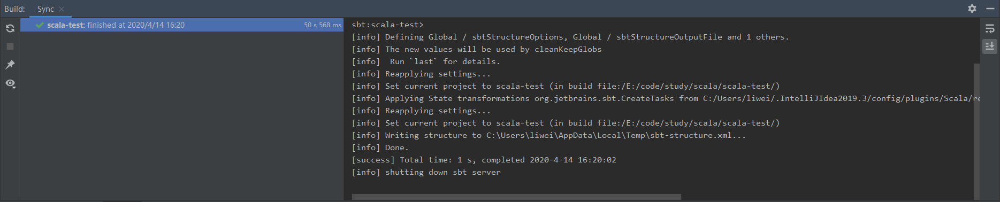

### 环境信息

- windows 10
- IDEA 2019.3

不用下载`scala`和`sbt`，直接使用 IDEA 插件中自带的就行。

<!--more-->

### 操作步骤

1. IDEA 安装`scala`插件
   
   国内网络环境安装可能比较慢，如果失败的话可以通过`设置代理`或者[离线下载](https://plugins.jetbrains.com/plugin/1347-scala/versions)的方式安装。
2. 设置`sbt`环境
   这一步是因为国内访问 sbt 仓库太慢，需要配置国内加速镜像。

   在`~/.sbt`目录下创建`repositories`文件，内容如下：

   ```
   [repositories]
   local
   nexus-aliyun:https://maven.aliyun.com/nexus/content/groups/public
   huaweicloud-maven: https://repo.huaweicloud.com/repository/maven/
   maven-central: https://repo1.maven.org/maven2/
   sbt-plugin-repo: https://repo.scala-sbt.org/scalasbt/sbt-plugin-releases, [organization]/[module]/(scala_[scalaVersion]/)(sbt_[sbtVersion]/)[revision]/[type]s/[artifact](-[classifier]).[ext]
   ```

   在 IDEA 设置中搜索`sbt`，然后修改`VM parameters`，填入以下内容：

   ```
   -Dsbt.override.build.repos=true
   -Dsbt.repository.config=${用户目录}\.sbt\repositories
   ```

   

   设置完毕就可以畅快使用`sbt`了。

3. 创建项目
   IDEA 创建项目时选择`scala`+`sbt`
   

   点击`Next`到下一步，选择对应的`sbt`和`scala`版本
   

   然后一直等到`sync finished`就可以了
   
