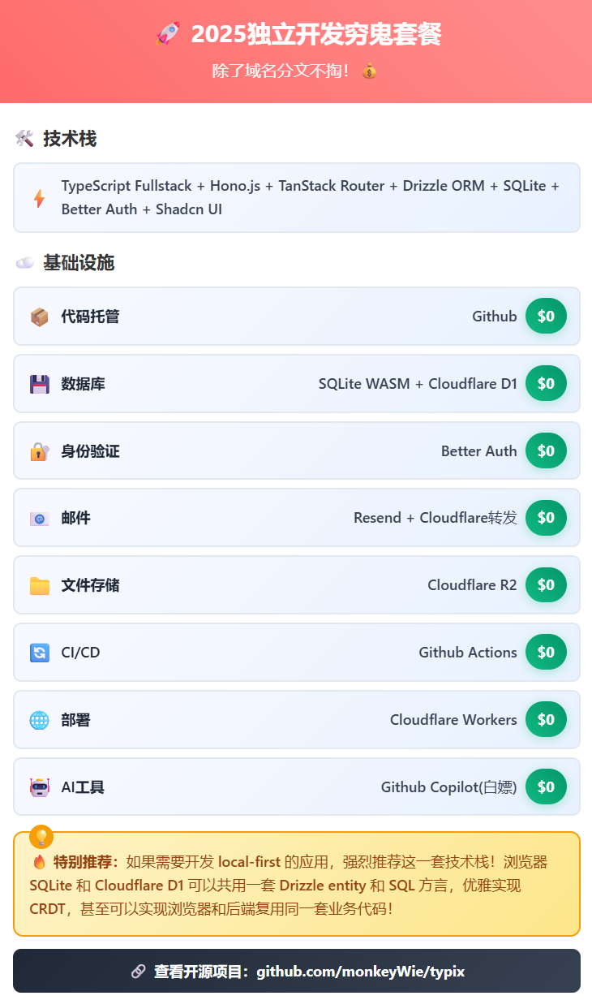

# 我的 2025 独立开发穷鬼套餐

除了域名分文不掏！

<!-- more -->

## 🛠️ 技术栈

- **前端框架**: TypeScript + TanStack Router
- **后端框架**: Hono.js
- **数据库**: Drizzle ORM + SQLite
- **认证**: Better Auth
- **UI 组件**: shadcn/ui

## 🏗️ 基础设施

| 服务         | 解决方案                                    | 成本     |
| ------------ | ------------------------------------------- | -------- |
| **代码托管** | GitHub                                      | 免费     |
| **数据库**   | SQLite WASM(浏览器) + Cloudflare D1(服务端) | 免费     |
| **认证**     | Better Auth                                 | 免费     |
| **邮件服务** | Resend + Cloudflare 邮件转发                | 免费     |
| **文件存储** | Cloudflare R2                               | 免费额度 |
| **CI/CD**    | GitHub Actions                              | 免费     |
| **部署**     | Cloudflare Workers                          | 免费     |
| **AI 工具**  | GitHub Copilot                              | 白嫖     |

> 如果需要开发 local-first 的应用，强烈推荐这一套技术栈，浏览器 SQLite 和 Cloudflare D1 可以共用一套 drizzle entity 和 sql 方言，这样可以非常优雅的做到 CRDT，甚至可以实现浏览器和后端复用同一套业务代码

以上代码已开源，项目地址：
[github.com/monkeyWie/typix](https://github.com/monkeyWie/typix)
