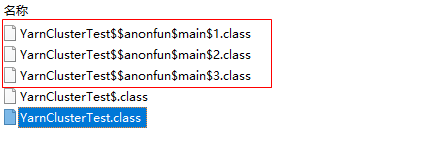

## 前言

平常开发 spark 应用的时候，为了快速验证程序是否正确一般都会设置`master`为`local`模式来运行，但是如果想用集群环境来运行的话，就需要打一个 jar 包用`spark-submit`进行任务提交，但是在开发过程中频繁打 jar 包提交也是一件麻烦事，查阅相关资料之后发现其实可以在本地运行代码的时候指定集群环境来运行，达到快速调试的目的。

<!--more-->

## 准备

每次运行之前还是需要打一个 jar 包，如果有引入 spark 之外的依赖，需要把依赖也打进去，否则会报`ClassNotFound`.

```
sbt package
```

## spark standalone 集群

```scala
val conf = new SparkConf()
      .setAppName("test")
      //指定spark master地址
      .setMaster("spark://master:7077")
      //指定本地jar包路径
      .setJars(List("file:///E:/code/study/scala/spark-demo/target/scala-2.11/spark-demo_2.11-0.1.jar"))
      //指定本机IP为driver
      .setIfMissing("spark.driver.host", "192.168.102.142")
val spark = SparkSession.builder()
    .config(conf)
    .getOrCreate()
```

这样在直接运行代码就可以直接运行在指定的 spark 集群环境上了。

## spark on yarn 集群

这种集群方式稍微有点麻烦，需要先手动把 spark 中的 jar 包上传到 hdfs 中，然后指定 yarn 运行环境的 spark jars 路径。

1. 上传 jar 包至 hdfs
   把集群中`${SPARK_HOME}/jars`目录下的所有文件上传到 hdfs 中

   ```
   hadoop fs -put ./jars/* /user/spark/share/lib/2.4.5/
   ```

   `注：如果是使用的cdh安装的spark集群，不能使用cdh中的spark目录下的jar包，因为cdh和apache官方提供的jar包不一致，而开发的时候引入的依赖一般都是apache提供的jar包，这样运行的时候会报错，需要自行从apache官网下载对应的spark发行包然后进行上传，总而言之待上传的spark环境需要和本地开发环境保持一致即可。`

2. 编写代码

```
val conf = new SparkConf()
      .setAppName("test")
      //设置为yarn模式提交
      .setMaster("yarn")
      //设置yarn域名(必需，不然job状态一直ACCEPTED)
      .set("spark.hadoop.yarn.resourcemanager.hostname", "master")
      //设置yarn提交地址
      .set("spark.hadoop.yarn.resourcemanager.address", "master:8032")
      //设置stagingDir，用于存放任务运行时的临时文件
      .set("spark.yarn.stagingDir", "hdfs://master:8020/user/root/spark/test")
      //设置yarn jars，填入上一步上传的hdfs地址
      .set("spark.yarn.jars", "hdfs://master:8020/user/spark/share/lib/2.4.5/*.jar")
      //设置本地jar包地址
      .setJars(List("file:///E:/code/study/scala/spark-demo/target/scala-2.11/spark-demo_2.11-0.1.jar"))
      //指定本机IP为driver
      .setIfMissing("spark.driver.host", "192.168.102.142")
val spark = SparkSession.builder()
    .config(conf)
    .getOrCreate()
```

## 关于 setJars

前面说了每次运行之前都需要重新构建一次 jar 包，但其实也不一定，这个 jar 包的作用是为了能将参与 spark 运算的`匿名函数`的反序列化。

所以在没有修改`运算逻辑`的时候，可以不需要重新构建 jar 包，举个例子来证明：

1. 第一次代码如下：

```scala
spark.sparkContext
      .parallelize(List("hello word", "test word", "hello haha", "ok"))
      .flatMap(_.split(" "))
      .map((_, 1))
      .take(10)
      .foreach(kv => println(kv._1 + ":" + kv._2))
```

2. 构建 jar 包

```
sbt package
```

3. 运行代码

输出结果如下：

```
test:1
ok:1
haha:1
hello:2
word:2
```

4. 修改代码，把数据改一改

```
spark.sparkContext
      .parallelize(List("hello scala", "test scala", "hello haha", "ok"))
      .flatMap(_.split(" "))
      .map((_, 1))
      .countByKey()
      .take(10)
      .foreach(kv => println(kv._1 + ":" + kv._2))
```

5. 不重新构建 jar 包，直接运行

结果如下：

```
test:1
scala:2
ok:1
haha:1
hello:2
```

可以发现没有重新构建 jar 包，结果也边了，说明是运行的刚刚修改的代码。

6. 修改算子运行

```
spark.sparkContext
      .parallelize(List("hello scala", "test scala", "hello haha", "ok"))
      .flatMap(_.split(" "))
      .map((_, 2)) //注意这里从1改成了2
      .countByKey()
      .take(10)
      .foreach(kv => println(kv._1 + ":" + kv._2))
```

不重新构建 jar 包，直接运行，结果如下：

```
test:1
scala:2
ok:1
haha:1
hello:2
```

计算结果和之前的一样，没有发生变化，说明在计算的时候，节点是以 jar 中编译好的 class 进行计算。

7. 继续测试

修改代码如下：

```
spark.sparkContext
      .parallelize(List("hello scala", "test scala", "hello haha", "ok"))
      .flatMap(_.split(" "))
      .map((_, 2))
      .countByKey()
      .take(10)
      .foreach(kv => println(kv._1 + "=" + kv._2)) //注意这里将:换成了=
```

直接运行，结果如下：

```
test=1
scala=2
ok=1
haha=1
hello=2
```

可以看到结果发生变化了，同样是匿名函数的实现修改，为什么这里又可以直接生效呢，接着往下。

## setJars 原理

通过上面的示例，可以指定在这个例子中 spark 从 jar 包里主要拿到下面两个`匿名函数`反序列化之后的类

```
.flatMap(_.split(" "))
.map((_, 1))
```

把 jar 包打开看一看，里面有三个内部类，分别对应代码中的三个`匿名函数`


```
//main$1.class
.flatMap(_.split(" "))
//main$2.class
.map((_, 1))
//main$3.class
.foreach(kv => println(kv._1 + ":" + kv._2))
```

在将 rdd 分发到各个计算节点时，都是通过 jar 包中的 class 来`反序列化`出对应的`匿名函数`，所以在没有重新构建 jar 包的情况下修改代码不会生效，但是由于`.foreach(kv => println(kv._1 + ":" + kv._2))`在`take()`方法之后调用，take 这个方法是将计算结果取回到`driver`中，是使用本地运行时编译的 class，所以这里代码修改的话不需要重新构建 jar 也能及时生效。

## 后记

本来只是想要通过代码直接提交任务至 spark 集群环境，却意外研究了`setJars`相关的知识，让我对 spark 计算过程有了更深刻的了解，甚是美哉。

## 参考

[https://stackoverflow.com/a/52164371/8129004](https://stackoverflow.com/a/52164371/8129004)
