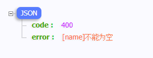

## 介绍

`JSR-380`是 J2EE 的一个规范，用于校验实体属性，它是`JSR-303`的升级版，在 Spring Boot 中可以基于它优雅实现参数校验。

## 示例

在没有使用`JSR-380`之前，我们一般都会将参数校验硬编码在`controller`类中，示例：

```java
public Result add(@RequestBody User user){
    if(StringUtils.isBlank(user.getName())){
        return Result.error("用户名不能为空");
    }
    // ...
}
```

而使用`JSR-303`只需要通过添加对应的注解即可实现校验，示例：

```java
@Data
public class User{
    @NotBlank
    private String name;
    private Integer age;
}
```

```java
public Result register(@Validated @RequestBody User user){
    // ...
}
```

这样看起来代码是不是清爽了很多，只需要在需要校验的字段上加上对应的校验注解，然后对需要校验的地方加上`@Validated`注解，然后框架就会帮我们完成校验。

## 通过全局异常自定义错误响应

框架校验失败之后会抛出异常，需要捕获这个异常然后来自定义校验不通过的错误响应，这里直接贴代码，兼容`@RequestBody`、`@ModelAttribute`、`@RequestParam`三种入参的校验：

```java
@ControllerAdvice
public class GlobalExceptionHandler {

    @ExceptionHandler(value = {MethodArgumentNotValidException.class, BindException.class})
    public ResponseEntity<Result> methodArgumentNotValidHandler(HttpServletRequest request, Exception e) {
        BindingResult bindingResult;
        if (e instanceof MethodArgumentNotValidException) {
            //@RequestBody参数校验
            bindingResult = ((MethodArgumentNotValidException) e).getBindingResult();
        } else {
            //@ModelAttribute参数校验
            bindingResult = ((BindException) e).getBindingResult();
        }
        FieldError fieldError = bindingResult.getFieldError();
        return ResponseEntity.ok(Result.fail(Result.CODE_PARAMS_INVALID, "[" + fieldError.getField() + "]" + fieldError.getDefaultMessage()));
    }

    //@RequestParam参数校验
    @ExceptionHandler(value = {ConstraintViolationException.class, MissingServletRequestParameterException.class})
    public ResponseEntity<Result> constraintViolationHandler(Exception e) {
        String field;
        String msg;
        if (e instanceof ConstraintViolationException) {
            ConstraintViolation<?> constraintViolation = ((ConstraintViolationException) e).getConstraintViolations().stream().findFirst().get();
            List<Path.Node> pathList = StreamSupport.stream(constraintViolation.getPropertyPath().spliterator(), false)
                    .collect(Collectors.toList());
            field = pathList.get(pathList.size() - 1).getName();
            msg = constraintViolation.getMessage();
        } else {
            // 这个不是JSR标准返回的异常，要自定义提示文本
            field = ((MissingServletRequestParameterException) e).getParameterName();
            msg = "不能为空";
        }
        return ResponseEntity.ok(Result.fail(Result.CODE_PARAMS_INVALID, "[" + field + "]" + msg));
    }
}
```

然后再访问一下接口，可以看到错误提示已经按自定义的规范显示了：



可以看到都不需要写任何提示文本就可以完成校验和提示，上图的`不能为空`是框架内置的`I18N`国际化支持，每个注解都内置相应的提示模板。

## 常用校验注解

| 注解             | 描述                                                                          |
| ---------------- | ----------------------------------------------------------------------------- |
| @NotNull         | 验证值不为 null                                                               |
| @AssertTrue      | 验证值为 true                                                                 |
| @Size            | 验证值的长度介于 min 和 max 之间，可应用于 String、Collection、Map 和数组类型 |
| @Min             | 验证值不小于该值                                                              |
| @Max             | 验证值不大于该值                                                              |
| @Email           | 验证字符串是有效的电子邮件地址                                                |
| @NotEmpty        | 验证值不为 null 或空，可应用于 String、Collection、Map 和数组类型             |
| @NotBlank        | 验证字符串不为 null 并且不是空白字符                                          |
| @Positive        | 验证数字为正数                                                                |
| @PositiveOrZero  | 验证数字为正数(包括 0)                                                        |
| @Negative        | 验证数字为负数                                                                |
| @NegativeOrZero  | 验证数字为负数(包括 0)                                                        |
| @Past            | 验证日期值是过去                                                              |
| @PastOrPresent   | 验证日期值是过去(包括现在)                                                    |
| @Future          | 验证日期值是未来                                                              |
| @FutureOrPresent | 验证日期值是未来(包括现在)                                                    |

## 附录

本文完整代码放在[github](https://github.com/monkeyWie/spring-boot-best-practices/tree/master/jsr380)。

- [Java Bean Validation Basics](https://www.baeldung.com/javax-validation)
- [JSR-380 规范](https://jcp.org/en/jsr/detail?id=380)
