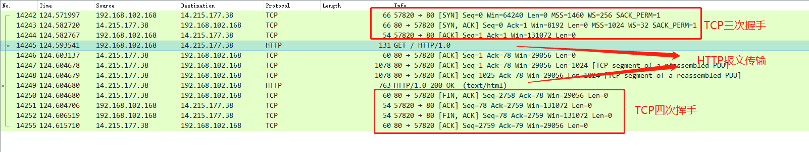
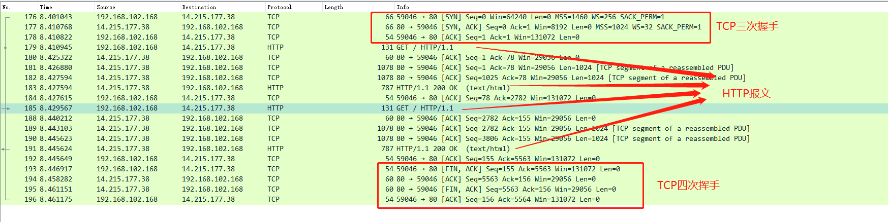
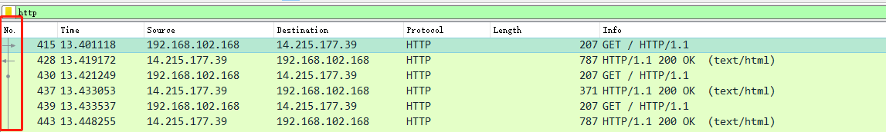
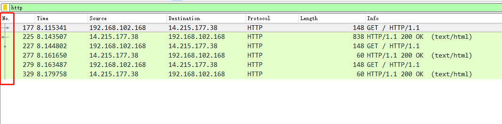

## 介绍

HTTP 协议里的`keep-alive`机制和长连接协议的`keep-alive`机制有所不同，HTTP 中的作用是为了复用 TCP 连接，而长连接中大多数作用是为了保活，例如 TCP 通过 keep-alive 心跳包来检测对方是否存活。

在`HTTP/1.1`版本中`keep-alive`默认是开启的，通过复用 TCP 连接，可以有效的降低 TCP 连接创建的开销，大多数浏览器只允许同时对同一个域名建立 6 个 TCP 连接。

<!-- more -->

## HTTP/1.0

在`HTTP/1.0`版本中是没有`keep-alive`机制的，意味着每次 HTTP 请求都会创建一个新的 TCP 连接，在响应完成后关闭当前 TCP 连接，为了验证我使用`wireshark`来监听网卡上的 HTTP 报文。

1. 通过`curl`指定 HTTP/1.0 版本

```
curl --http1.0 http://www.baidu.com
```

2. 报文截图



可以看到在服务器发送完响应之后就主动发送了`FIN包`来关闭连接，验证了之前的内容。

## HTTP/1.1

在`HTTP/1.0`时代，由于 TCP 连接创建成本很高，很多服务器和浏览器使用了了一套非标准的`keep-alive`机制，用于复用 TCP 连接，当然最后`HTTP/1.1`将这套东西纳入到了标准中，这个标准就是`Connection`头，用于客户端和服务端协商是否要复用 TCP 连接，在 HTTP/1.1 版本中默认值就是`keep-alive`，即保持连接。

```http
Connection: keep-alive
```

客户端或服务器发现对方一段时间没有活动，就可以主动关闭连接。不过，规范的做法是，客户端在最后一个请求时，发送 Connection: close，明确要求服务器关闭 TCP 连接。

```http
Connection: close
```

同样的为了验证以上内容，需要抓个包来看看。

1. 通过`curl`连续访问同一地址

```bash
curl http://www.baidu.com http://www.baidu.com
```

2. 报文截图



通过报文可以看到在建立了 TCP 连接之后，发生了两次 HTTP 请求之后由客户端发送`FIN`包关闭连接，说明这两次 HTTP 请求是在同一个 TCP 连接上进行的。

### 一些细节

在`HTTP/1.0`版本中，服务器不用返回`Content-Length`响应头来标识响应体的报文长度，因为每次请求之后都会主动断开 TCP 连接，所以客户端在接收到`EOF`(报文结束标识:-1)时，就说明响应已经全部接收完了。

而在`HTTP/1.1`版本中，由于 TCP 连接的复用，服务器必须得通过`Content-Length`来告诉客户端响应体报文应该读到哪里，不过`Content-Length`需要提前知道响应体的报文长度，对应一些很耗时的动态操作来说(例如：[HTTP 服务器推送](https://monkeywie.github.io/2019/08/08/server-push-and-websocket/#more))，服务器要等到所有操作完成，才能发送数据，显然这样的效率不高。

对于这种情况 HTTP 协议提出了另一种`Chunked`编码来用于 HTTP 报文的传输，有一点数据就发送一点数据，直到数据发送完成，示例：

```http
HTTP/1.1 200 OK
Content-Type: text/html
Transfer-Encoding: chunked

5
hello
4
word
0
```

报文格式为：

```
<length>\r\n
<data>\r\n
<length>\r\n
<data>\r\n
0\r\n
```

即`数据块长度(16进制)`+`\r\n`+`数据块`+`\r\n`以此循环，直到`数据块长度=0`+`\r\n`结束

### 缺点

虽然`keep-alive`是复用了 TCP 连接，但是由于`HTTP1/1`协议是不支持`并行`的，如果同一个 TCP 连接上需要完成多个 HTTP 请求，那么后一个就会被前一个 HTTP 请求阻塞着，如果前一个请求响应的特别慢，那么后面的请求就会等待的越久，在许多`HTTP客户端`中为了避免这个问题，都会允许启用多个 TCP 连接来处理，当然在应用层也可以通过合并请求的方式来减少请求数(例如：多个小图片合成一个大图)，为了解决这些问题又衍生出了`HTTP/2`版本，这里就不做过多描述了。

## 衍生

我顺带测试了下`java`和`go`的 http client，发现其实它们也都实现了`keep-alive`，
，之前从代码的上来看，一直以为是请求完之后会直接关闭 TCP 连接，要设置一个连接池之类的东西去实现，没想到底层全部实现好了。

### java 测试

- 测试代码
  使用`URL`库发起三个 HTTP 请求，并抓包分析。

  ```java
  public static void main(String[] args) throws IOException {
      for (int i = 0; i < 3; i++) {
          URL url = new URL("http://www.baidu.com");
          URLConnection urlConnection = url.openConnection();
          try (InputStream inputStream = urlConnection.getInputStream()) {
              byte[] temp = new byte[8192];
              // 空读
              while (inputStream.read(temp) != -1) {
              }
          }
      }
  }
  ```

- 报文截图
  通过第一列的连线可以观察到是同一个 TCP 连接
  

### go 测试

- 测试代码
  使用`http`标准库来测试，发起三个 HTTP 请求并抓包分析。

  ```go
  func main() {
    for i := 0; i < 3; i++ {
      resp, err := http.Get("http://www.baidu.com")
      if err != nil {
        panic(err)
      }
      // 空读，注：golang里一定要把数据读完，否则不会复用TCP连接
      io.Copy(ioutil.Discard, resp.Body)
      resp.Body.Close()
    }
  }
  ```

- 报文截图
  结果也是一样，复用了一个 TCP 连接
  
