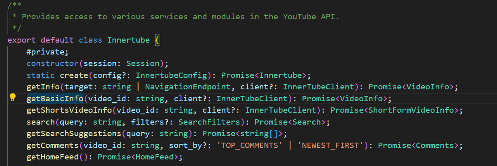
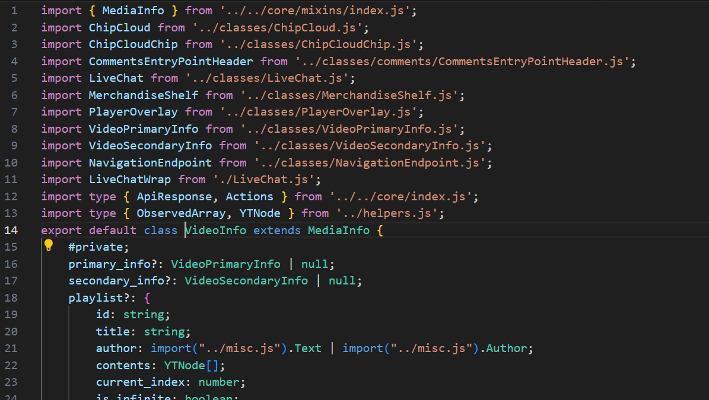
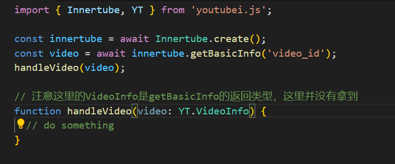

假设有一个第三方库，我们引用了它并且调用了它的方法，然后我们需要拿到这个方法的返回类型作为我们一个公共函数的参数类型，例如：

```typescript
import { Innertube } from "youtubei.js";

const innertube = await Innertube.create();
const video = await innertube.getBasicInfo("video_id");
handleVideo(video);

// 注意这里的VideoInfo是getBasicInfo的返回类型，这里并没有拿到
function handleVideo(video: VideoInfo) {
  // do something
}
```

这个时候可能就会有人说，很简单啊直接`Ctrl + 点击`进去方法看一下返回类型不就行了吗？，好的那我们点进`getBasicInfo`看下：



<!--more-->

可以看到这个方法的返回类型是`Promise<VideoInfo>`，然后我们再点进`VideoInfo`看下：



然后，然后就没了，根本就找不到要怎么`import`这个类型，当然如果仔细看源码的话还是能找到的，比如这里我最终找到了`VideoInfo`的定义：



它竟然是在套娃在某个导出模块里，这种情况只能说运气还是比较好，起码作者把类型导出了，还有些库可能连类型都不导出，这种情况下就需要用到类型推导了。

## 类型推导

### typeof

`typeof`是 TS 中的一个关键字，它可以获取一个变量的类型，例如：

```typescript
const a = 1;
type A = typeof a; // number
```

结合上面的例子，我们可以这样写：

```typescript
import { Innertube } from "youtubei.js";

const innertube = await Innertube.create();
const video = await innertube.getBasicInfo("video_id");
handleVideo(video);

type VideoInfo = typeof video;
// 注意这里的VideoInfo是getBasicInfo的返回类型，这里并没有拿到
function handleVideo(video: VideoInfo) {
  // do something
}
```

然而这并不满足我的需求，因为`typeof`只能获取变量的类型，而我需要在没有变量的情况下获取方法的返回类型。

### ReturnType

`ReturnType`是 TS 中的一个工具类型，它可以获取一个函数的返回类型，例如：

```typescript
function fn() {
  return 1;
}

type FnReturnType = ReturnType<typeof fn>; // number
```

是不是感觉很接近了，但是这里的`fn`是本地定义的一个函数，而`getBasicInfo`是存在于`Innertube`类型中的一个方法，大概长这样：

```typescript
type Innertube = {
  getBasicInfo: (videoId: string) => Promise<VideoInfo>;
};
```

那要怎么取到`getBasicInfo`的方法签名类型呢？这里就需要用到索引类型查询（Indexed Access Types）特性了，就是通过`[]`来获取类型的属性，例如：

```typescript
type GetBasicInfo = Innertube["getBasicInfo"];
```

现在取到了`getBasicInfo`的方法签名类型，然后我们就可以使用`ReturnType`来获取它的返回类型了：

```typescript
type VideoInfo = ReturnType<GetBasicInfo>;
```

到此为止，我们取到了想要的类型为，但是实际上它现在还是`Promise<VideoInfo>`，还要把`Promise`给去掉，这里就需要用到`Awaited`工具类型了，它可以获取一个`Promise`的返回类型，修改如下：

```typescript
type VideoInfo = Awaited<ReturnType<GetBasicInfo>>;
```

最终的代码如下：

```typescript
import { Innertube } from "youtubei.js";

type VideoInfo = Awaited<ReturnType<Innertube["getBasicInfo"]>>;
function handleVideo(video: VideoInfo) {
  // do something
}
```

### 举一反三

比如要获取第三方库中某个函数的参数类型，可以使用`Parameters`工具类型，例如：

```typescript
function fn(a: number, b: string) {
  return a + b;
}

type FnParameters = Parameters<typeof fn>; // [number, string]
type ParamA = FnParameters[0]; // number
type ParamB = FnParameters[1]; // string
```

## 总结

通过`ReturnType`、`Parameters`、`Awaited`等工具类型，我们可以很方便的获取第三方库中的类型，这样就不用再去翻乱七八糟的模块导出源码了，而且这种方式还能保证类型的准确性，因为它是直接推导出来的。
