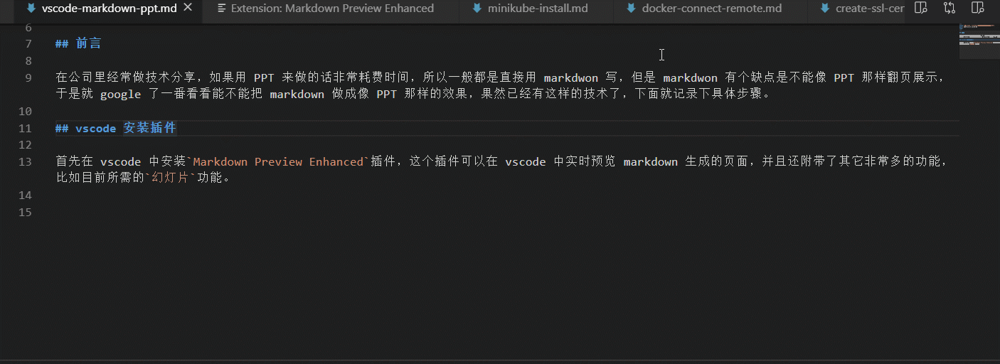
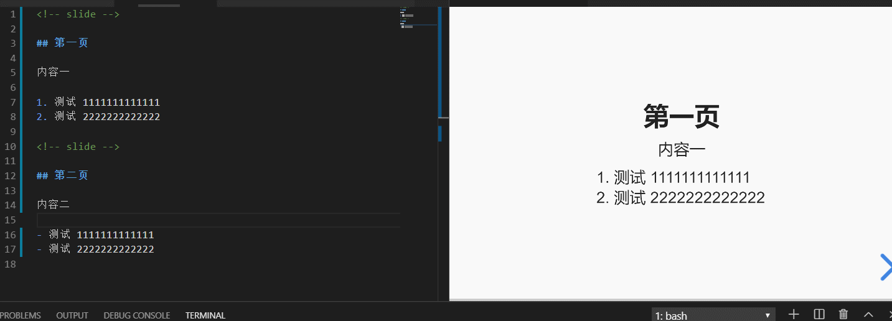
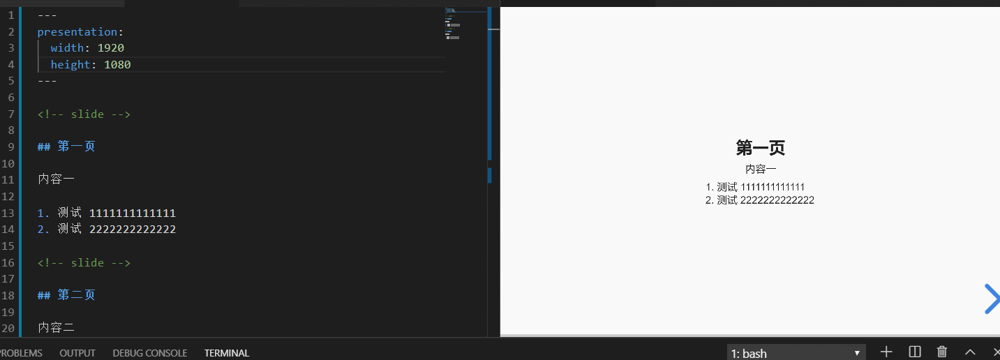
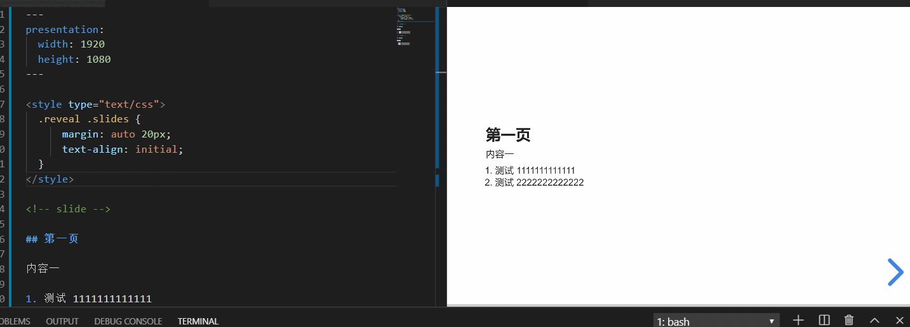
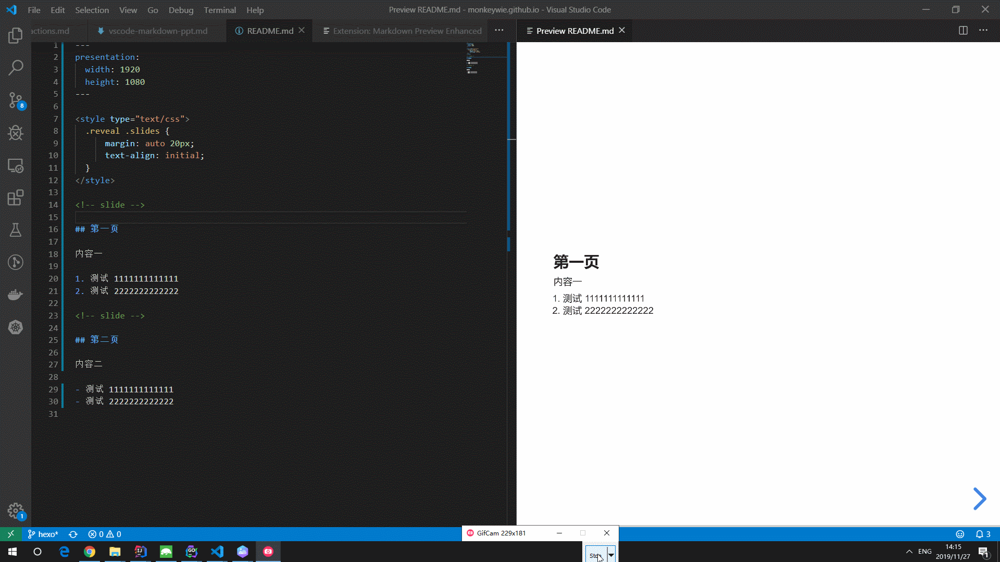

## 前言

在公司里经常做技术分享，如果用 PPT 来做的话非常耗费时间，所以一般都是直接用 markdwon 写，但是 markdwon 有个缺点是不能像 PPT 那样翻页展示，于是就 google 了一番看看能不能把 markdown 做成像 PPT 那样的效果，果然已经有这样的技术了，下面就记录下具体步骤。

## vscode 安装插件

首先在 vscode 中安装`Markdown Preview Enhanced`插件，这个插件可以在 vscode 中实时预览 markdown 生成的页面。



并且还附带了其它非常多的功能，比如目前所需的`幻灯片`功能，相关文档在这：[https://shd101wyy.github.io/markdown-preview-enhanced/#/zh-cn/presentation](https://shd101wyy.github.io/markdown-preview-enhanced/#/zh-cn/presentation)

## 语法介绍

在 markdown 中只需要使用`<!-- slide -->`代码来标记内容为幻灯片，例如：

```markdown
<!-- slide -->

## 第一页

内容一

1. 测试 1111111111111
2. 测试 2222222222222

<!-- slide -->

## 第二页

内容二

- 测试 1111111111111
- 测试 2222222222222
```

效果预览：



## 样式调整

默认内容的 div 大小为：`width:960px;height:700px`，在全屏预览的时候效果不好，可以通过`front-matter`语法来设置对应的分辨率：

```markdown
---
presentation:
  width: 1920
  height: 1080
---

<!-- slide -->

## 第一页

内容一

1. 测试 1111111111111
2. 测试 2222222222222

<!-- slide -->

## 第二页

内容二

- 测试 1111111111111
- 测试 2222222222222
```

效果预览：


默认内容是居中的，通过自定义`css style`可以把内容调整为左对齐：

```markdown
---
presentation:
  width: 1920
  height: 1080
---

<style type="text/css">
  .reveal .slides {
      margin: auto 20px;
      text-align: initial;
  }
</style>

<!-- slide -->

## 第一页

内容一

1. 测试 1111111111111
2. 测试 2222222222222

<!-- slide -->

## 第二页

内容二

- 测试 1111111111111
- 测试 2222222222222
```

效果预览：


## 演示

最后通过`Markdown Preview Enhanced`插件的浏览器预览功能，通过浏览器打开，并进入全屏(F11)即可得到与 PPT 一致的体验了。

> Tips:在浏览器中可以使用<kbd>←</kbd><kbd>→</kbd>来控制 PPT 的翻页，按<kbd>ESC</kbd>可以预览所有页面的缩略图。

效果演示：
