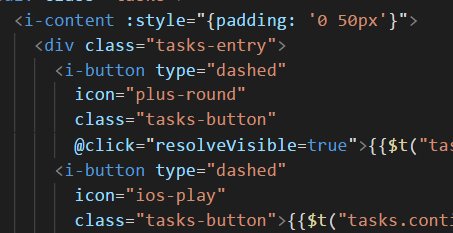
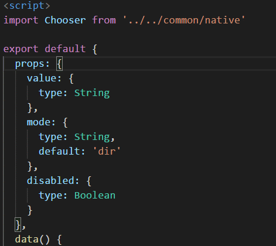

## 前言

本人是 JAVA 为主，开发工具用的 IDEA，之前写 Vue 前端的时候也是直接用的 IDEA+Vue 插件来开发的，一般也是写着玩，不是正式项目，所以也从来没用过`ESLint`和`Prettier`，然后最近要参与一个前端项目，用 IDEA 导入项目后打开，出于强迫症使用熟悉的<kbd>ctrl</kbd>+<kbd>alt</kbd>+<kbd>L</kbd>格式了下代码，发现代码格式完全对不上啊，调研了下之后，义无反顾的转投`VS Code`写前端了。

## 安装 vs code 和插件

首先在[VS Code 官网](https://code.visualstudio.com/)下载安装包，安装好之后启动，然后按<kbd>ctrl</kbd>+<kbd>shift</kbd>+<kbd>X</kbd>打开插件安装界面，搜索以下插件并安装好。

1.  Vetur
2.  ESLint
3.  Prettier - Code formatter

安装完之后最好是重启下`VS Code`避免插件不生效的问题。

## 插件配置

按<kbd>ctrl</kbd>+<kbd>,</kbd>打开设置界面，在窗口右边有两个 tab 页面：

- USER SETTINGS
  全局配置，也就是说在这里配置的话其他项目也会使用到这个配置。
- WORKSPACE SETTINGS
  项目配置，会在当前项目的根路径里创建一个`.vscode/settings.json`文件，然后配置只在当前项目生效。

我这里是把插件的配置写在了`WORKSPACE SETTINGS`里，配置如下：

```js
{
  //.vue文件template格式化支持，并使用js-beautify-html插件
  "vetur.format.defaultFormatter.html": "js-beautify-html",
  //js-beautify-html格式化配置，属性强制换行
  //文档：https://github.com/beautify-web/js-beautify#css--html
  "vetur.format.defaultFormatterOptions": {
    "js-beautify-html": {
      "wrap_attributes": "force"
    }
  },
  //根据文件后缀名定义vue文件类型
  "files.associations": {
    "*.vue": "vue"
  },
  //保存时eslint自动修复错误
  "eslint.validate": [
    "javascript",
    "javascriptreact",
    {
      "language": "vue",
      "autoFix": true
    }
  ],
  "eslint.autoFixOnSave": true
}
```

## ESLint 和 Prettier 的冲突修复

在用`Prettier`格式化的时候，可以能会和`ESLint`定义的校验规则冲突，比如`Prettier`字符串默认是用双引号而`ESLint`定义的是单引号的话这样格式化之后就不符合`ESLint`规则了。所以要解决冲突就需要在`Prettier`的规则配置里也配置上和`ESLint`一样的规则，这里贴下`ESLint`和`Prettier`的配置文件。

- .eslintrc.js
  配置`ESLint`[选项](http://eslint.cn/docs/rules/)，使用单引号、结尾不能有分号。

```js
module.exports = {
  root: true,
  env: {
    node: true
  },
  extends: ["plugin:vue/essential", "eslint:recommended"],
  rules: {
    "no-console": process.env.NODE_ENV === "production" ? "error" : "off",
    "no-debugger": process.env.NODE_ENV === "production" ? "error" : "off",
    "no-alert": process.env.NODE_ENV === "production" ? "error" : "off",
    //强制使用单引号
    quotes: ["error", "single"],
    //强制不使用分号结尾
    semi: ["error", "never"]
  },
  parserOptions: {
    parser: "babel-eslint"
  }
};
```

- .prettierrc
  配置`Prettier`[选项](https://prettier.io/docs/en/options.html)，使用单引号、结尾不能有分号。

```js
{
  "eslintIntegration": true,
  //使用单引号
  "singleQuote": true,
  //结尾不加分号
  "semi": false
}
```

这样把`ESLint`和`Prettier`冲突的规则配置一致,格式化之后就不会冲突了。

## 效果预览
  
  
