## 1. HTTP 协议

在谈论 HTTPS 协议之前，先来回顾一下 HTTP 协议的概念。

### 1.1 HTTP 协议介绍

HTTP 协议是一种基于文本的传输协议，它位于 OSI 网络模型中的`应用层`。

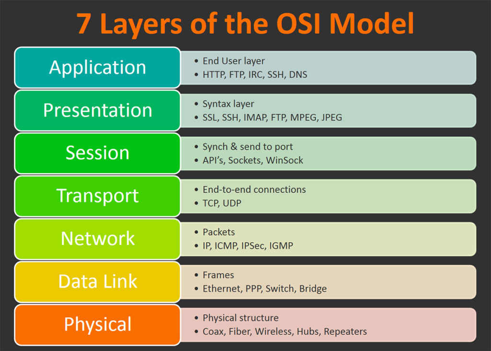

HTTP 协议是通过客户端和服务器的请求应答来进行通讯，目前协议由之前的 [RFC 2616](https://tools.ietf.org/html/rfc2616) 拆分成立六个单独的协议说明（[RFC 7230](https://tools.ietf.org/html/rfc7230)、[RFC 7231](https://tools.ietf.org/html/rfc7231)、[RFC 7232](https://tools.ietf.org/html/rfc7232)、[RFC 7233](https://tools.ietf.org/html/rfc7233)、[RFC 7234](https://tools.ietf.org/html/rfc7234)、[RFC 7235](https://tools.ietf.org/html/rfc7235)），通讯报文如下：

- 请求

```http
POST http://www.baidu.com HTTP/1.1
Host: www.baidu.com
Connection: keep-alive
Content-Length: 7
User-Agent: Mozilla/5.0 (Windows NT 10.0; Win64; x64) AppleWebKit/537.36 (KHTML, like Gecko) Chrome/71.0.3578.98 Safari/537.36

wd=HTTP
```

- 响应

```http
HTTP/1.1 200 OK
Connection: Keep-Alive
Content-Encoding: gzip
Content-Type: text/html;charset=utf-8
Date: Thu, 14 Feb 2019 07:23:49 GMT
Transfer-Encoding: chunked

<html>...</html>
```

<!--more-->

### 1.2 HTTP 中间人攻击

HTTP 协议使用起来确实非常的方便，但是它存在一个致命的缺点：`不安全`。

我们知道 HTTP 协议中的报文都是以明文的方式进行传输，不做任何加密，这样会导致什么问题呢？下面来举个例子：

1. 小明在 JAVA 贴吧发帖，内容为`我爱JAVA`：
   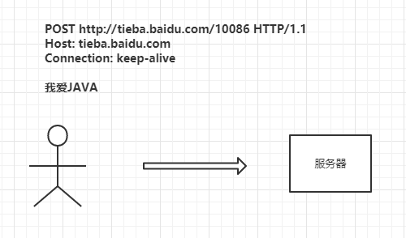
2. 被中间人进行攻击，内容修改为`我爱PHP`
   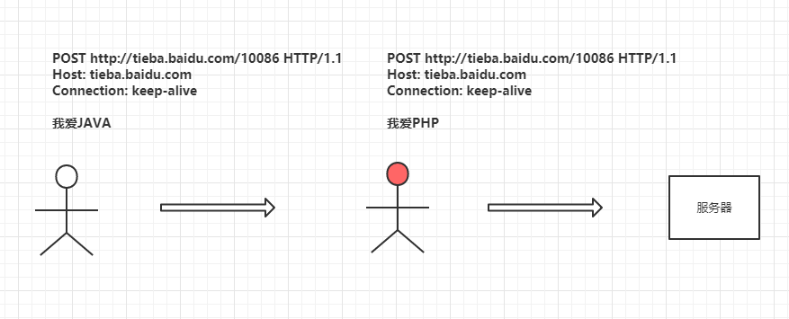
3. 小明被群嘲

可以看到在 HTTP 传输过程中，中间人能看到并且修改 HTTP 通讯中所有的请求和响应内容，所以使用 HTTP 是非常的不安全的。

### 1.3 防止中间人攻击

这个时候可能就有人想到了，既然内容是明文那我使用`对称加密`的方式将报文加密这样中间人不就看不到明文了吗，于是如下改造：

1. 双方约定加密方式
   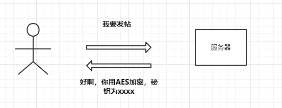
2. 使用 AES 加密报文
   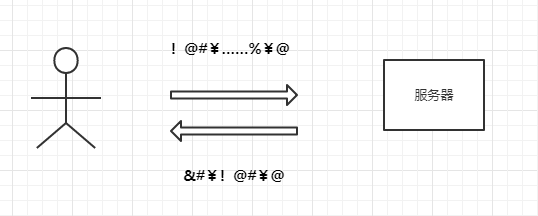

这样看似中间人获取不到明文信息了，但其实在通讯过程中还是会以明文的方式暴露加密方式和秘钥，如果第一次通信被拦截到了，那么秘钥就会泄露给中间人，中间人仍然可以解密后续的通信：

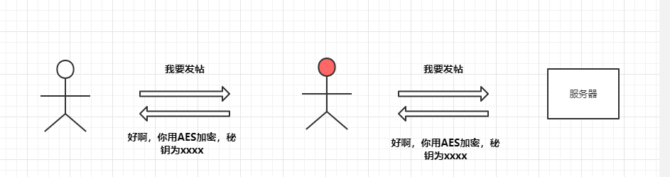

那么对于这种情况，我们肯定就会考虑能不能将秘钥进行加密不让中间人看到呢？答案是有的，采用`非对称加密`，我们可以通过 RSA 算法来实现。

在约定加密方式的时候由服务器生成一对`公私钥`，服务器将`公钥`返回给客户端，客户端本地生成一串秘钥(`AES_KEY`)用于`对称加密`，并通过服务器发送的`公钥`进行加密得到(`AES_KEY_SECRET`)，之后返回给服务端，服务端通过`私钥`将客户端发送的`AES_KEY_SECRET`进行解密得到`AEK_KEY`,最后客户端和服务器通过`AEK_KEY`进行报文的加密通讯，改造如下：

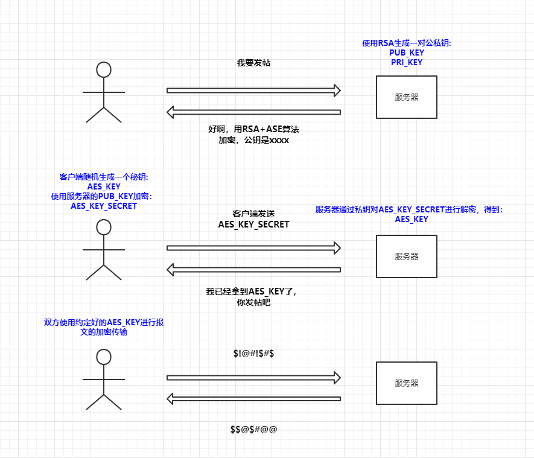

可以看到这种情况下中间人是窃取不到用于`AES加密`的秘钥，所以对于后续的通讯是肯定无法进行解密了，那么这样做就是绝对安全了吗？

所谓道高一尺魔高一丈，中间人为了对应这种加密方法又想出了一个新的破解方案，既然拿不到`AES_KEY`，那我就把自己模拟成一个客户端和服务器端的结合体，在`用户->中间人`的过程中中间人模拟服务器的行为，这样可以拿到用户请求的明文，在`中间人->服务器`的过程中中间人模拟客户端行为，这样可以拿到服务器响应的明文，以此来进行中间人攻击：

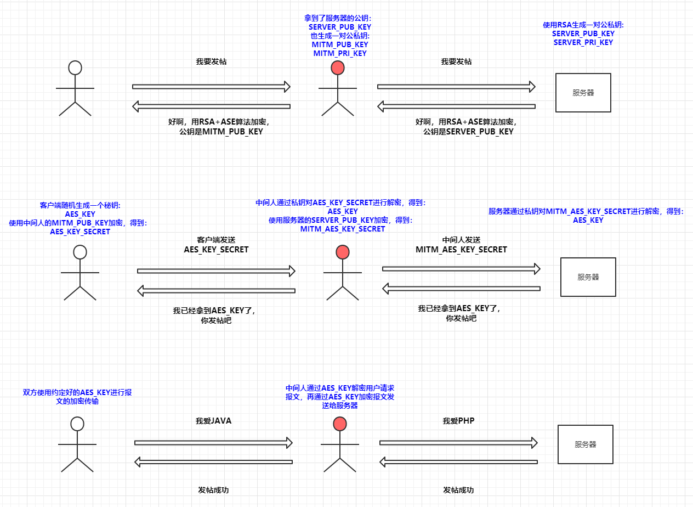

这一次通信再次被中间人截获，中间人自己也伪造了一对公私钥，并将公钥发送给用户以此来窃取客户端生成的`AES_KEY`，在拿到`AES_KEY`之后就能轻松的进行解密了。

中间人这样为所欲为，就没有办法制裁下吗，当然有啊，接下来我们看看 HTTPS 是怎么解决通讯安全问题的。

## 2. HTTPS 协议

### 2.1 HTTPS 简介

HTTPS 其实是`SSL+HTTP`的简称,当然现在`SSL`基本已经被`TLS`取代了，不过接下来我们还是统一以`SSL`作为简称，`SSL`协议其实不止是应用在`HTTP`协议上，还在应用在各种应用层协议上，例如：`FTP`、`WebSocket`。

其实`SSL`协议大致就和上一节`非对称加密`的性质一样，握手的过程中主要也是为了交换秘钥，然后再通讯过程中使用`对称加密`进行通讯，大概流程如下：

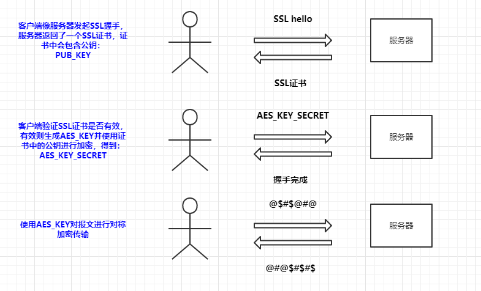

这里我只是画了个示意图，其实真正的 SSL 握手会比这个复杂的多，但是性质还是差不多，而且我们这里需要关注的重点在于 HTTPS 是如何防止中间人攻击的。

通过上图可以观察到，服务器是通过 SSL 证书来传递`公钥`，客户端会对 SSL 证书进行验证，其中证书认证体系就是确保`SSL`安全的关键，接下来我们就来讲解下`CA 认证体系`，看看它是如何防止中间人攻击的。

### 2.2 CA 认证体系

上一节我们看到客户端需要对服务器返回的 SSL 证书进行校验，那么客户端是如何校验服务器 SSL 证书的安全性呢。

- 权威认证机构
  在 CA 认证体系中，所有的证书都是由权威机构来颁发，而权威机构的 CA 证书都是已经在操作系统中内置的，我们把这些证书称之为`CA根证书`：
  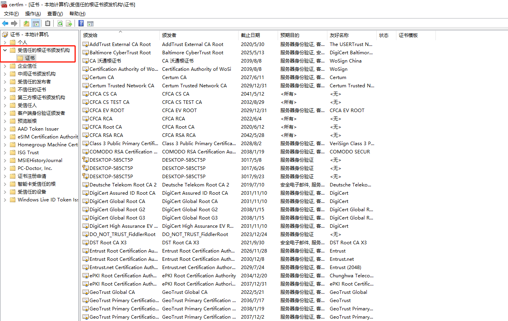

- 签发证书
  我们的应用服务器如果想要使用 SSL 的话，需要通过权威认证机构来签发`CA证书`，我们将服务器生成的公钥和站点相关信息发送给`CA签发机构`，再由`CA签发机构`通过服务器发送的相关信息用`CA签发机构`进行加签，由此得到我们应用服务器的证书，证书会对应的生成证书内容的`签名`，并将该`签名`使用`CA签发机构`的私钥进行加密得到`证书指纹`，并且与上级证书生成关系链。
  这里我们把百度的证书下载下来看看：
  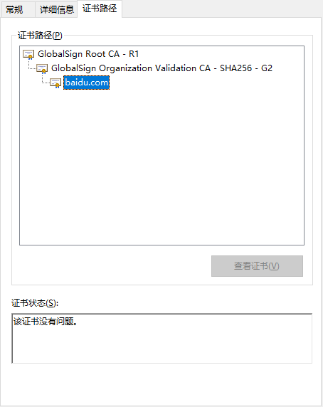
  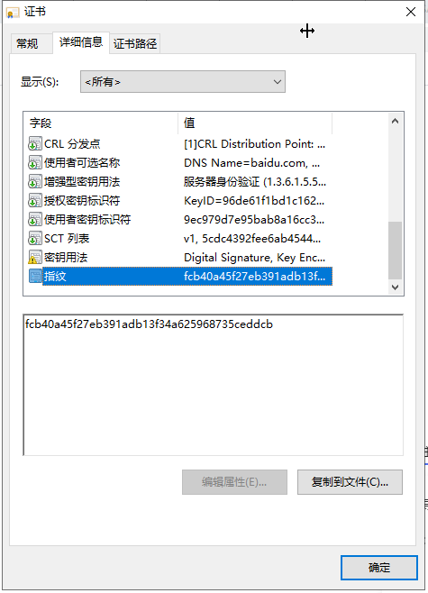

  可以看到百度是受信于`GlobalSign G2`，同样的`GlobalSign G2`是受信于`GlobalSign R1`，当客户端(浏览器)做证书校验时，会一级一级的向上做检查，直到最后的`根证书`，如果没有问题说明`服务器证书`是可以被信任的。

- 如何验证服务器证书
  那么客户端(浏览器)又是如何对`服务器证书`做校验的呢，首先会通过层级关系找到上级证书，通过上级证书里的`公钥`来对服务器的`证书指纹`进行解密得到`签名(sign1)`，再通过签名算法算出服务器证书的`签名(sign2)`，通过对比`sign1`和`sign2`，如果相等就说明证书是没有被`篡改`也不是`伪造`的。
  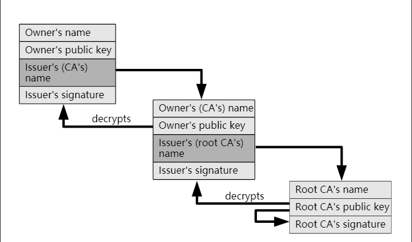
  > 这里有趣的是，证书校验用的 RSA 是通过私钥加密证书签名，公钥解密来巧妙的验证证书有效性。

这样通过证书的认证体系，我们就可以避免了中间人窃取`AES_KEY`从而发起拦截和修改 HTTP 通讯的报文。

## 总结

首先先通过对 HTTP 中间人攻击的来了解到 HTTP 为什么是不安全的，然后再从安全攻防的技术演变一直到 HTTPS 的原理概括，希望能让大家对 HTTPS 有个更深刻的了解。
