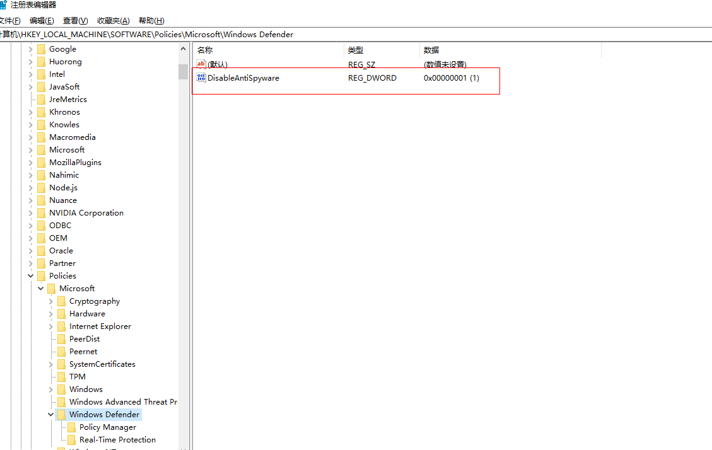
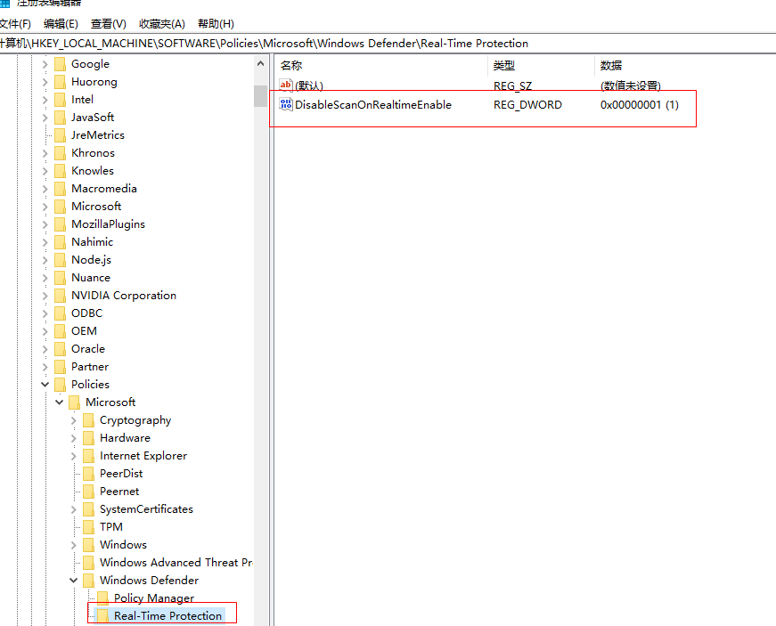
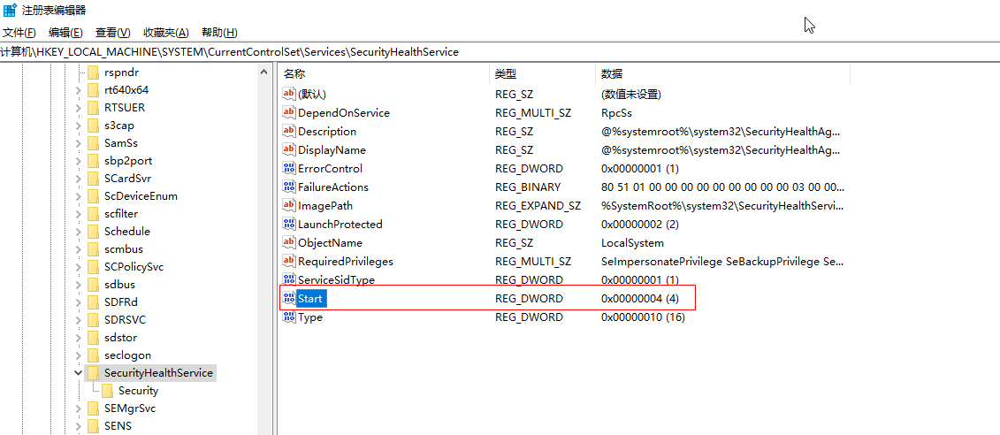

### 前言

最近把 win10 版本升级到了`1909`,然后发现在有个`Windows Defender Antivirus Server`的服务会占用大量的 cpu 和内存，网上找了好多办法都关不掉它，现在终于找了个靠谱的办法在这里记录下。

<!--more-->

### 步骤

1. 打开注册表，找到`HKEY_LOCAL_MACHINE/SOFTWARE/Policies/Microsoft/Windows Defender`

2. 右边窗口新建一个名为`DisableAntiSpyware`类型为`DWORD(32 位)值`的键，并将值设为`1`保存。

3. 左边窗口选中`Windows Defender`项，再其里面新建一个名为`Real-Time Protection`的`项`。

4. 在刚刚创建的`Real-Time Protection`项中新建一个名为`DisableScanOnRealtimeEnable`类型为`DWORD(32 位)值`的键，并将值设为`1`保存。

5. 最重要的一步，禁用`Windows Defender`启动，找到`\HKEY_LOCAL_MACHINE\SYSTEM\CurrentControlSet\Services\SecurityHealthService`

6. 将右边窗口的`Start`键值由`2`改为`4`，如果后续要重新启用再改回来即可。

