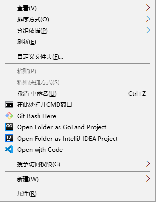

win10 右键菜单只能打开 Powershell，然而不知道是 Powershell 难用还是我不会用，各种莫名其妙的问题，这个时候想想还是`cmd`真香，所以在网上找了个办法把 `cmd` 加到右键菜单里已方便使用。

<!-- more -->

### 步骤

新建一个文档，赋值粘贴以下代码，并且将文档保存为.reg 格式的文件。

```
Windows Registry Editor Version 5.00

[HKEY_LOCAL_MACHINE\SOFTWARE\Classes\Directory\background\shell\cmd_here]

@="在此处打开CMD窗口"
"Icon"="cmd.exe"

[HKEY_LOCAL_MACHINE\SOFTWARE\Classes\Directory\background\shell\cmd_here\command]

@="\"C:\\Windows\\System32\\cmd.exe\""


[HKEY_LOCAL_MACHINE\SOFTWARE\Classes\Folder\shell\cmdPrompt]

@="在此处打开CMD窗口"


[HKEY_LOCAL_MACHINE\SOFTWARE\Classes\Folder\shell\cmdPrompt\command]

@="\"C:\\Windows\\System32\\cmd.exe\" \"cd %1\""


[HKEY_LOCAL_MACHINE\SOFTWARE\Classes\Directory\shell\cmd_here]

@="在此处打开CMD窗口"
"Icon"="cmd.exe"


[HKEY_LOCAL_MACHINE\SOFTWARE\Classes\Directory\shell\cmd_here\command]

@="\"C:\\Windows\\System32\\cmd.exe\""
```

双击运行即可

### 效果


