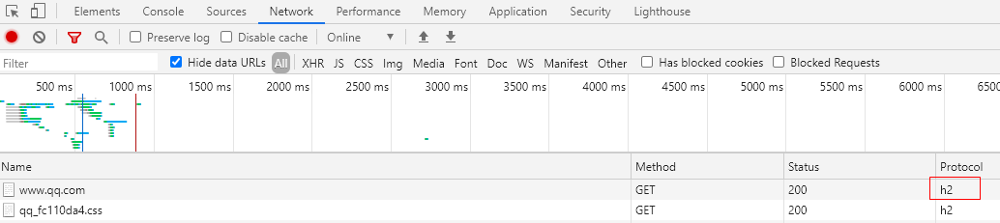
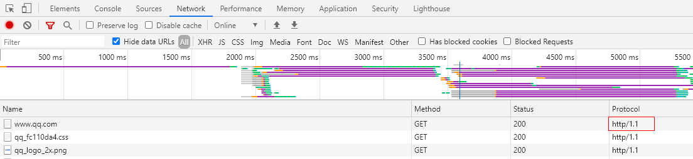
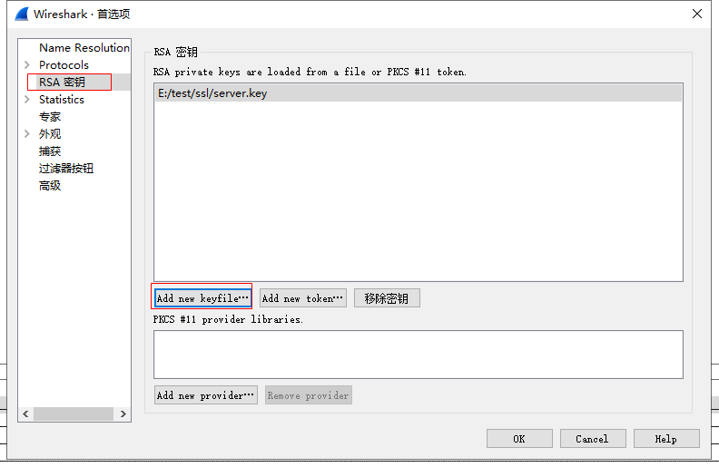
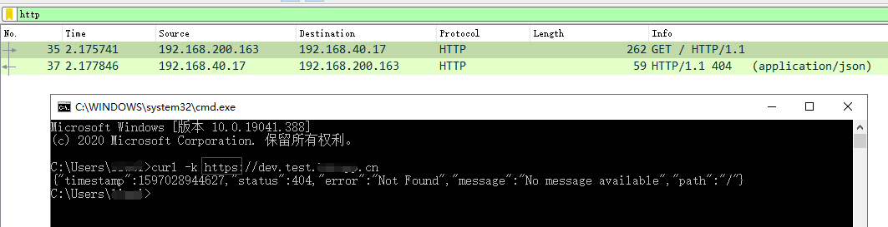
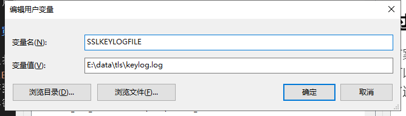
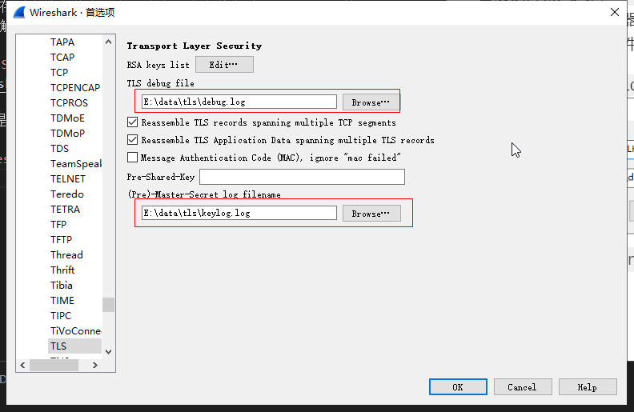
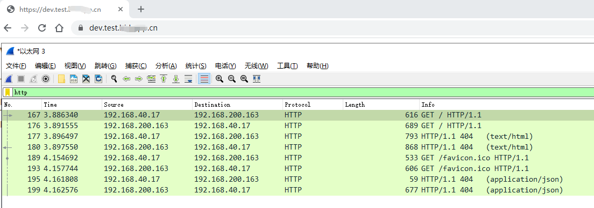
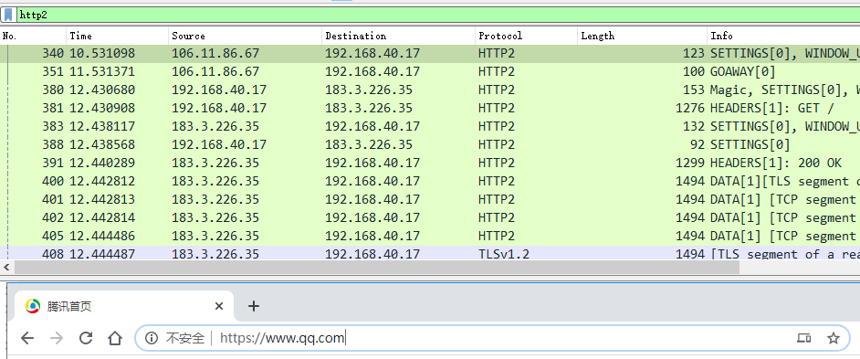

## 前言

以前在使用`wireshark`做协议分析的时候，一直以为它只能抓 HTTP 的报文，所以在抓 HTTPS 包的时候一直是用的`Fiddler`，然而有一天我突然想抓一下`HTTP2`的报文看一看，`Fiddler`就不行了，于是在一番 google 之后发现`wireshark`是可以支持的，只不过需要在特定的条件下才可以。

<!--more-->

## Fiddler 存在的问题

`Fiddler`目前还不支持`HTTP2`协议，无法看到真正的`HTTP2`报文，这里有些人可能会有疑问，说我明明就用`Fiddler`抓到了`HTTP2`协议的报文啊，那是因为`Fiddler`中间人攻击服务器通过协商把协议降级成了`HTTP1`协议，所以实际上看到的还是的`HTTP1`的报文，通过下面两个图片可以直观的感受到：

- 不通过代理，直接访问支持 HTTP2 的服务

- 通过代理访问，进行抓包

可以看到在通过代理抓包的时候，协议变成了`http/1.1`。

## 使用 wireshark 抓取

现在市面上的主流浏览器实现的 HTTP2 都是基于`TLS`的，也就是说要分析`HTTP2`报文得先过了`TLS`这一关，不然只能分析一堆加密的乱码。

`wireshark`支持两种方式来解密`SSL/TLS`报文：

1. 通过网站的私钥
2. 通过浏览器的将 TLS 对称加密秘保存在外部文件中，以供 wireshark 加解密

下面我来一一进行演示

### 1. 通过网站的私钥

如果你想抓取的网站是你自己的，那么可以利用这种方式，因为这需要使用网站生成证书使用的私钥进行解密，就是那个 nginx 上`ssl_certificate_key`配置对应的私钥文件，把它添加到 wireshark 配置中：

然后通过`wireshark`就可以看到明文了：

通过上图可以看到，我通过`curl`访问的 https 协议的 URL，在配置了该服务器对应的私钥后可以抓取到对应的 HTTP 明文。

不过缺点也非常明显，只能分析自己持有私钥的网站，如果别人的网站就分析不了了，所幸的是还有第二种方案来支持。

### 2. 通过浏览器的 SSL 日志功能

目前该方案只支持`Chrome`和`Firefox`浏览器，通过设置`SSLKEYLOGFILE`环境变量，可以指定浏览器在访问`SSL/TLS`网站时将对应的密钥保存到本地文件中，有了这个日志文件之后`wireshake`就可以将报文进行解密了。

1. 首先设置`SSLKEYLOGFILE`环境变量：
   

   > 注：这是在 windows 系统上进行操作的，其它操作系统同理

2. 配置`wireshake`，首选项->Protocls->TLS：
   

   将第一步中指定的文件路径配置好

3. 重启浏览器，进行抓包：
   

   同样的可以抓取到 HTTP 明文。

   > 注：不抓包时记得把环境变量删掉，以避免性能浪费和安全性问题

方案二的优点非常明显，可以抓取任意网站的`SSL/TLS`加密的报文，唯一的缺点就是只能是浏览器支持的情况才行，而方案一可以针对任何 HTTP 客户端进行抓包。

## 通过 wireshake 抓取 HTTP2 报文

上面都是针对`TLS+HTTP1`进行的抓包，市面上主流的浏览器的`HTTP2`都是基于`TLS`实现的，所以也是一样的，把`TLS`这层解密了自然看到的就是最原始的明文。

这里以分析`https://www.qq.com`为例，为什么不是经典`htts://www.baidu.com`，因为百度首页至今还是`HTTP/1.1`协议。

1. 使用上面的第二种方案配置好`wiresharke`
2. 通过`http2`关键字做过滤
3. 浏览器访问`https://www.qq.com`
4. 查看`HTTP2`报文：
   

   这样就抓取到了`HTTP2`报文了，HTTP2 协议非常复杂，我也还在学习阶段，这里就不多说啥了。

## 后记

wireshake 真的是一款非常强大的网络分析工具，在`HTTPS`和`HTTP2`日渐成为主流的时候，可以用它来帮助我们加深对这些协议的理解，以便迎接新的机遇与挑战。

## 参考

- [使用 Wireshark 调试 HTTP/2 流量](https://imququ.com/post/http2-traffic-in-wireshark.html)
