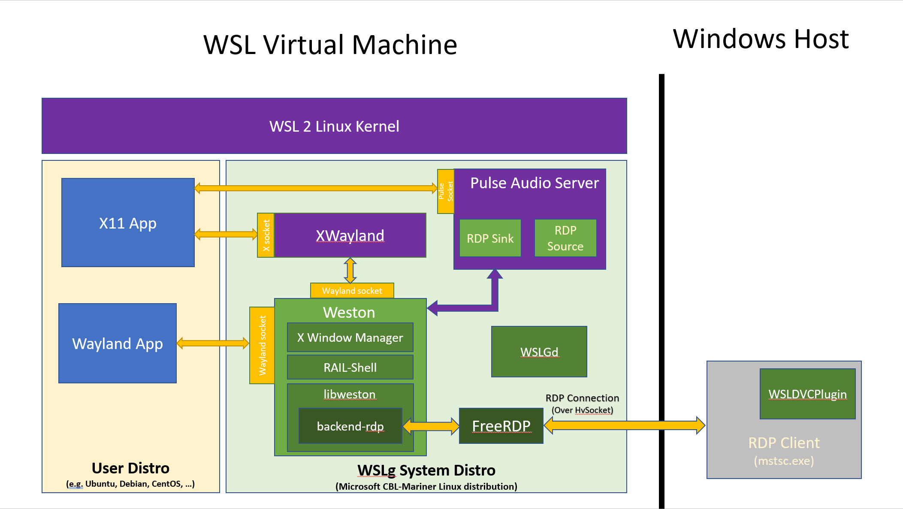
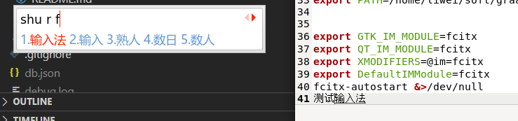
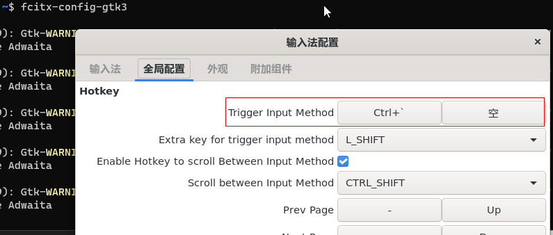
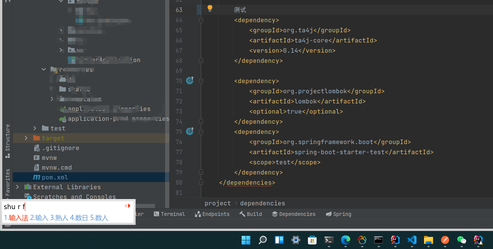

## 前言

最近由于某些需求，需要在`linux`环境下做 java 开发，刚好可以试试`wsl2 gui`，一通折腾下来总算符合自己的预期了，这里就记录下踩坑历程。

<!--more-->

## 安装步骤

### 开启 WSL2

首先 WSL2 gui 需要`Windows 11 Build 22000`版本以上才支持，然后关于升级到 Windows11 和开启 WSL2 的步骤就不多叙了，网上很多教程。

附：[官方文档](https://docs.microsoft.com/en-us/windows/wsl/tutorials/gui-apps)

### 安装到指定目录

默认情况下`WSL2系统`会安装在 C 盘，但是我有块开发专用的 SSD 硬盘，所以需要安装到指定的目录里。

这需要手动下载安装包进行安装，找到微软提供的 wsl 支持的操作系统安装包列表，然后下载对应的安装包即可(https://docs.microsoft.com/en-us/windows/wsl/install-manual#downloading-distributions)。

我下载的是`Ubuntu 20.04`，下载完之后把后缀名改成`.zip`然后解压到对应的目录，双击
`ubuntu2004.exe`就安装好了，然后目录下会生成一个`ext4.vhdx`文件，这个就是虚拟机挂载的磁盘文件了。

### 中文乱码修复

安装好 IDEA 之后，打开发现中文全部变成了方块乱码，为了解决这个问题需要安装中文字体。

- 安装相关的包

```sh
sudo apt install language-pack-zh-hans
sudo dpkg-reconfigure locales #这一步要选择en_US.UTF-8和zh_CN.UTF-8, 并且zh_CN.UTF-8为默认语言
sudo apt install fontconfig
```

- 安装 Windows 字体

创建`/etc/fonts/local.conf`文件，内容如下：

```xml
<?xml version="1.0"?>
<!DOCTYPE fontconfig SYSTEM "fonts.dtd">
<fontconfig>
    <dir>/mnt/c/Windows/Fonts</dir>
</fontconfig>
```

- 刷新字体缓存

```sh
fc-cache -f -v
```

- 重启 wsl 即可

```sh
wsl --shutdown
```

### 输入法问题

由于 wsl gui 底层依旧是基于 RDP 的远程桌面实现，官方架构图
：


所以输入法不能使用 Windows 宿主机上的，需要在虚拟机里安装输入法，目前有一个很大的问题就是，输入法的候选框不会跟随光标，其它的暂时没啥问题，勉强能用。

- 安装 fcitx

```sh
sudo apt install fcitx dbus-x11 im-config fcitx-sunpinyin
```

- 编辑`/etc/locale.gen`文件

```
# 找到 # zh_CN.UTF-8 这一行，取消注释
zh_CN.UTF-8
```

- 编辑`~/.profile`文件

```sh
export GTK_IM_MODULE=fcitx
export QT_IM_MODULE=fcitx
export XMODIFIERS=@im=fcitx
export DefaultIMModule=fcitx
fcitx-autostart &>/dev/null
```

- 刷新`~/.profile`

```sh
source ~/.profile
```

这个时候在`gedit`里已经可以切出中文输入法了，如图：



需要注意的时，fcitx 默认输入法切换快捷键是<kdb>ctrl</kdb>+<kdb>space</kdb>，会覆盖 IDEA 的提示快捷键，可以通过`fcitx-config-gtk3`修改，但是不能和 Windows 宿主机上的全局热键冲突，不然会无效。



- `IDEA` 输入法支持

上面配好之后，IDEA 切不出输入法，需要特殊配置一下才行，编辑 IDEA 启动脚本`idea.sh`，在上面加入以下配置：

```sh
export XMODIFIERS=@im=fcitx
export QT_IM_MODULE=fcitx
```

然后重启`IDEA`就可以切出输入法了，如图：


