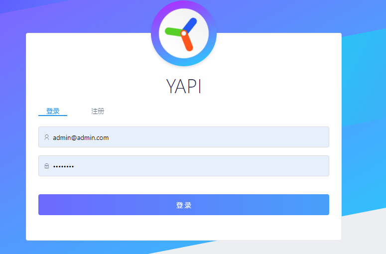
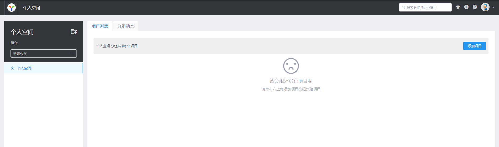
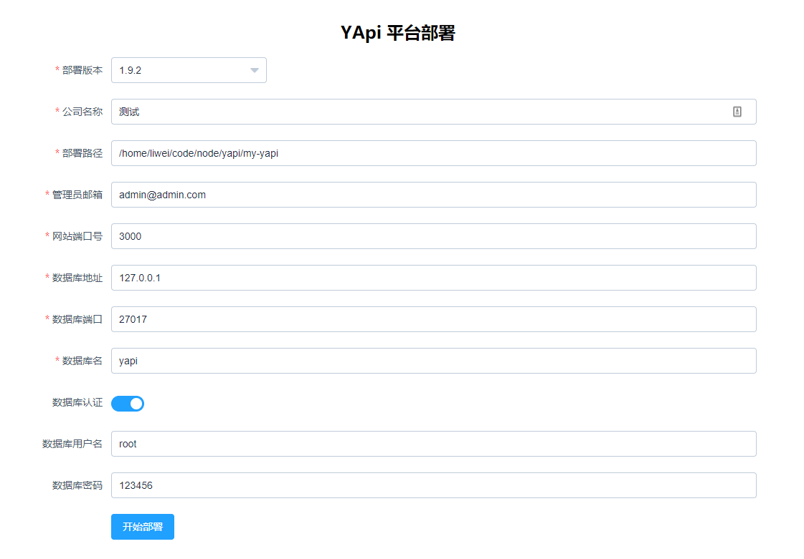

## YApi 简介

YApi 是去哪儿网开源的一个`高效`、`易用`、`功能强大`的 API 管理平台，它拥有接口管理，接口调试，接口测试，Mock 等等一系列特性。

官方已经部署了一套公有服务进行演示，直接访问[https://yapi.baidu.com](https://yapi.baidu.com)即可快速体验。

<!--more-->

## 部署

这里介绍两种部署方式，一种是基于`docker`一键部署，还有一种是基于`命令行`手动部署，当然我强烈建议使用`docker`进行部署，否则容易碰到一些环境相关的问题。

### 基于 docker 部署

#### 1.创建网桥

创建一个网桥让 yapi 容器能访问到 mongoDB 容器，命令如下：

```sh
docker network create yapi
```

#### 2.部署 mongoDB

基于 docker 部署非常简单，只需要一行命令就搞定，如下：

```sh
docker run -d --name=mongo \
  --network=yapi \
  -e MONGO_INITDB_ROOT_USERNAME=root \
  -e MONGO_INITDB_ROOT_PASSWORD=123456 \
  mongo:3.6.21-xenial
```

这里关键的点就是通过`MONGO_INITDB_ROOT_USERNAME`和`MONGO_INITDB_ROOT_PASSWORD`环境变量来设置数据库访问的账号密码，在下面部署 yapi 时要用到。

### 3.部署 yapi

通过上一步部署的 mongoDB 账号密码进行部署，如下：

```sh
docker run -d --name yapi \
  --network=yapi \
  -e DB_SERVERNAME=mongo \
  -e DB_DATABASE=admin \
  -e DB_PORT=27017 \
  -e DB_USER=root \
  -e DB_PASS=123456 \
  -p 3000:3000 \
  liwei2633/yapi
```

部署成功的话通过浏览器访问`http://127.0.0.1:3000`应该就可以看到以下界面：


然后使用默认管理员账号密码：`admin@admin.com`+`ymfe.org`登录就能使用了。




> 这里的镜像是我自己构建上传的镜像，详细可以参考：[basic/README.md](https://github.com/monkeyWie/yapi-docker/blob/master/build/basic/README.md)。
> 然后还提供了一个支持`gitlab登录`的镜像，如果有需要的可以参考：[gitlab/README.md](https://github.com/monkeyWie/yapi-docker/blob/master/build/gitlab/README.md)

### 基于命令行部署

上面介绍了基于 docker 的方式安装，现在介绍下基于命令行的方式进行安装。

#### 1.安装 mongoDB

通过 mongoDB 官网的教程，根据自己的操作系统进行安装即可，地址：`https://docs.mongodb.com/v3.6/administration/install-community`

由于 mongoDB 默认是无需身份验证的，不太安全，所以要创建一个用户用于访问数据库，命令如下：

```sh
use admin

db.createUser(
  {
    user: "root",
    pwd: "123456",
    roles: [ { role: "userAdminAnyDatabase", db: "admin" } ]
  }
)
```

这样创建好了一个用户，账号密码为：`root`+`123456`

#### 2.安装 node.js 环境

注意不要安装太高版本的 node，否则可能会导致部分依赖下载失败，我测试 node10 版本是没问题的，直接去官网`https://nodejs.org/dist/latest-v10.x`，下载对应的 node 版本安装即可。

安装好之后运行以下命令来验证是否正确安装：

```sh
node -v
```

正常的话会输出`v10.x.x`对应版本号，接着就可以开始安装 yapi 了。

#### 3.安装 yapi

选好一个安装目录，在目录下打开终端执行命令：

```
npm install -g yapi-cli --registry https://registry.npm.taobao.org
yapi server
```

运行成功之后终端会提示访问地址，通过浏览器访问`http://127.0.0.1:9090`进行安装，如图：



填写好对应的配置信息，然后点击开始部署，接着等待一段时间就部署完成了，然后按<kbd>ctrl</kbd>+<kbd>c</kbd>退出。

再根据安装提示在终端中启动 yapi 服务：

```
cd <部署路径>
node vendors/server/app.js
```

启动成功后就可以访问了。

## 后记

YApi 使用在我们团队使用了一段时间，体验还是非常不错的，但是很可惜的是这个项目目前基本属于无人维护的状态，最近的一次`commit`还是在`2020年10月`，如果碰到坑的话就不要指望官方来修复了，只能靠自己，前几天给官方提了个[PR](https://github.com/YMFE/yapi/pull/2059)到现在也还没回复，希望官方能把项目再运营起来吧~
