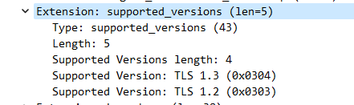
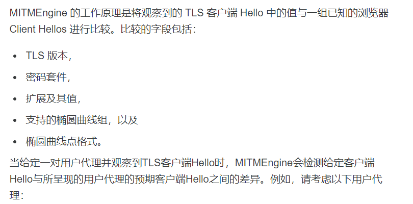

## 背景

最近碰到一个神奇的网站，在浏览器可以打开，但是通过 curl 或者 代码访问就直接 403，我估摸着这肯定是做了`UA校验`，于是请求的时候把浏览器的 UA 给带上，然后访问发现还是 403，不过这也难不倒我，肯定是还有校验其它的请求头，直接浏览器打开 network，把所有的请求头复制过来并且带上，确保我和浏览器在 http 协议层面的请求完全一样，这样不可能会失败了吧，然而运行完发现还是 403。

> 放个地址: https://pixabay.com

<!-- more -->

## 思考

服务端校验客户端没有什么黑魔法，因为都是通过 TCP 协议通讯，不可能存在浏览器发送一个 HTTP 报文和我发送一个同样的 HTTP 报文服务器能识别出来，既然不是校验的 HTTP 层，那只可能是在 TLS 层校验的，于是祭出`wireshark`抓包，看看能不能找到 TLS 握手中差异化的东西，众所周知在 TLS 握手时有一个客户端发送给服务端的`Client Hello`报文，很有可能就是根据它来辨别浏览器和非浏览器请求的，因为在这个报文中，客户端要告诉服务端支持的加密套件，TLS 版本等等信息，而这些信息根据客户端的实现都会有所差异，先抓个正常浏览器请求的报文看看，如下图：


然后再通过 curl 访问抓包，如下图；


可以看到两边的报文确实存在很大的差异，逐一对比排查之后发现很有可能是因为 curl 的请求报文里缺少`supported_versions`扩展信息导致的 403，浏览器那边在此扩展信息内容如图：



表示支持`TLSv1.2`和`TLSv1.3`，而且最终握手之后的协议也是切换到了`TLSv1.3`，在上面两个对比图可以看到，浏览器走的是`TLSv1.3`，而 curl 走的是`TLSv1.2`，可能是一定要使用`TLSv1.3`才能访问成功。

## 验证

马上 google 了下如何指定 curl 的 TLS 版本，发现只需要加上`--tlsv1.3`参数就可以了，如下：

```bash
$ curl -I --tlsv1.3 'https://pixabay.com/'  \
> -H 'accept-language: zh-CN,zh;q=0.9,en;q=0.8,en-GB;q=0.7,en-US;q=0.6' \
> -H 'user-agent: Mozilla/5.0 (Windows NT 10.0; Win64; x64) AppleWebKit/537.36 (KHTML, like Gecko) Chrome/103.0.5060.114 Safari/537.36 Edg/103.0.1264.49'
HTTP/2 200
date: Fri, 22 Jul 2022 02:40:35 GMT
content-type: text/html; charset=utf-8
cf-ray: 72e8cffc18c73d5a-HKG
cache-control: s-maxage=86400
content-language: en
vary: Accept-Encoding, Cookie, Accept-Language
cf-cache-status: MISS
content-security-policy: frame-ancestors none
expect-ct: max-age=604800, report-uri="https://report-uri.cloudflare.com/cdn-cgi/beacon/expect-ct"
referrer-policy: strict-origin-when-cross-origin
x-frame-options: DENY
set-cookie: __cf_bm=Cy4a751rDND6kHhu.RzEr5DpqnaxRdpUxaMfNfkya0A-1658457635-0-AS1DaewDqNjWHZ/m74A88bNyEG0EFsZAwmsm/ON5QQEuh8B6XOS7PkSnhGgXPLV+LtEvzOKTy/WWHmwY63uGlD0=; path=/; expires=Fri, 22-Jul-22 03:10:35 GMT; domain=.pixabay.com; HttpOnly; Secure; SameSite=None
server: cloudflare
alt-svc: h3=":443"; ma=86400, h3-29=":443"; ma=86400
```

经过反复验证，发现除了要指定`tlsv1.3`之外，还需要加上`accept-language`和`user-agent`头，并且一定得是 http2 协议，三个条件缺一不可。

## nodejs 访问

上面说到了一定要走 http2 协议，而现在市面上流行的 http client 基本都是只支持 http1.1，所以只能直接从基础库入手了，官方有一个`http2`的库，一番调教之后也是成功请求了，代码如下：

```js
const http2 = require("http2");

function get(host, path) {
  return new Promise((resolve, reject) => {
    const session = http2.connect(`https://${host}`, {
      minVersion: "TLSv1.3",
      maxVersion: "TLSv1.3",
    });

    session.on("error", (err) => {
      reject(err);
    });

    const req = session.request({
      [http2.constants.HTTP2_HEADER_AUTHORITY]: host,
      [http2.constants.HTTP2_HEADER_METHOD]: http2.constants.HTTP2_METHOD_GET,
      [http2.constants.HTTP2_HEADER_PATH]: path,
      "user-agent":
        "Mozilla/5.0 (Windows NT 10.0; Win64; x64) AppleWebKit/537.36 (KHTML, like Gecko) Chrome/100.0.4896.127 Safari/537.36 Edg/100.0.1185.50",
    });

    req.setEncoding("utf8");
    let data = "";
    req.on("data", (chunk) => {
      data += chunk;
    });
    req.on("end", () => {
      session.close();
      if (data) {
        try {
          resolve(data);
        } catch (e) {
          reject(e);
        }
      }
    });
    req.on("error", (err) => {
      reject(err);
    });
    req.end();
  });
}

(async function () {
  const data = await get("pixabay.com", "/");
  console.log(data);
})();
```

## 深入

虽然已经成功请求了，但是本着探索的精神继续深入发现 cloudflare 官方有一篇博客就是专门介绍这个 TLS 拦截技术的，链接如下：
[https://blog.cloudflare.com/monsters-in-the-middleboxes/](https://blog.cloudflare.com/monsters-in-the-middleboxes/)

其中有一段内容也证明了我的猜想，翻译后如下：



也就是说 cloudflare 会维护一组浏览器的 TLS 指纹，当收到一个 Client Hello 请求时，会检查这组指纹，如果匹配不上，就会拦截这个请求，这样可以拦截掉大部分不是来自浏览器的请求了。
