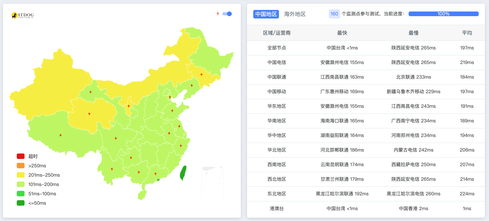
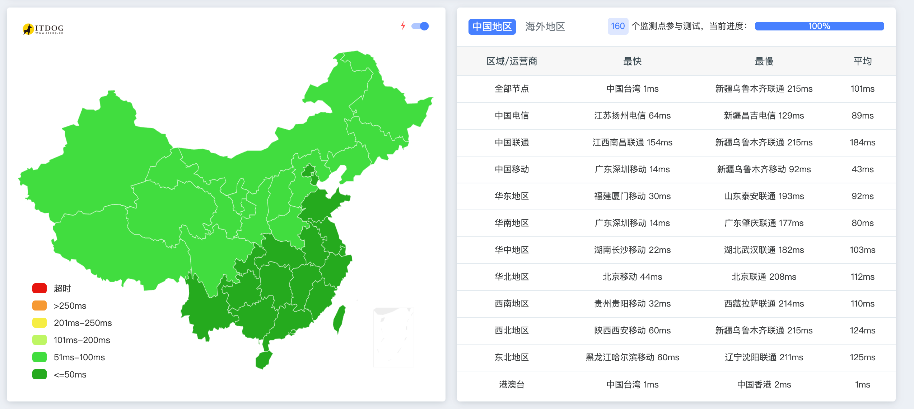
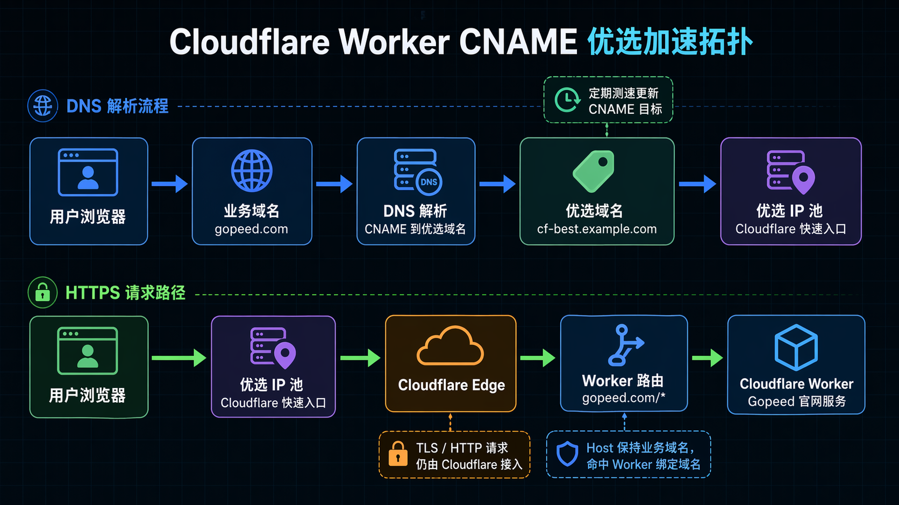
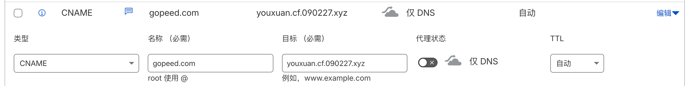

最近有没有发现 [Gopeed](https://gopeed.com) 官网打开变快了？

之前把官网从 `Vercel` 搬到 `Cloudflare Workers` 之后，有些用户反馈国内访问变慢了，我以前还专门研究了下怎么优化，但是感觉网上教程看起来都太麻烦就一直没下手，后来有用户直接给了个方案过来，不得不说 Gopeed 的用户里真藏龙卧虎，照着试了一下，结果还真行。

<!-- more -->

## 先看效果

- 优化前：

- 优化后：

可以看到在使用了优选 IP 优化之后，国内的访问延迟明显降低了。

先直接说结论：优化之后，国内多个节点的延迟和稳定性都有明显改善，最直观的感受就是首屏不再那么抽风了。

整个链路大概是下面这样，业务域名通过 `CNAME` 指向优选域名，优选域名再解析到当前质量更好的 Cloudflare 入口 IP，最终请求仍然由 Cloudflare Edge 接入并命中 Worker 路由。

## 优选IP 是什么？

简单来说，就是找一个国内访问更快的 Cloudflare 节点。

Cloudflare 默认分配的 IP，在国内访问时延迟通常比较高，有时候甚至直接打不开。而通过优选，可以手动把域名解析到那些国内访问更快的 Cloudflare IP 上，从而提升网站的访问速度和可用性。

从上面的对比图也能看出来，优选之后响应速度快了很多，出口 IP 也变多了。这个对于网站的可用性和加载速度提升是非常明显的。

要做到优选，核心就两点：**自己控制路由规则**和**自己控制 DNS 解析**。

## 优选原理

首先得搞清楚 CDN 是怎么通过不同域名分发内容的。

可以把它抽象成两层：**规则层**和**解析层**。当在 Cloudflare 正常添加一条开启小黄云的 DNS 解析时，Cloudflare 实际上做了两件事：

1. 写一条 DNS 解析指向 Cloudflare 的 IP
2. 在 Cloudflare 上创建一条路由规则

所谓优选，本质上就是手动改掉这个 DNS 解析，让它指向一个更快的 Cloudflare 节点。

### 直接解析优选 IP

最直接的办法就是手动把域名 A 记录解析到一个优选 IP 上。这个方法能用，但问题也很明显，优选 IP 不是一成不变的，今天快的 IP 明天可能就慢了，需要经常手动去换，维护起来很麻烦。

### CNAME 优选域名

所以后来就有了 CNAME 的方式。不再直接指向某个具体 IP，而是 CNAME 到一个优选域名上，让这个优选域名来负责解析到当前最快的 IP，这样即使 IP 变了，也不需要动自己的 DNS 配置。

常用的社区优选域名：https://cf.090227.xyz

这些域名是社区通过扫描 Cloudflare 官方 IP 段，找出国内延迟最低的 IP 整理出来的，并且会持续更新。只需要把业务域名 CNAME 到这些优选域名上，就能一直享受到较快的访问速度了。

## Worker 优选实践

如果服务本身就部署在 Cloudflare Workers 上，那就享大福了，这种配置起来是最简单的。其他场景（比如 SaaS 回源等）这里就不展开了，可以自行搜索相关资料。

整个配置就两步：

### 1. 创建 Worker 路由

在 Cloudflare Dashboard 中，进入 Workers Routes 页面，添加一条路由规则，把自定义域名绑定到对应的 Worker 上。比如将 `www.example.com/*` 路由到你的 Worker。

### 2. 修改域名 CNAME 解析

到域名的 DNS 管理处，把业务域名的解析从原来的 A 记录改为 CNAME，指向前面提到的优选域名，记得不要开启小黄云。

就这样，两步搞定。

## 后记

整体体验下来，Cloudflare IP 优选对于国内访问质量的提升确实是立竿见影的，尤其是 Worker 场景下几乎零成本就能搞定。当然优选 IP 本身也不是银弹，网络波动、节点变更这些因素都会影响效果，建议定期关注优选域名的更新情况，如果有更好的优选方案，也欢迎交流。
