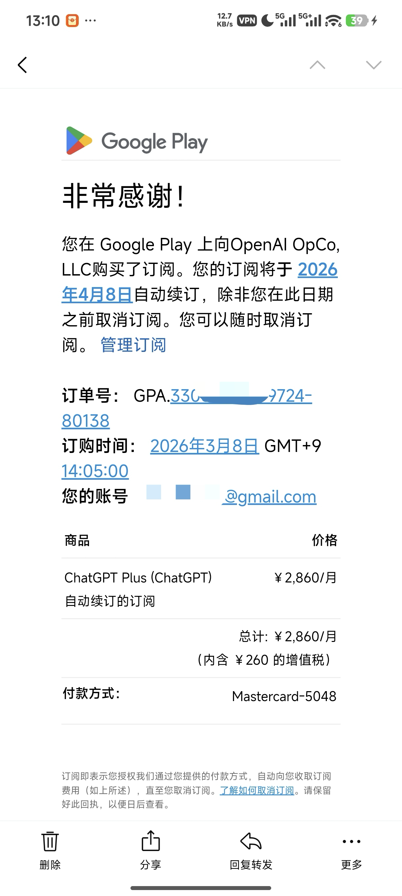
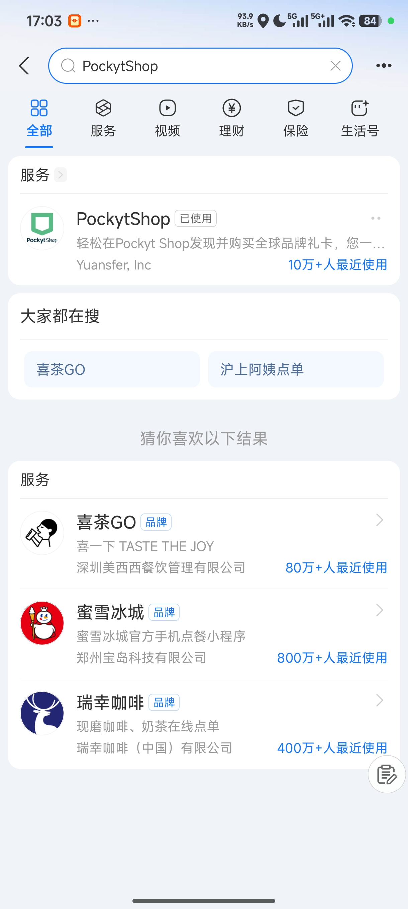
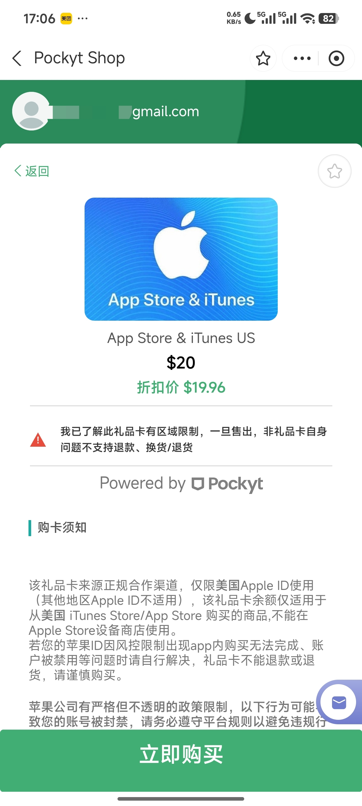
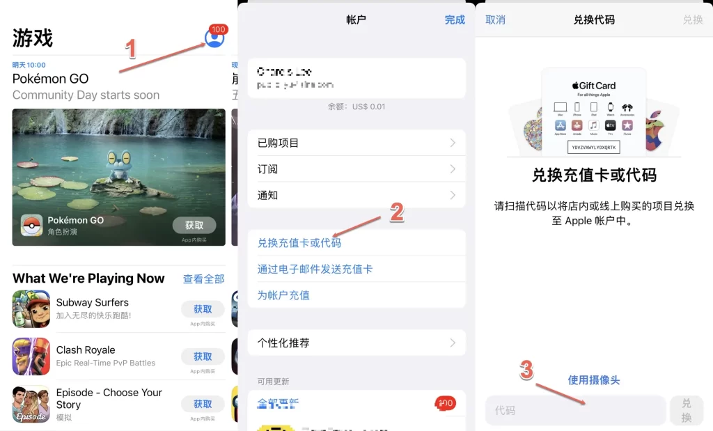
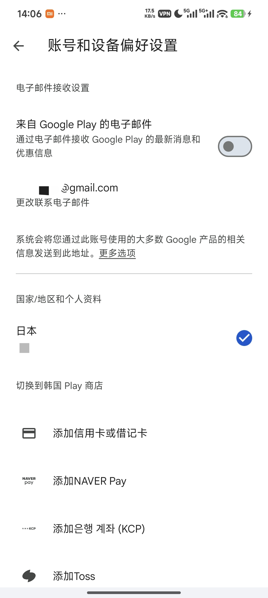
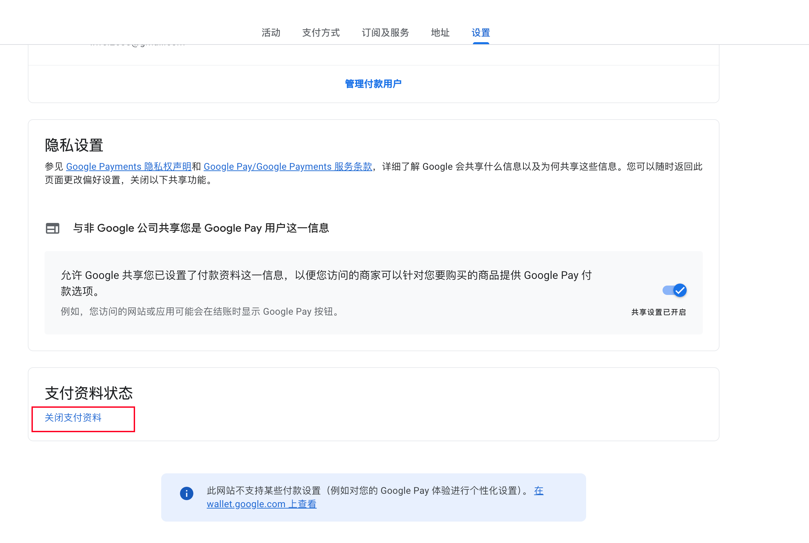
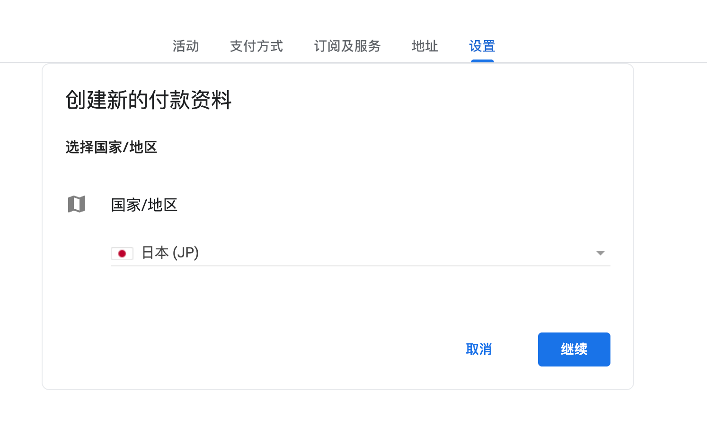
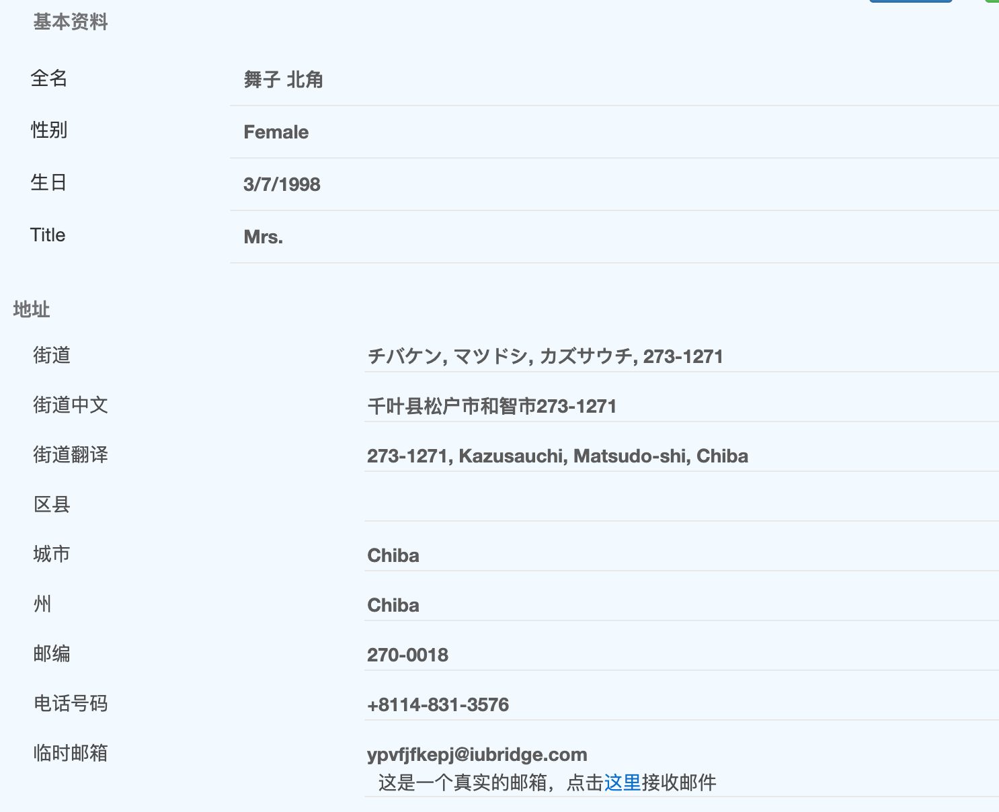
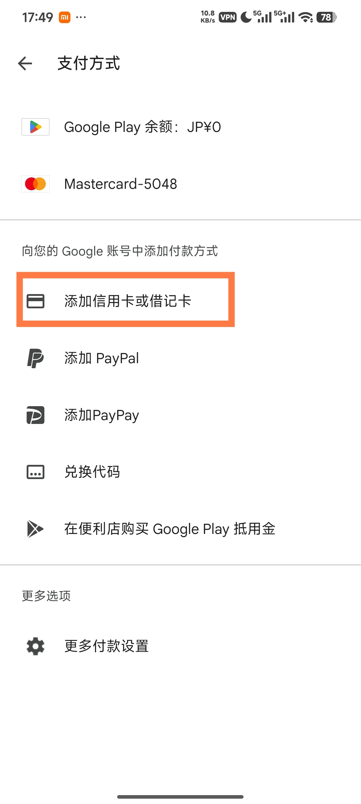
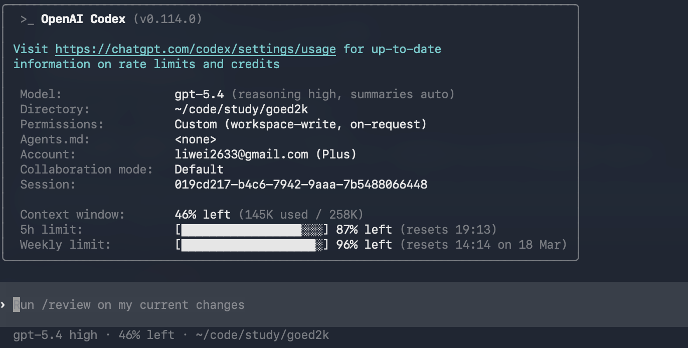

## 前言

最近 `Codex` 开放了免费使用，体验下来确实很不错。不过免费版额度比较低，用不了多久就会触发限制，这时候就得想办法升级。问题是，在国内订阅 `ChatGPT Plus` 并不算容易，支付和网络环境都不太友好。所以这篇文章主要分享一下我个人的订阅经验：**无需海外信用卡或虚拟卡，走国内可操作的正规渠道，实测有效**，供大家参考。



## 开通教程

说白了，开通方式就两种：

1. 通过 **OpenAI 官方渠道**订阅，门槛稍高，但**最稳定**，这也是本文主要介绍的方式。
2. 通过**中转站**购买，缺点很多：**不稳定**，随时可能卷款跑路；**模型注水严重**，可能拿开源模型充数；**没有隐私保障**，所有对话都对中转站透明。所以**非常不推荐**这种方式。

### 如何订阅 ChatGPT Plus

先说结论：直接通过 `OpenAI` 官网订阅，国内信用卡百分百会被拒。这时候就需要曲线救国，通过 `App Store` 或 `Google Play` 的应用内购来绕过这个限制。

这两个渠道我都试过，而且都成功了。也就是说，只要你手上有 `iOS` 或 `Android` 设备，**不需要专门开国外信用卡**，也能通过正规渠道订阅 `ChatGPT Plus`。下面分别说一下具体流程。

## 通过 App Store 订阅

`iOS` 设备实测下来是最简单的，只要有个 🪜 基本就能搞定。

### 前提准备

1. 干净的 🪜 IP（香港不行，`OpenAI` 目前**不对香港提供服务**）
2. 美区 Apple ID

如果没有美区 Apple ID 的话，需要自行注册一个，注册教程网上一大把，这里就不赘述了。

### 订阅流程

#### 安装 ChatGPT

通过美区 Apple ID 登录 `App Store`，搜索 `ChatGPT` 进行安装。如果搜不到，说明你的 Apple ID 不是美区的，想办法弄个美区 Apple ID 再继续。

#### 购买美区礼品卡

接下来需要购买美区 Apple 礼品卡。`ChatGPT Plus` 的价格是 **`20 美元/月`**，所以买 **`20 美元`** 面额的礼品卡就够了。

购买渠道直接走支付宝里的 `PockytShop` 小程序，发货快，稳定性也还不错：



进去注册登录之后，选择 `App Store & iTunes`，输入 **`20 美元`** 面额，最后付款就行：



付款成功后，等一会儿就会拿到一个礼品卡兑换码。

> 注：如果 `iOS` 上的支付宝搜不到 `PockytShop` 小程序，可以复制下面这个链接进入(推给同事的时候遇到过这种情况)：

```
# https://www.wmslz.com/s/QR28LIj06s4#💪复置💪此消息，打开支f`u.保嗖索，体验PockytShop小程序  j:/6 HU1010 $538
```

#### 兑换礼品卡

拿到兑换码之后，打开 `App Store`，点击头像进入账户设置，选择 `兑换礼品卡或代码`，输入兑换码进行兑换：



兑换完成后，账户里就会有 **`20 美元`** 余额，可以直接用来订阅 `ChatGPT Plus`。

#### 订阅 ChatGPT Plus

打开 `ChatGPT` 应用，注册或登录账号，点击 `升级到 Plus`，选择 `订阅`，确认后就完成了。后面每个月会自动续费，只需要定期在 `PockytShop` 补对应金额的礼品卡即可。

## 通过 Google Play 订阅

`Google Play` 的订阅门槛会稍高一点。除了 🪜 之外，还需要一张国内能申请到的**双币信用卡**，比如 `Visa` 或 `Mastercard`。

不过 `Google Play` 的优势也很明显，就是可以切到一些更便宜的国家地区来订阅，价格通常会比美区更低。比如我切的是**日本区**，订阅价格是 **`2860 日元/月`**，折合大概 **`18 美元/月`**，比美区每个月便宜大约 **`2 美元`**。

至于网上常说的什么 `土区`、`尼区`，我也都试过。现在可能是被薅得太多了，风控比较严，一支付就失败，提示：`无法完成您的购买交易。请检查您是否在 Play 帐号中选择了正确的国家/地区`。

### 前提准备

1. 干净的 🪜 IP（香港不行，`OpenAI` 目前**不对香港提供服务**）
2. 安装了 Google Play 的 Android 设备
3. 双币信用卡

#### 安装 Google Play

由于我是小米手机，这里只写一下小米手机的安装方式。小米系统自带 `Google 服务`，安装起来比较简单，步骤如下：

1. 开启谷歌服务：`设置 -> 更多设置 -> 帐号与同步 -> 谷歌基础服务`
2. 安装 Google Play：在应用商店搜索`Google Play`进行安装即可

其它品牌的手机安装 Google Play 的步骤可能会有些不同，请自行搜索相关教程。

#### 查看 Google Play 国家

打开 `Google Play` 商店，点击头像，选择 `设置 -> 常规 -> 账户和设备偏好设置`，在这里就可以看到 `国家和个人资料`。



> 注：实测 `Google Play` 的国家和 🪜 IP 没有强关联，不一定非要是同一个国家。

默认会根据注册时的 IP 地址自动分配一个国家。如果你要切到日本区，通常在 App 里是搞不定的，需要走网页版。

#### 切换 Google Play 国家

打开 [Google Payments 设置页](https://payments.google.com/gp/w/home/settings)，拉到最下面，点击 `关闭支付资料`。



然后重新创建一个新的支付资料，国家选择 `日本`，再填写相关信息。



> 当然也不一定非要日本区，可能还有别的区更便宜。有兴趣的话可以自己多试几个国家。我试了一圈之后，感觉日本区已经算比较划算了，所以就没继续折腾。

后面的资料可以通过 [日本地址生成器](https://www.meiguodizhi.com/jp-address) 来生成，能通过验证就行。



添加完成后，退出 `Google Play` 再重新打开确认一下，会发现已经切到日本区了。

#### 添加信用卡

点击头像，选择 `付款和订阅 -> 付款方式 -> 添加信用卡或借记卡`。



添加完成之后，就可以为后续订阅做好准备了。

#### 安装 ChatGPT

在 `Google Play` 搜索 `ChatGPT` 进行安装。注意，如果搜索不到，可能是因为你之前所在的国家没有上架 `ChatGPT`。切到日本区之后，通常还要清一下缓存，方法是：`设置 -> 常规 -> 账户和设备偏好设置 -> 清空设备上的搜索记录`。清理完成后退出 `Google Play` 再重新打开，一般就能搜到了。

#### 订阅 ChatGPT Plus

打开 `ChatGPT` 应用，注册或登录账号，点击 `升级到 Plus`，选择 `订阅`，确认之后就完成了。后续每个月会自动从信用卡扣款续费。

## 对比 Claude Pro 套餐

上面的订阅方法不只适用于 `ChatGPT Plus`，其实也同样适用于 `Claude订阅`。其实我也顺手订了一个 **`20 美元/月`** 的 `Claude Pro`，但实际体验下来，和 `ChatGPT Plus` 真的没法比。

比如用 `Opus 4.6` 写代码，不到 `20` 分钟就到5小时 `limit` 了，基本没法高强度使用。当然富哥们预算充足的话，可以考虑 **`200 美元/月`** 的 `Claude Max`。但如果同样都是 **`20 美元/月`**，那 `ChatGPT Plus` 真的可以说是**量大管饱**。像我这种高强度使用 `GPT-5.4 High` 一整天，通常也用不到 `Weekly Limit` 的 `10%`。



不得不说，`ChatGPT Plus` 的性价比确实很高。跑复杂任务时，它并不比 `Claude` 差，甚至有些场景`Opus 4.6`搞不定的，`ChatGPT Plus`还能搞定，所以无脑冲就完事了。
