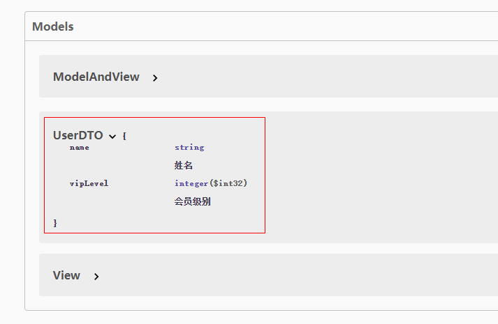
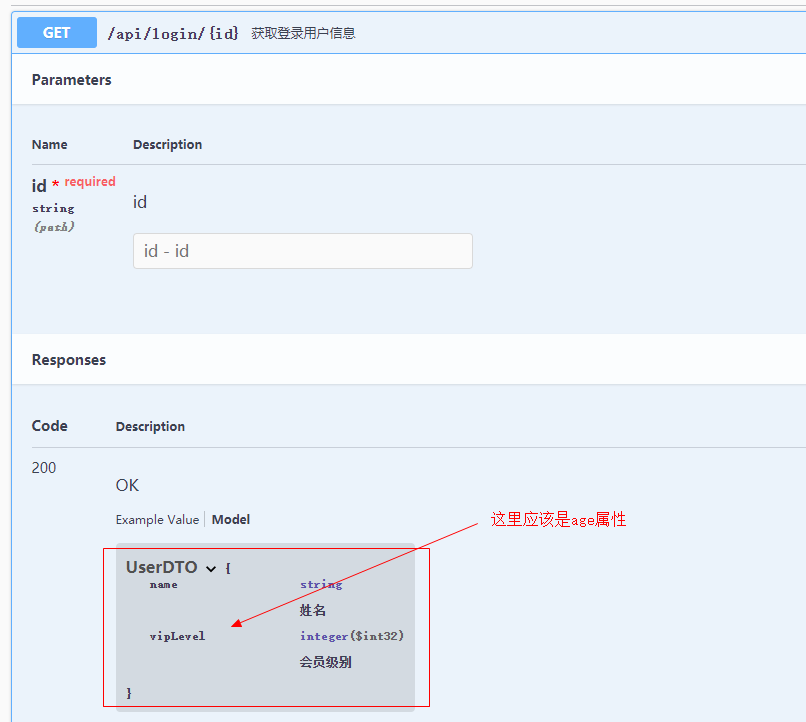
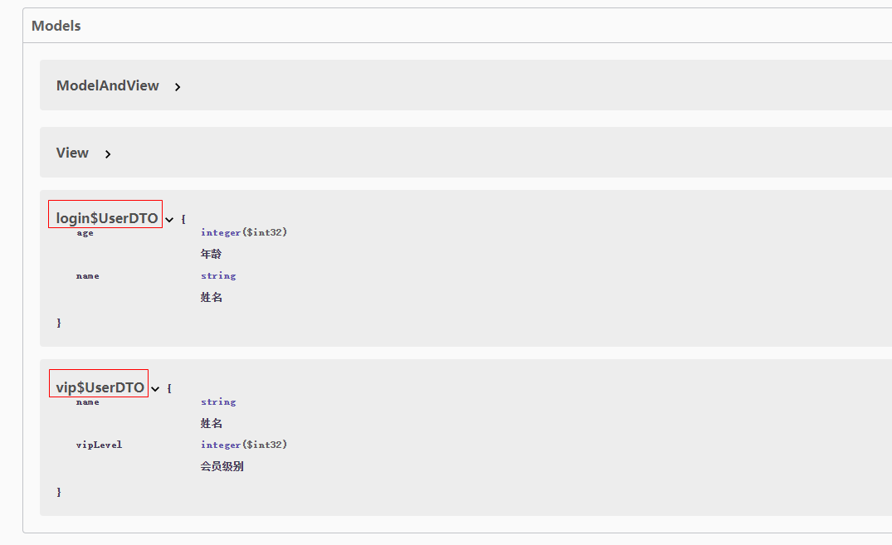
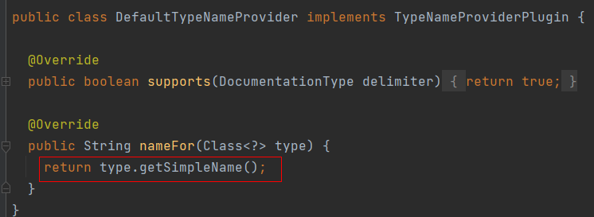

## 前言

> 项目使用的`springfox-swagger2@2.9.2`版本

在 Spring 中集成 swagger 文档功能，需要通过`@ApiModel`注解修饰出入参的类，但是如果有两个不同包下的相同名称的类都使用了`@ApiModel`注解时，会导致文档被覆盖，例如：

<!-- more -->

- com.example.demo.login.dto.UserDTO

```java
package com.example.demo.login.dto;

@Data
@ApiModel
public class UserDTO{
  @ApiModelProperty("姓名")
  private String name;
  @ApiModelProperty("年龄")
  private Integer age;
}
```

- com.example.demo.vip.dto.UserDTO

```java
package com.example.demo.vip.dto;

@Data
@ApiModel
public class UserDTO{
  @ApiModelProperty("姓名")
  private String name;
  @ApiModelProperty("会员级别")
  private Integer vipLevel;
}
```

上面两个类生成出来的文档会变成一个`swagger model`：



从而导致接口文档显示错误：



## 解决冲突

### 修改@ApiModel 注解（推荐）

通过修改@ApiModel 的 value 属性，来规避同名冲突，修改之后为：

```java
package com.example.demo.login.dto;

@Data
@ApiModel("login$UserDTO")
public class UserDTO{}
```

```java
package com.example.demo.vip.dto;

@Data
@ApiModel("vip$UserDTO")
public class UserDTO{}
```

可以看到生成了两个`swagger model`：



### 修改类名

把两个类名做修改，让类名不冲突即可。

## 自定义 swagger 插件

然而上面解决冲突的方式还是太麻烦了，定义一个文档的出入参类而已，还要考虑类重名的问题，这种增加心智负担和工作量的问题应该要尽量避免掉的，我在想有没有可能做到每个类上只需要加上`@ApiModel`注解就行，剩下的冲突问题全部不用考虑。

于是乎通过跟踪源码，找到了`swagger model`名称生成的地方，详见：[github](https://github.com/springfox/springfox/blob/09d4a734b64a216bb5c26c0329f3d15b8276c0e4/springfox-swagger-common/src/main/java/springfox/documentation/swagger/schema/ApiModelTypeNameProvider.java#L38-L43)


可以看到取名的逻辑是，优先取`@ApiModel`的`value`值，如果没有就会使用`defaultTypeName`,跟进去一看，`defaultTypeName`是直接取类的`简称`，代码如下：



正是因为默认情况下取类的`简称`，导致不同包名下的同名类生成出来的`swagger model`被覆盖。
原因已经分析出来了，接下来其实就是看看能不能定制化这个`super.nameFor(type)`方法了，然而很遗憾这个方法是写死的，没地方下手，但是`ApiModelTypeNameProvider`这个类上两个注解`@Component`和`@Order`已经明示了这个是一个`Spring bean`，并且是通过`Spring插件机制进行加载的`，所以可以自定义一个插件来完成，在默认时通过完整的类路径和类名来生成唯一的`swagger model`，代码如下：

```java
@Component
@Order(SwaggerPluginSupport.SWAGGER_PLUGIN_ORDER - 100)
public class FullPathTypeNameProvider extends DefaultTypeNameProvider {

    public static final String SPLIT_CHAR = "$";

    @Override
    public String nameFor(Class<?> type) {
        ApiModel annotation = AnnotationUtils.findAnnotation(type, ApiModel.class);
        if (annotation == null) {
            return super.nameFor(type);
        }
        if (StringUtils.hasText(annotation.value())) {
            return annotation.value();
        }
        // 如果@ApiModel的value为空，则默认取完整类路径
        int packagePathLength = type.getPackage().getName().length();
        return Stream.of(type.getPackage().getName().split("\\."))
                .map(path -> path.substring(0, 1))
                .collect(Collectors.joining(SPLIT_CHAR))
                + SPLIT_CHAR
                + type.getName().substring(packagePathLength + 1);
    }

}
```

效果如下：


## 后记

通过这一个小小的优化，就可以减少许多团队中不必要的沟通成本，让我们能更专注于业务开发。
