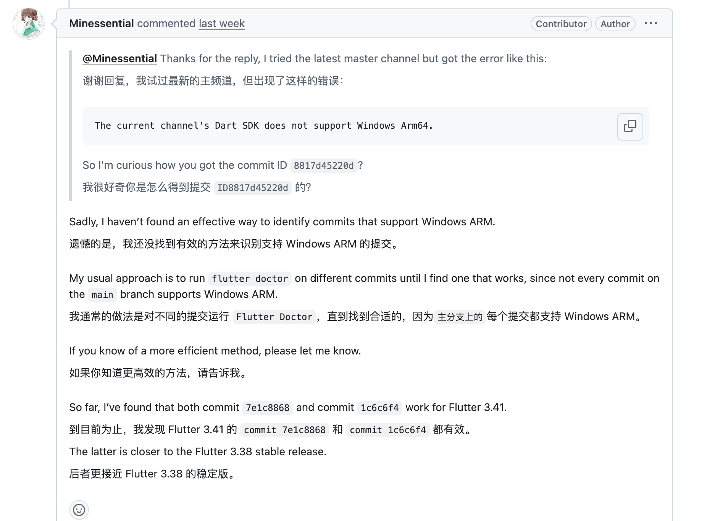
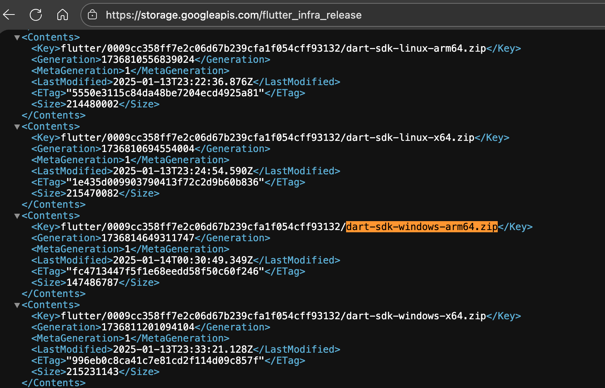
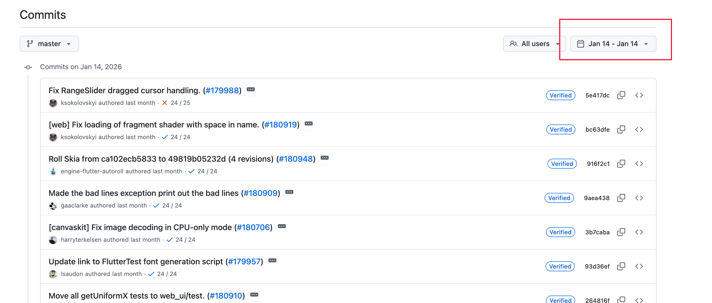

## 前言

上个版本`Gopeed`加入了 Windows ARM64 支持，来自社区的一个 PR，让它成了少数支持 Windows ARM64 的 Flutter 应用。不过这事儿没那么简单，Flutter 官方对 ARM64 的支持还不够完善，后续构建的时候各种问题接踵而至。这篇文章记录一下踩过的坑和找到的解法，算是给后来人铺个路。

<!-- more -->

## Windows ARM 这两年才起来

得先说说背景。苹果 M 芯片干得漂亮之后，高通也开始在 Windows 笔记本上推 Snapdragon X 系列处理器，虽然市场份额还小，但能支持的话总归是个加分项。

## 官方的支持现状

翻了下 Flutter 官方的 [issue #62597](https://github.com/flutter/flutter/issues/62597)，计划看着挺完整：

1. **Dart SDK** — 在 Windows ARM64 上编译运行，支持从 x64 交叉编译到 ARM64
2. **Engine** — 编译成 ARM64 版本
3. **构建工具链** — `flutter`命令和 build system 要识别 ARM64 平台
4. **开发环境** — 既要在 ARM64 机器上开发，也要支持 x64 交叉编译
5. **CI/CD** — 专门的 CI 机器定期构建 ARM64 产物
6. **测试** — devicelab 上有 ARM64 设备持续测试

但这都 2026 年了，stable 分支还是没有合并进来。从 2020 年到现在，6 年了。

## 实际遇到的坑

### 版本混乱

官方说`master`分支支持，但实际上**不是所有 master 上的 commit 都行**。

直接用最新的 master 构建，很可能碰到这个错误：

```
The current channel's Dart SDK does not support Windows Arm64.
```

框架代码可能声称支持了，但对应的 Dart SDK 二进制还没编译出来。只能一个个 commit 试，跑`flutter doctor`，不行就换下一个。

Gopeed 升级到 flutter 3.38 之后，PR 里用的 commit 还是兼容 3.24 版本的，导致构建失败。我试了最新的 master commit，还是不行。最后还是 PR 作者给的 commit ID 才解决问题。



这个版本其实是`flutter 3.41.0-0.0.pre`，虽然是预发布版本，但至少能用。

### mingw 工具链的问题

按照 PR 的构建代码，需要配置`llvm-mingw-ucrt-aarch64`这个交叉编译工具链，用来生成便携版需要的`.dll`文件。

结果又冒出个新问题。有用户反馈在 arm64 的 Windows 上用不了 gopeed，我在 Mac 上装了个 Windows ARM64 虚拟机测试，确实跑不起来。更神奇的是，用`flutter 3.41.0-0.0.pre`构建的安装包能正常运行，但便携版不行。

反复对比才发现，便携版需要把`llvm-mingw-ucrt-aarch64`工具链里的`libunwind.dll`拷贝到根目录才能跑。而用`Inno Setup`打出来的安装包没有`libunwind.dll`却也能正常运行。这个我到现在都没完全搞明白。

## 找版本的小技巧

在找支持 arm64 的 commit 时，发现了个有用的方法。Flutter 的 dart sdk 会构建在它们的 CDN 上，每次切换版本时自动下载对应的 sdk。可以通过这个 URL 查看什么时候构建过 windows-arm64 的 dart sdk：

```
https://storage.googleapis.com/flutter_infra_release
```

打开是个巨大的 XML 索引文件，搜索`dart-sdk-windows-arm64.zip`关键词：



根据构建时间，就能大概推断出哪些版本的 flutter 支持 windows-arm64。比如这个是`2025-01-14`构建的，就在 master 分支上找这个时间点附近的 commit。可以用 GitHub 的 commit 筛选功能：



这样定位起来快多了。

## 后记

Windows ARM64 支持确实是个加分项，但 Flutter 官方的进度实在太慢。现在能跑起来已经不错了，虽然过程中遇到的问题有点莫名其妙。如果你也在做类似的事情，希望这些经验能帮你少走点弯路。

话说回来，Flutter 的跨平台能力确实强，但要做到真正的全平台支持，还有不少路要走。尤其是这种相对小众的平台，基本上只能靠社区来推动了。
