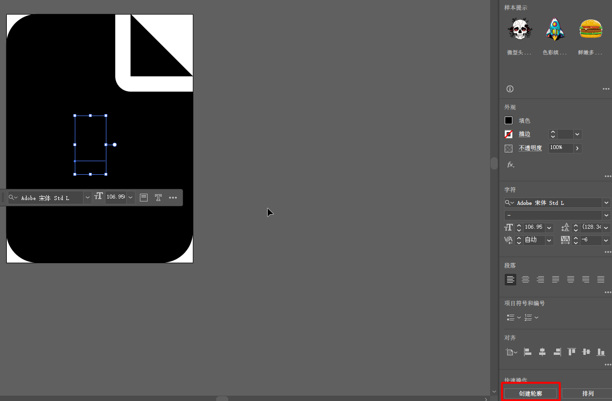
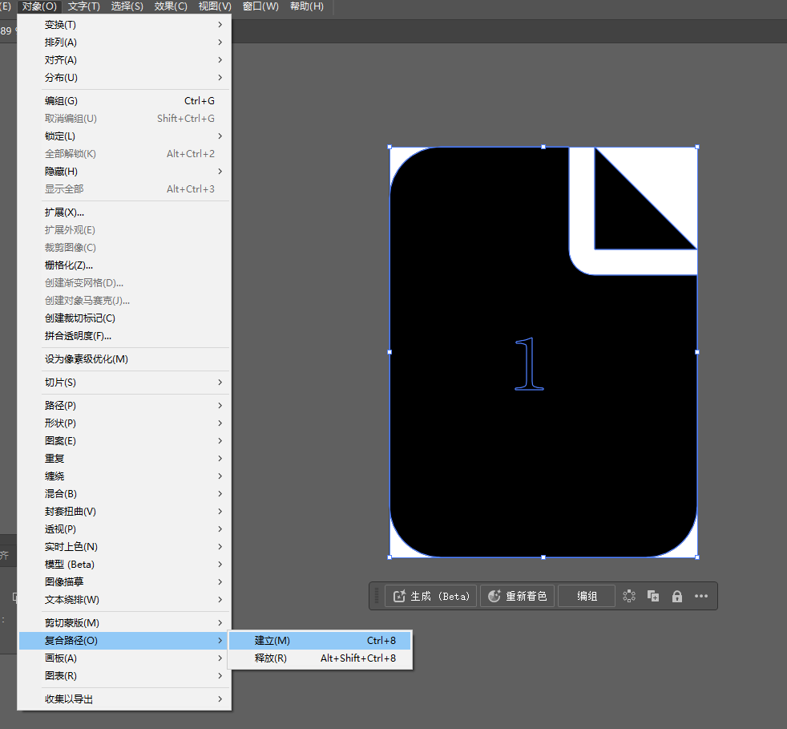

## 背景

在开发 flutter 项目时，经常会用到一些图标，这些图标通常是从一些图标库中下载下来的，然后需要把图标`svg`格式转换成`flutter`项目中的`icon font`，这个过程是比较繁琐的，而且如果图标库中的图标有更新，那么还需要手动去下载新的图标，然后再转换，在有了`fluttericon.com`这个网站之后，这个过程就变得非常简单了。

<!-- more -->

## fluttericon.com 是什么

`fluttericon.com` 是一个在线的图标管理网站，它提供了大量的免费图标库，可以直接在线检索图标:


在挑选好所需的图标之后，点击`DOWNLOAD`按钮，就可以下载一个`zip`文件，里面包含了字体文件和`flutter`项目中的`icons.dart`文件：


### 使用

下载下来的`zip`文件解压之后，里面包含了两个文件夹，一个是`fonts`文件夹，里面包含了字体文件，`my_flutter_app_icons.dart`文件，将这两个文件夹拷贝到`flutter`项目中，然后在`pubspec.yaml`文件中引入字体文件：

```yaml
fonts:
  - family: MyFlutterApp
    fonts:
      - asset: fonts/my_flutter_app.ttf
```

> 这里的`my_flutter_app`是根据 fluttericon.com 网站中自定义的项目名称来的，这里是默认的名称，可以随意修改。

然后在项目中使用这个图标：

```dart
import 'package:flutter/material.dart';
import 'my_flutter_app_icons.dart';

class MyWidget extends StatelessWidget {
  Widget build(BuildContext context) {
    return IconButton(
      icon: Icon(MyFlutterApp.my_icon),
      onPressed: () {
        print('icon clicked');
      },
    );
  }
}
```

### 备份

由于`fluttericon.com`是使用浏览器`cookie`来保存用户的图标库，如果清除了`cookie`，那么之前的图标库就会丢失，所以在使用`fluttericon.com`的时候，最好将下载的图标库(.zip)备份一下，这样以后就可以直接导入自己的图标库，而不用重新挑选一遍。

## 导入自定义 SVG

除了自带的图标库之外，`fluttericon.com`还支持导入自定义的`svg`文件，但是需要注意的是，导入的必须是`compound path svg`，而且也不支持类似`fill`这样的属性，所以在导入之前需要先处理一下`svg`文件。

### 碰到的问题

我这里就碰到了一个场景，想在一个`SVG`文件加上文本，然后导入到`fluttericon.com`中，但是如果没有做处理的话会报错：

```
If image looks not as expected please convert to compound path manually.

Skipped tags and attributes: polygon,fill
```

因为如果直接编辑的`SVG`添加文本导出来的实际上是变成了多个`path`，比如这个：


我在原始的`SVG`中间添加了一个字，但是导出来的`SVG`变成了这样：

```xml
<?xml version="1.0" encoding="utf-8"?>
<!-- Generator: Adobe Illustrator 28.0.0, SVG Export Plug-In . SVG Version: 6.00 Build 0)  -->
<svg version="1.1" baseProfile="tiny"
	 xmlns="http://www.w3.org/2000/svg" xmlns:xlink="http://www.w3.org/1999/xlink" x="0px" y="0px" viewBox="0 0 384 512"
	 overflow="visible" xml:space="preserve">
<g>
	<g>
		<path fill="none" d="M185.8,397.9V296.4c-8.1,4-21.2,7.6-37.4,9.8v3l11.2,1c12.3,1,13.3,2.4,13.3,11v76.7
			c0,13.4-1.6,15.6-25.9,17.4v2.8H212v-2.8C187.7,413.6,185.8,411.4,185.8,397.9z"/>
		<path d="M256,160c-17.7,0-32-14.3-32-32V0H64C28.7,0,0,28.7,0,64v384c0,35.3,28.7,64,64,64h256c35.3,0,64-28.7,64-64V160H256z
			 M212,418.2h-64.9v-2.8c24.3-1.8,25.9-4,25.9-17.4v-76.7c0-8.6-1-10-13.3-11l-11.2-1v-3c16.2-2.2,29.3-5.8,37.4-9.8v101.5
			c0,13.4,1.8,15.6,26.2,17.4V418.2z"/>
	</g>
	<polygon points="256,0 256,128 384,128 	"/>
	<path fill="none" d="M185.8,397.9V296.4c-8.1,4-21.2,7.6-37.4,9.8v3l11.2,1c12.3,1,13.3,2.4,13.3,11v76.7
		c0,13.4-1.6,15.6-25.9,17.4v2.8H212v-2.8C187.7,413.6,185.8,411.4,185.8,397.9z"/>
</g>
</svg>
```

### 通过 Adobe Illustrator 处理

我本人对`SVG`不是很熟悉，网上找了很多资料也没有找到相关的解决方案，最后靠着 AI 和无尽的尝试，总算是盲人摸象的处理出来了，这里记录一下：

1. 首先打开`SVG`文件，然后把文本添加好，这一步很简单。
2. 选中文本，然后`属性`->`创建轮廓`：
   
3. 还是选中文本，然后`路径查找器`->`轮廓`：
   
4. 最后全选所有节点，然后`对象`->`复合路径`->`建立`：
   

这个时候再导出`SVG`文件，可以看到就只保留一条`path`了：

```xml
<?xml version="1.0" encoding="utf-8"?>
<!-- Generator: Adobe Illustrator 28.0.0, SVG Export Plug-In . SVG Version: 6.00 Build 0)  -->
<svg version="1.1" id="图层_1" xmlns="http://www.w3.org/2000/svg" xmlns:xlink="http://www.w3.org/1999/xlink" x="0px" y="0px"
	 viewBox="0 0 384 512" style="enable-background:new 0 0 384 512;" xml:space="preserve">
<path d="M0,64C0,28.7,28.7,0,64,0h160v128c0,17.7,14.3,32,32,32h128v288c0,35.3-28.7,64-64,64H64c-35.3,0-64-28.7-64-64V64z
	 M384,128H256V0L384,128z M157.2,301.3v1.5h34.6v-1.5c-13-1-13.9-2.1-13.9-9.3v-54.2c-4.3,2.1-11.3,4.1-19.9,5.2v1.6l6,0.5
	c6.6,0.5,7.1,1.3,7.1,5.9v41C171,299.2,170.2,300.4,157.2,301.3z"/>
</svg>
```

接下来就可以成功导入到`fluttericon.com`中了。

## 总结

折腾了这么久，终于搞定了 fluttericon.com 的图标导入问题！说实话，一开始处理 SVG 文件时还真是让人头大，特别是遇到那些路径格式不兼容的情况。不过通过这次实践，我总结出了一套还算顺手的处理流程，希望能帮其他开发者少走点弯路。

关键点就是：

- SVG 文件预处理很重要，特别是路径格式的转换
- 导入前最好先检查下 SVG 的结构是否规范
- 如果导入失败，99% 都是 SVG 格式的问题

总之，熟悉了这套流程后，处理自定义图标就变得轻松多了。搞定！🚀
