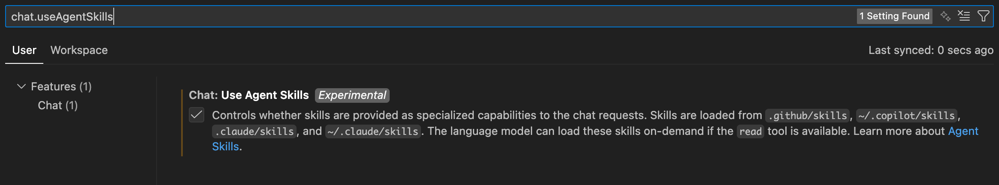
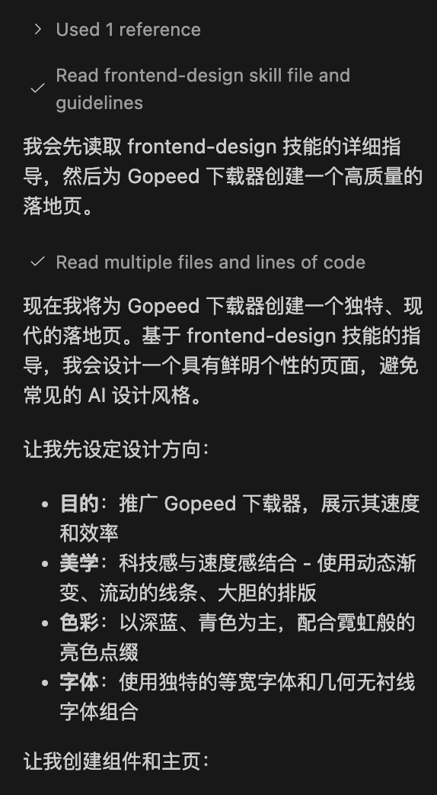

最近`Skills`火得一塌糊涂，VS Code 1.108 版本也紧跟步伐加入了对该功能的支持。目前处于预览阶段，刚好作为一个 Copilot 白嫖怪，第一时间上手体验后，感觉相当不错，聊一聊实测感受。

## Skills 是什么？

Skills 和 MCP 一样，也是来自 `Anthropic` 推出用于增强大模型能力的方案。

简单来说，Skills 就是**把你项目里的一些规则、脚本、模板等内容，固化成一个"技能包"**，让 Agent 在处理项目相关的任务时能自动加载这些内容，从而更好地符合你的项目需求，其实初步看起来有点像早期的那种`提示词模版`，但其实在设计理念上有很大区别。

比起常规的`提示词模版`，Skills 有几个关键差异：

1. **按需加载**：只需加载元数据，在匹配到相关意图时才会加载具体内容，而不是每次都把所有提示词都塞进去，避免上下文过载
2. **能带工具**：不只是文字规则，还能附带脚本、模板这些实际工具
3. **统一标准**：统一定义了Skills的目录结构规范，方便不同工具识别和使用

目前基本上主流 AI 工具都添加了对 Skills 的支持，比如：

- Claude Code
- Codex
- Cursor
- GitHub Copilot

## Github Copilot Skills 初体验

### 开启 Skills

目前 GitHub Copilot 对 Skills 的支持还在预览阶段，需要手动开启，打开VS Code 设置页，然后搜索 `chat.useAgentSkills`，把它启用就行。



启用后 VS Code 会自动从这些路径来识别 Skills：

- 项目级：`.github/skills/<skill-name>/SKILL.md`
- 兼容 claude：`~/.claude/skills/...`
- 个人级：`~/.copilot/skills/...`

### 实战试水

先写个官网落地页看看效果，根据网上的推荐，安装`frontend-design`试试水，看看能不能摆脱看吐了的紫色渐变，下面是同样一份 `提示词` + `Claude Sonnet 4.5`，来生成 Gopeed 官网落地页，分别在开启和关闭 Skills 的情况下的对比：

- 提示词：

```
帮我用 next.js + tailwindcss 写一个 Gopeed 下载器的官网落地页，要求包含以下内容：
1. 首页横幅，突出产品的核心卖点
2. 功能介绍，展示下载器的主要功能
3. 用户评价，展示用户对下载器的好评
4. 下载按钮，方便用户下载产品
5. 联系我们，提供联系方式和社交媒体链接
请使用简洁现代的设计风格，确保页面响应式设计，适配不同设备。
```

- 没装 Skills 的实测：


> 这里挺出乎意料的，竟然没有使用AI味道很重的紫色渐变，但是排版和设计还是一眼看出来是 AI 生成的，整体感觉比较普通。

- 装了 Skills 后的实测：

首先通过命令行安装`frontend-design`：

```bash
npx skills add anthropics/claude-code
```

然后再次创建一个新的项目执行，可以看到在copliot的输出里，已经有调用 Skill 的痕迹了：



这是最终的结果：


> 效果高下立判，在使用 Skills 后，整体设计感提升了一个档次，基本看不出 AI 生成的痕迹了，确实令人惊艳。

## 结尾

上面演示的只是 Skills 的冰山一角，它的潜力远不止于此。感兴趣的可以去逛逛 skillsmp，那里收集了从编程、设计到写作，甚至视频剪辑的各类技能包，基本覆盖了常见的开发与创作需求。如果说 2025 年属于 MCP 的爆发，那 2026 年大概率就是 Skills 的元年了。生态已经起势，让我们静待更多有趣玩法的诞生吧。
