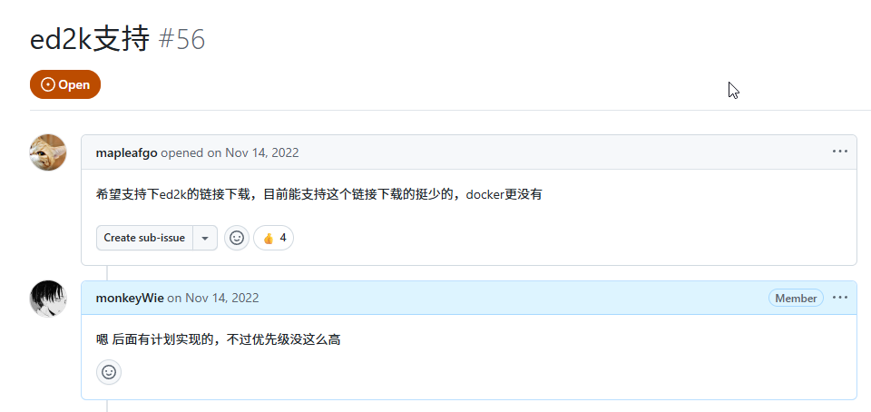
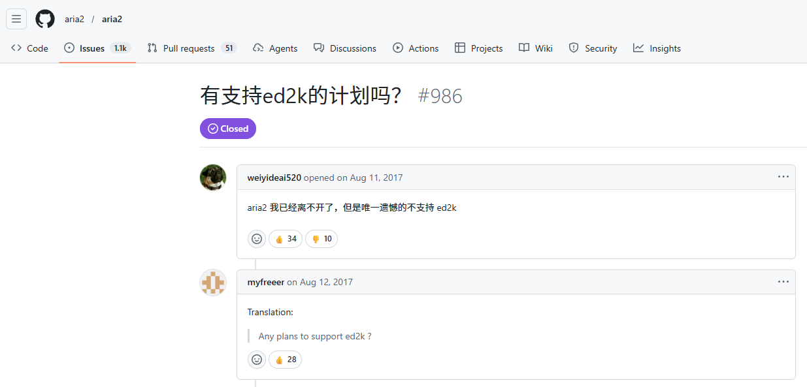
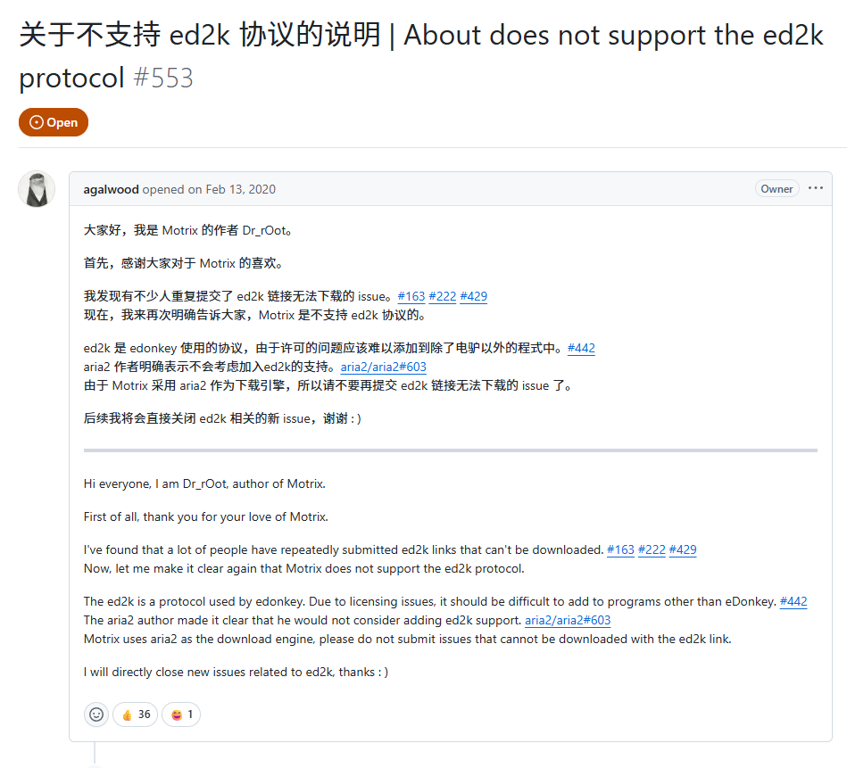

## ed2k 早就过时了，但它还没有“死”

如果你经历过电驴时代，ed2k 这个名字不会陌生，它曾经是文件共享网络里非常重要的一环，但今天它确实过时了。生态萎缩、客户端老旧、资料零散，普通用户的行为习惯也彻底迁移到了更现代的协议和服务上。

但它并没有彻底消失。仍然有不少冷门资源只在这套网络里流通，特别是一些 `Windows` 系统镜像。

也正因为这样，我一直觉得：ed2k 虽然老，但还没到彻底失去价值。问题只在于，它太旧了，旧到几乎已经没人愿意再认真把它实现一遍。

## 早就埋下的一颗种子

其实在很早之前，就有用户在 Gopeed 的 issue 里提过 ed2k 的需求：



而且包括各大开源下载器里也有不少用户在问这个需求，比如 aria2、Motrix：




那个时候我就研究过在 Gopeed 上添加 `ed2k` 支持的可行性，结果发现这个协议的资料非常零散，连一份权威的官方协议文档都没有。能找到的资料大多散落在 wiki、论坛帖子、老项目源码和零碎博客里，而且不同实现之间还会出现行为差异，基本很难入手。它不像 `BitTorrent` 那样，官方有一套标准的 `BEP` 协议规范文档，几乎没法直接开展开发，除非自己去看源码、抓包分析协议细节。这工作量非常大，我怕我秃了都不一定能把它做出来，所以就一直拖着没做。

## AI 的出现带来转机

但近一年 `AI 编程` 的兴起，让我看到了新的可能性。其实需求很简单，就是让 `AI` 参考开源的 `ed2k` 项目，并用 `Go` 语言 1:1 复刻一个 `ed2k` 下载器。不过由于之前 `Code Agent` 和大模型的能力还不够，我尝试了几次都没有成功，就先搁置了。最近我刚好开通了 `ChatGPT Plus`，想着用最新的 `GPT-5.4` 和 `codex` 再试一次，结果这次居然出乎意料地成功了，最终复刻出了一个全功能的 `ed2k` 下载实现。

主要参考了以下两个开源项目：

- [jed2k](https://github.com/a-pavlov/jed2k)： 一个java实现的ed2k下载器，功能比较全，代码也比较清晰，适合用来参考协议细节和实现逻辑。
- [aMule](https://github.com/amule-project/amule)：市面上仅存的还在维护的ed2k下载器，由于它是C++实现的，代码比较复杂，不太适合直接参考，但可以用来验证协议细节和实现逻辑。

给AI的`prompt`就是先让它去复刻`jed2k`的功能实现，然后如果有遗漏和不完整的地方，再让它去参考`aMule`的实现来完善细节，最终成功复刻出了一个功能完整的ed2k下载器。

## 开源

目前已经开源在 [goed2k](https://github.com/monkeyWie/goed2k)，它既可以作为库被其他项目调用，也提供了一个内置的 `终端下载器`，可以直接安装体验。

### 特性支持

`goed2k` 目前已经覆盖了一套可用的 ED2K 客户端基础能力，主要包括：

- [x] ED2K 文件下载
- [x] 多任务并发下载
- [x] 多个 ED2K server 并发找源
- [x] `server.met` 加载
- [x] KAD bootstrap 和 source 查找
- [x] 资源搜索
- [x] 暂停、继续、删除任务
- [x] 状态持久化与恢复
- [x] 上传支持
- [x] 任务、peer、server、piece 状态快照
- [x] 任务进度订阅
- [x] 可交互的终端下载管理器

### 终端下载器

如果想体验的话，可以通过命令行安装使用：

```bash
go install github.com/monkeyWie/goed2k/cmd/goed2k@latest
```

安装完成后，就可以直接运行 `goed2k` 进入交互终端使用，支持 `搜索` 和 `下载`，效果如下：


上面的演示里，先通过 `/search` 命令进入搜索面板搜索资源，然后选择了 2 个资源进行下载。速度也还不错，接近 `1MB/s`。在任务管理面板中，左边可以看到任务列表，右边可以看到下载详情，包括下载速度、文件信息、连接数等。

### 作为库被调用

`goed2k`库的使用也非常简单，下面是一个简单的示例：

```go
package main

import (
	"log"

	"github.com/monkeyWie/goed2k"
)

func main() {
	settings := goed2k.NewSettings()
	settings.ReconnectToServer = true

	client := goed2k.NewClient(settings)
	if err := client.Start(); err != nil {
		log.Fatal(err)
	}
	defer client.Close()

	if err := client.ConnectServers("176.123.5.89:4725"); err != nil {
		log.Fatal(err)
	}

	if _, _, err := client.AddLink(
		"ed2k://|file|example-file.mp3|12345678|0123456789ABCDEF0123456789ABCDEF|/",
		"./downloads",
	); err != nil {
		log.Fatal(err)
	}

	if err := client.Wait(); err != nil && err != goed2k.ErrClientStopped {
		log.Fatal(err)
	}
}
```

上面的示例里，先创建了一个 `goed2k` 客户端实例，然后连接到一个 `ed2k` 服务器，接着添加一个下载链接，最后等待下载完成。

> 更多示例可以在 [examples](https://github.com/monkeyWie/goed2k/tree/main/examples) 目录中找到，这里就不一一列举了。

## 结语

虽然 `ed2k` 协议已经过时了，但它在某些特定资源的下载场景里仍然有价值，尤其是一些冷门资源。借助 `AI` 的帮助，我成功复刻了一个 `ed2k` 下载器，并且已经将这个项目开源，希望能让更多人受益。

后续我会把它集成到 Gopeed 里，让用户更方便地使用 `ed2k` 下载功能，敬请期待！
