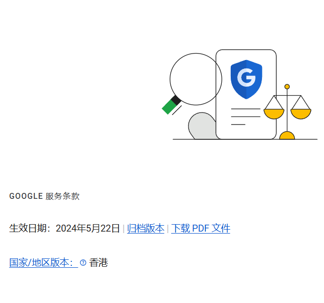
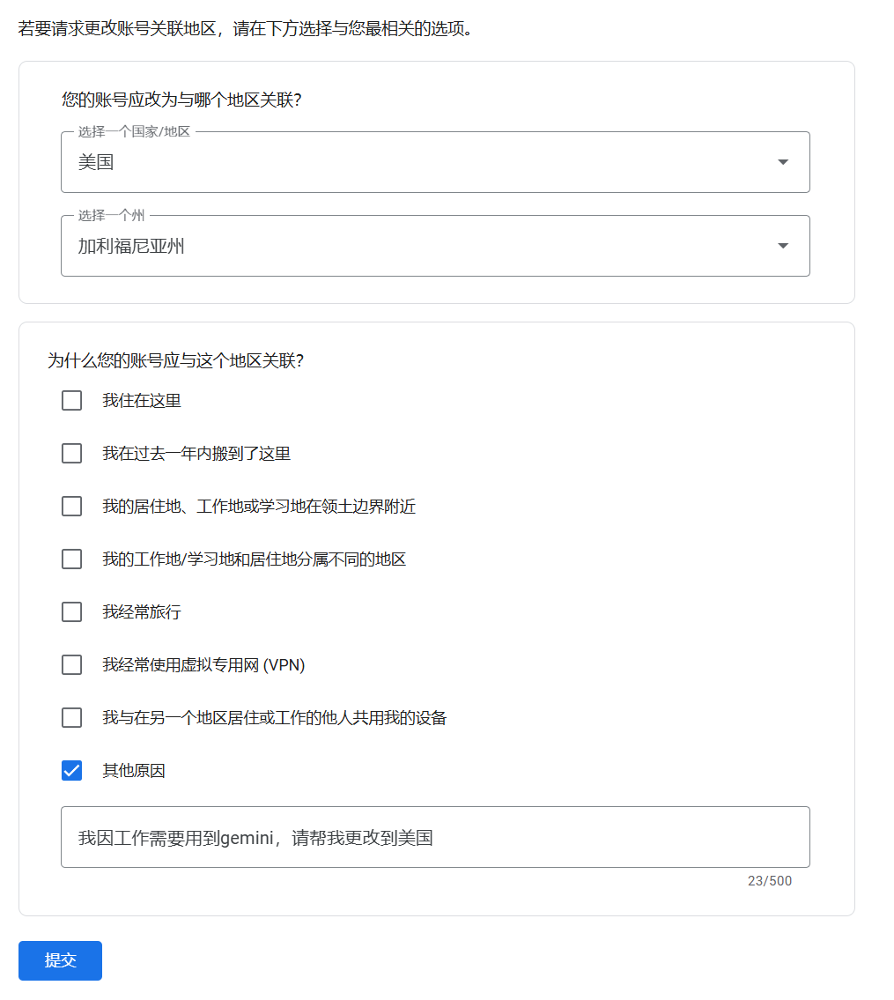
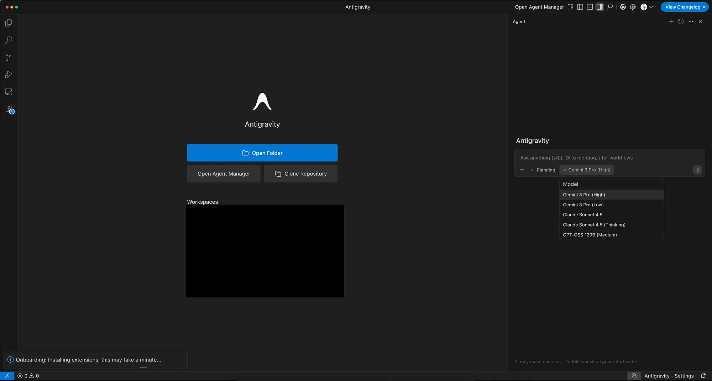

就在昨天，Google 发布了他们家的AI IDE `Antigravity`，目前可以免费使用，支持`Gemini3`和`Claude4.5`，但是在测试使用的过程中一直因为地区问题无法登录，折腾半天总算解决了，来分享下我的经验

# 📍第一步：先确认你的Google账户地区

去[账户设置](https://policies.google.com/terms)里看看，地区得是美国或者新加坡才行。我一开始是香港，结果一直用不了

# 🔄第二步：改地区！

如果地区不对，别慌～进入[地区修改页面](https://policies.google.com/country-association-form)，申请变更地区，原因参考我这个模版

# 🌐第三步：网络IP要和账户地区一致

保持网络IP和账户地区匹配，不然还是会失败哦，比如我的IP是新加坡然后申请的变更为新加坡

# 🚀第四步：一定一定要开TUN模式

这个真的是关键中的关键，不开的话前面都白搭

搞定之后就能愉快使用啦～

